블로그 조회수가 적게 나오는 것 같지는 않다. cloudflare의 분석에 의하면 하루 평균적으로 100명 정도는 오는 것 같았다. 그래서 한번 블로그에 조회수 카운터를 만들어 보기로 했다. 구글 애널리틱스를 사용했다.

# 1. 블로그를 구글 애널리틱스에 추가

[블로그를 Google Analytics에 추가](https://ha-young.github.io/2020/gatsby/Add-Google-Analytics/)글을 따라하였다.

## 1.1. 계정 생성

구글 애널리틱스 계정을 새로 생성하자.

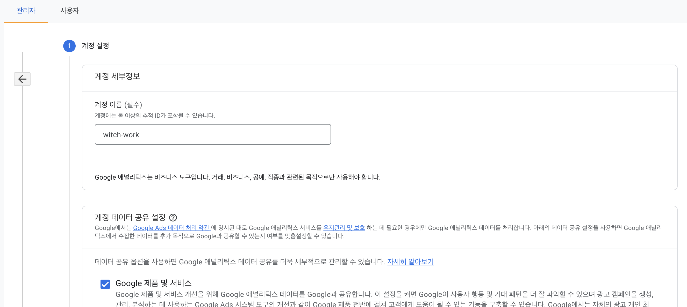

그리고 웹사이트 속성도 설정한다.

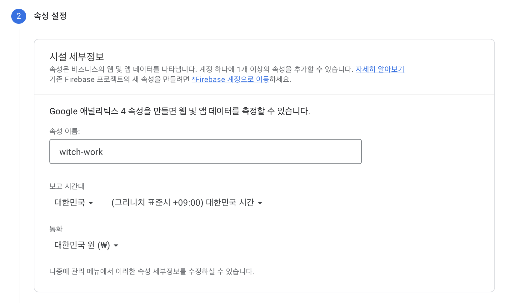

비즈니스 정보도 적당히 설정한 후 약관 등에 동의하고 계정 생성을 마친다.

## 1.2. 데이터 스트림과 태그 추가

그 다음 데이터 스트림 메뉴에 들어가서 페이지의 데이터 스트림을 추가해 주자.

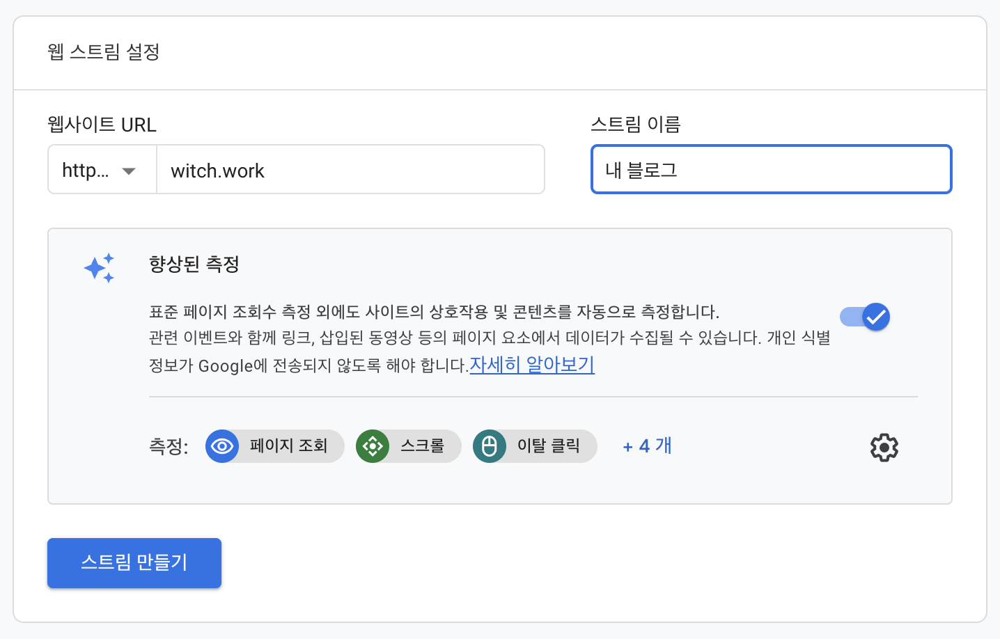

어..그런데 다음과 같은 경고가 뜬다. 데이터 수집이 활성화되지 않았다고 한다.


앞에서 획득한 측정 ID를 등록해 줘야 하기 때문이다. `gatsby-plugin-google-gtag`를 설치하자.

```
npm install gatsby-plugin-google-gtag
```

이렇게 하고 내 블로그의 gatsby-config.ts에 들어가 보니 이미 구글 애널리틱스와 관련된 항목이 있었다.

```ts
{
  resolve: 'gatsby-plugin-google-analytics',
  options: {
    trackingId: siteMetadata.googleAnalytics,
    head: true,
    anonymize: true,
    defer: true,
  },
},
```

gatsby-plugin-google-gtag의 옛날 버전이다. 그러나 우리는 이를 gtag로 바꿨으므로 거기에 맞게 내용을 바꿔주자.

```ts
{
  resolve: "gatsby-plugin-google-gtag",
  options: {
    trackingIds: [siteMetadata.googleAnalytics],
    gtagConfig: {
      anonymize_ip: true,
    },
    pluginConfig: {
      head: true,
    },
  },
},
```

그리고 아까 데이터 스트림을 추가하고 얻은 측정 ID를 `siteMetadata`에 추가한다. 나 같은 경우 blog-config.ts에 있었다. 그런데 이런 siteMetadata를 사용하지 않는다면 그냥 문자열로 추가해도 된다.

## 1.3. 삽질

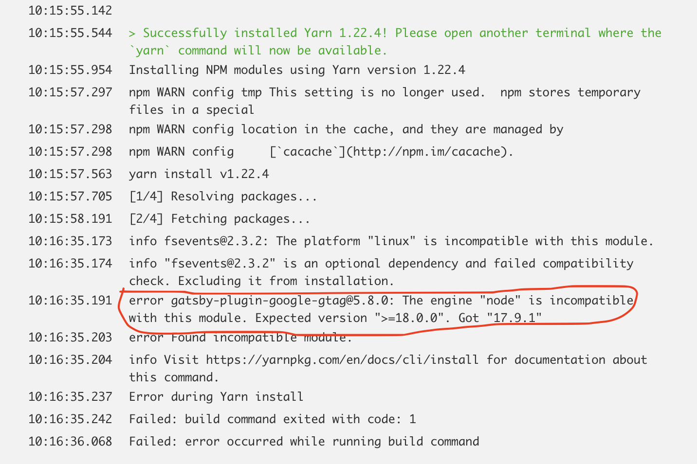

하지만 문제가 발생했다. `gatsby-plugin-google-gtag` 는 node 18 이상을 요구한다. cloudflare는 node 17까지밖에 지원을 안 한다. [node 18을 cloudflare에서 쓰는 걸 베타테스트 중](https://community.cloudflare.com/t/support-node-18-in-pages-or-allow-config/414797/4)이라고 하는데 어떻게 될지 모르겠다..

어쩔 수 없이, analytics.js가 2023년 9월까지는 지원한다고 하니 울며 겨자먹기로 이걸 쓰기로 했다. 다시 gatsby-config.ts를 원래대로 돌리자..

```ts
{
  resolve: 'gatsby-plugin-google-analytics',
  options: {
    trackingId: siteMetadata.googleAnalytics,
    head: true,
    anonymize: true,
    defer: true,
  },
},
```

그리고 빌드에 오류를 발생시키는 `gatsby-plugin-google-gtag`를 삭제하자.

```
yarn remove gatsby-plugin-google-gtag
```

하지만 여전히 잘 되지 않는다. 왜일까? 찾아보니 확실한지는 모르겠지만 GA4 이후로 새로 만든 계정이라면 gtag를 써야만 구글 애널리틱스에 등록이 된다고 한다. node 18 이상은 애초에 cloudflare를 사용하지 않는데..

그런데 내가 본 글들은 다 `gatsby-plugin-google-gtag`를 잘 사용했다. 뭐지? 생각해 보니 gtag가 언제나 node 18을 사용하지는 않았을 것이다. 저 사람들이 사용할 때는 node의 더 낮은 버전을 요구했을 것이다. 그럼 나는 `gatsby-plugin-google-gtag`의 더 낮은 버전을 사용하면 되는 것이다!

## 1.4. 다시, Google Analytics 태그 추가

`gatsby-plugin-google-gtag`의 이전 버전을 설치해 보자. 찾아보니 `gatsby-plugin-google-gtag`의 최신 버전은 5.8.0인데 4.25.0과 3.15.0도 다운로드 수가 만만치 않았다. 안전하게 제일 예전 버전으로 다운받자 싶어서 3.15.0을 받기로 했다.

```
npm install gatsby-plugin-google-gtag@3.15.0
```

그리고 기존에 있던 낡은 라이브러리는 삭제하자.

```
npm uninstall gatsby-plugin-google-analytics
```

그리고 gatsby-config.ts에서 `gatsby-plugin-google-analytics`에 관한 내용이 있었던 부분을 다음과 같이 수정하자. 

혹시 몰라서 gtag플러그인 정보를 plugins 배열 최상단에 위치시켰다. 누군가가 구글 애널리틱스 플러그인이 최상단에 있어야 태그 추가가 잘 된다고 했기 때문이다.

```ts
{
  resolve: "gatsby-plugin-google-gtag",
  options: {
    trackingIds: [siteMetadata.googleAnalytics],
    gtagConfig: {
      anonymize_ip: true,
    },
    pluginConfig: {
      head: true,
    },
  },
},
```

이제 다시 빌드해 보면 성공한다. 그리고 조금 기다리자 애널리틱스 페이지에도 다음과 같은 창이 떴다!

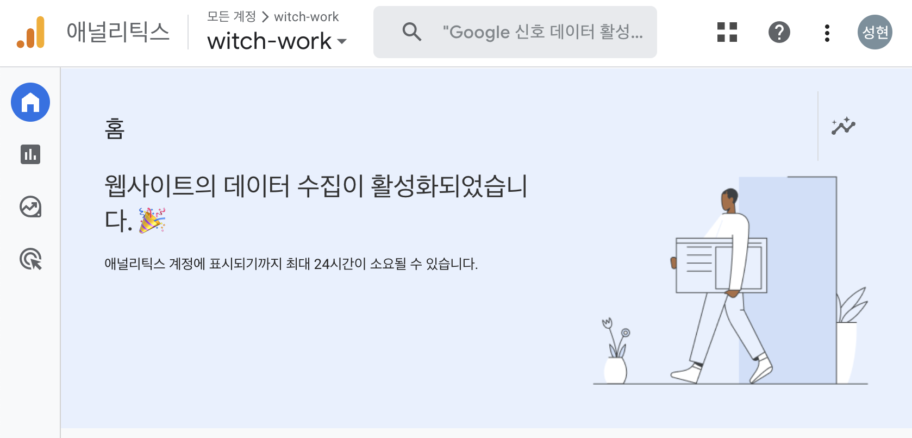

아아..드디어..

# 2. 조회수 가져오는 API 사용하기

구글 애널리틱스 API를 사용하여 게시글 조회수를 알아내도록 하자. [이 글](https://blog.yeppyshiba.com/article/adding-view-count-in-gatsby/)을 따라해 보았다.

## 2.1 API 권한 설정

먼저 [API 활성화](https://developers.google.com/analytics/devguides/reporting/data/v1/quickstart-client-libraries)를 하자.

그러면 프로젝트 이름을 입력하는 창이 뜨는데 입력과 약관 동의 후 다음으로 넘어간다. 그러면 private key들이 담긴 json 파일을 받을 수 있다.

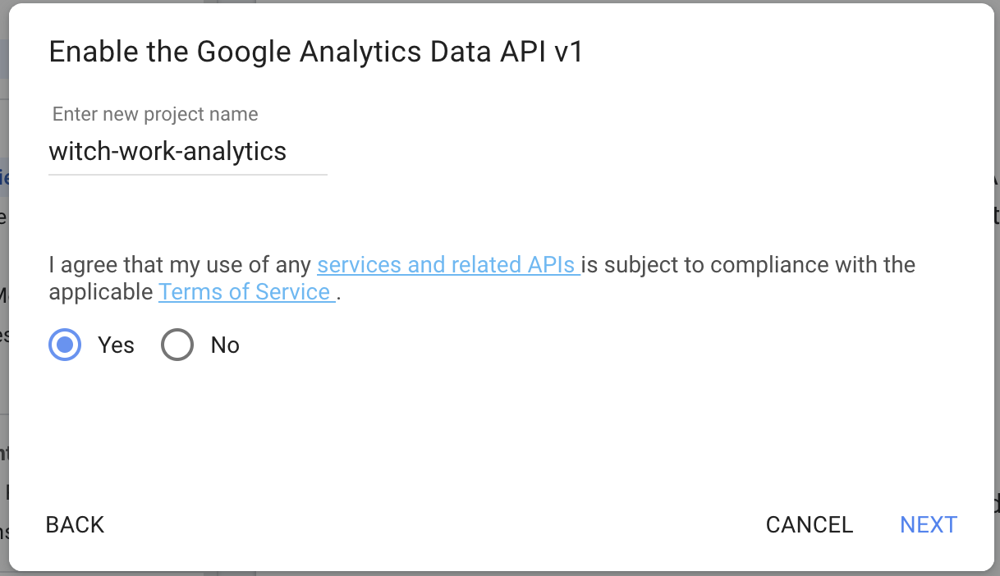

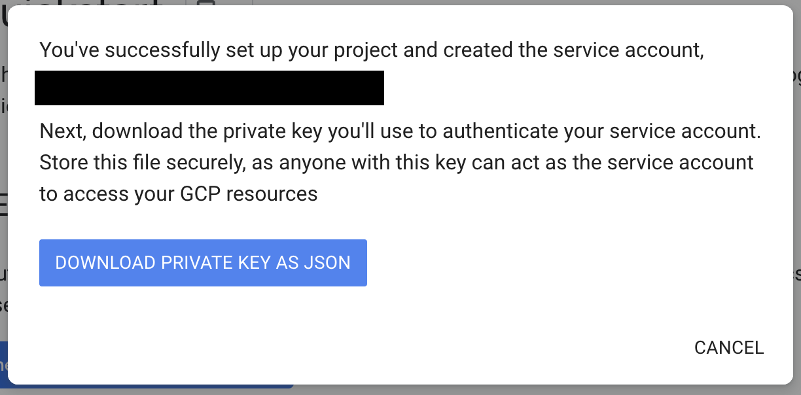

다운받은 json 파일을 열어서 `client_email`항목을 보자. 그리고 구글 애널리틱스 설정 화면에서 왼쪽 아래의 톱니바퀴를 누르고 속성 > 속성 액세스 관리 탭에 들어간다.

그리고 `client_email`의 이메일을 추가하고 권한을 뷰어로 설정한다.

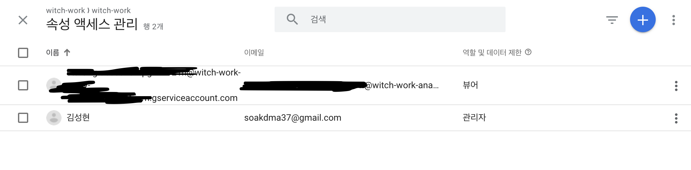

TODO.


# 4. 다른 방법, DB 사용하기

구글 애널리틱스를 조회수에 사용할 경우 애드블럭 등의 이유로 약 [10% 정도의 조회수가 누락된다고 한다.](https://leerob.io/blog/real-time-post-views) 특히 기술 관련 블로그일 경우 더 그렇다고 한다. 아마 기술적인 내용을 읽는 사람들은 대부분 애드블럭을 써서 그런 듯 하다.

따라서 firebase의 DB를 이용하는 방법이 있어서 이를 사용하려 했다. 처음엔 [이 글](https://leerob.io/blog/real-time-post-views)을 보고 따라하려 했으나 이 글은 Nextjs를 사용하며 api route 환경을 필요로 한다. 

그래서 더 조사하던 중 누군가가 [gatsby에서, 클라이언트 조작만으로 조회수를 얻는 법](https://dev.to/flashblaze/displaying-real-time-views-using-react-gatsby-and-firebase-283f)에 관한 글을 써주어서 이를 사용하였다.

# 5. firebase 세팅

## 5.1. firebase 프로젝트 생성

firebase에 로그인하고 콘솔로 이동한다. 나는 구글 계정으로 로그인했다. 그리고 상단 메뉴에 '콘솔로 이동'을 눌러 콘솔로 이동한다.

그러면 프로젝트를 만들 수 있는 화면이 나오는데 당연히 프로젝트를 만들러 이동하자.


난 `witch-work-views`라는 프로젝트를 만들었다. 그리고 구글 애널리틱스를 달 수도 있는데 나는 이전에 만들어 둔 계정이 있어서 그냥 달았다.

## 5.2. DB 설정

이제 조회수를 관리할 DB를 만들자. 좌측 메뉴에서 빌드 > Realtime Database를 클릭한다.

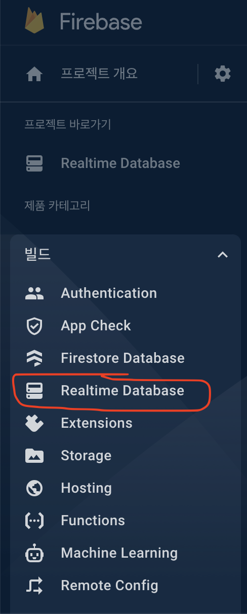

데이터베이스 만들기 클릭. 위치는 그냥 미국으로 하자. 그리고 보안 규칙은 테스트 모드에서 시작하기를 선택한다.

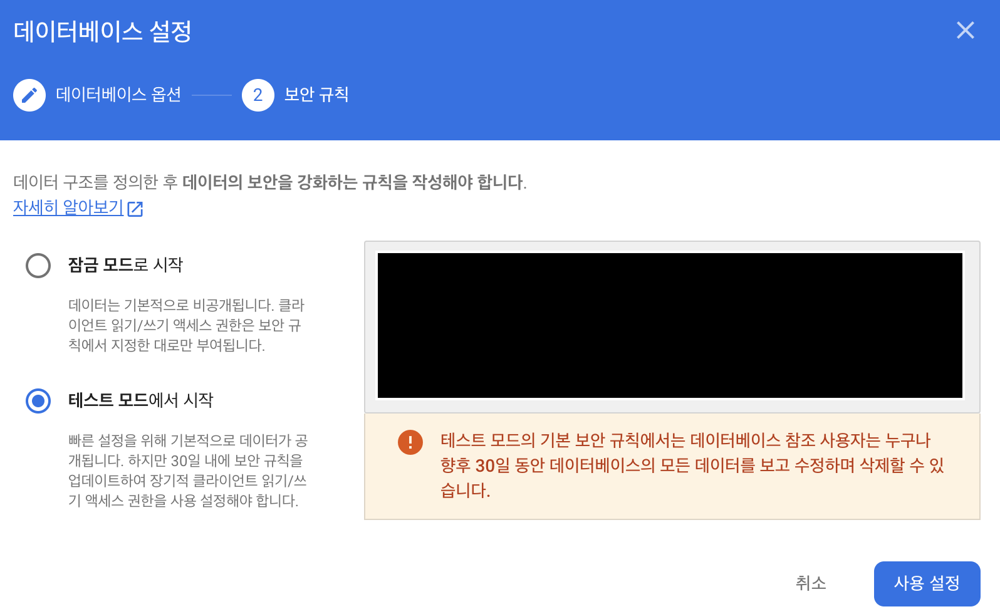

그러면 실시간 데이터베이스가 만들어진다.

그 다음 왼쪽 메뉴의 톱니바퀴를 누르고 '프로젝트 설정'을 선택한다.

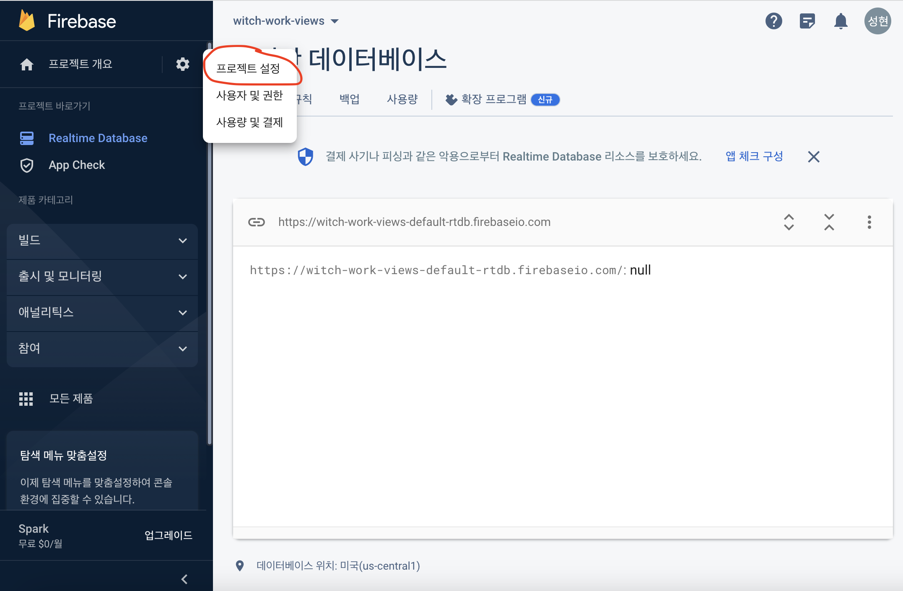

그리고 스크롤을 좀 아래로 내리면 '내 앱'이라는 메뉴가 있고 프로젝트에 앱이 없다는 말이 써 있다. 플랫폼을 선택해서 프로젝트를 새로 만들 수 있는데 웹앱을 선택하자. HTML 태그처럼 보이는 걸 택하면 된다.

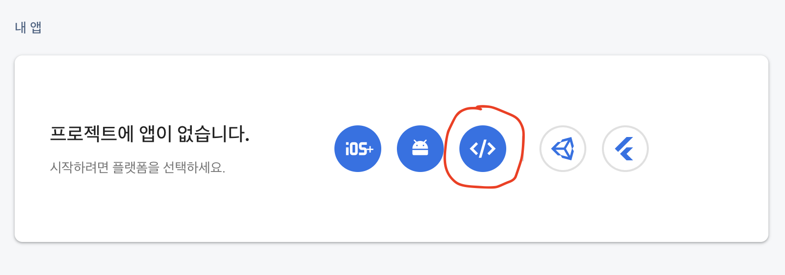

그러면 앱을 만드는 창이 뜨는데 이름을 입력하자. 그리고 firebase 호스팅 설정은 체크하지 않고 넘어가자. 나는 앱 이름을 `witch-work-views-app`으로 했다.

아래와 같은 상태에서 '앱 등록'을 누른다.

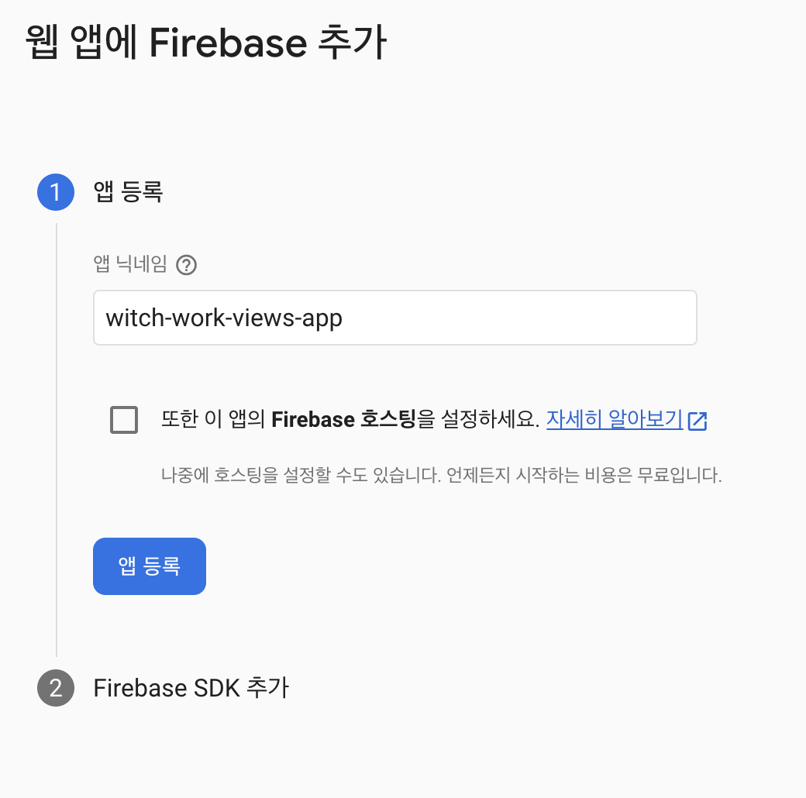

그 다음 Firebase SDK 추가 단계는 뭐 건드리지 말고 그냥 '콘솔로 이동'을 선택했다.

그리고 다시 아까 만들었던 Realtime Database로 돌아가서 '규칙' 메뉴를 선택한다. 현재는 다음과 같이 되어 있다. read, write 둘 다 2023년 5월 12일 전까지 true로 설정되어 있는 것이다.

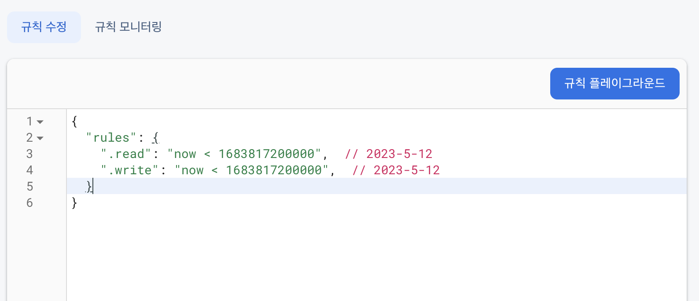

이 rule을 다음과 같이 변경한다.

```json
{
  "rules": {
        "views": {
          "$page": {
                ".read": true,
                ".write": true,
                ".validate": "newData.isNumber()"
        }
      }
   }
}
```

이렇게 하면 모든 사용자가 `views`라는 DB의 모든 페이지에 대한 조회수를 읽고 쓸 수 있게 된다.

# 6. gatsby 설정

먼저 firebase와 gatsby-plugin-firebase를 설치한다. 

```
npm install firebase gatsby-plugin-firebase
```

gatsby-config.ts에 다음과 같은 내용을 추가한다. [공식 문서](https://www.gatsbyjs.com/plugins/gatsby-plugin-firebase/?=firebase)에서 복붙하면 된다.

```typescript
{
  resolve: "gatsby-plugin-firebase",
  options: {
    credentials: {
      apiKey: "<YOUR_FIREBASE_API_KEY>",
      authDomain: "<YOUR_FIREBASE_AUTH_DOMAIN>",
      databaseURL: "<YOUR_FIREBASE_DATABASE_URL>",
      projectId: "<YOUR_FIREBASE_PROJECT_ID>",
      storageBucket: "<YOUR_FIREBASE_STORAGE_BUCKET>",
      messagingSenderId: "<YOUR_FIREBASE_MESSAGING_SENDER_ID>",
      appId: "<YOUR_FIREBASE_APP_ID>"
    }
  }
}
```

또한 우리가 실시간 데이터베이스를 사용하기 때문에 `import 'firebase/database`를 gatsby-browser.ts와 gatsby-ssr.tsx에 추가한다.

그 다음 firebase console로 이동하여 프로젝트 설정으로 이동한다. 그리고 스크롤을 내리면 내 앱의 firebaseConfig를 볼 수 있다.

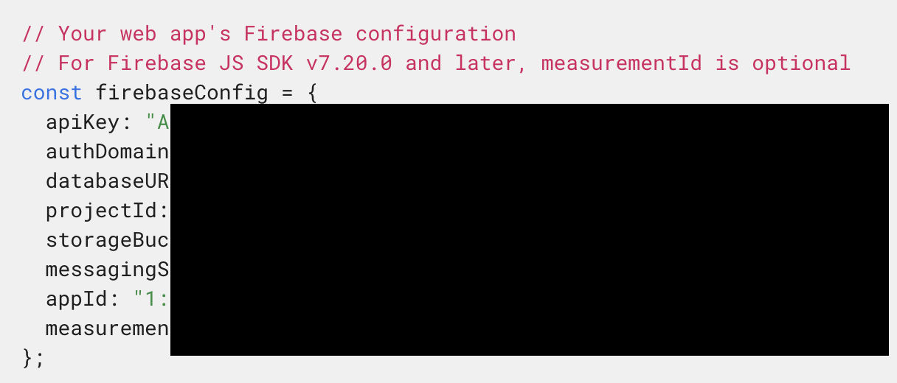

.env를 만들고 위의 config 값들을 하나하나 넣는다. 그리고 dotenv 설치.

```
npm install dotenv
```


# 참고

https://www.gatsbyjs.com/plugins/gatsby-plugin-google-gtag/

https://ha-young.github.io/2020/gatsby/Add-Google-Analytics/

https://leerob.io/blog/real-time-post-views

https://dev.to/flashblaze/displaying-real-time-views-using-react-gatsby-and-firebase-283f

https://www.gatsbyjs.com/plugins/gatsby-plugin-firebase/?=firebase

https://www.daleseo.com/js-dotenv/