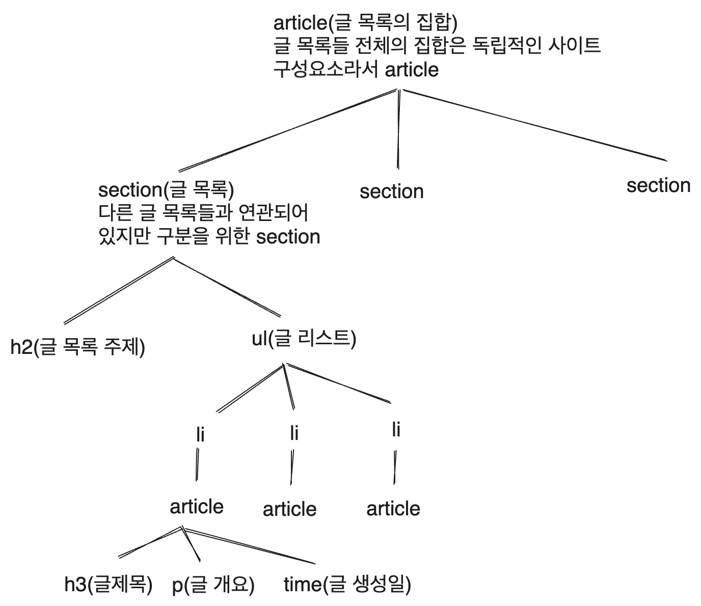

여기 있는 그림은 짤이 아니라면 [excalidraw](https://excalidraw.com/)로 그려졌다.

# 1. 시작


2023년 5월 19일 시점, 내가 쓰고 있는 블로그는 [이창희](https://xo.dev/)님이 만든 gatsby-starter-lavender 블로그 테마에 기초해 있다.

하지만 이 블로그는 내가 원하는 기능을 모두 갖추고 있지는 않다. 또한 나는 Gatsby를 잘 모르기 때문에 이를 손수 추가하는 데에도 한계가 있었다. 따라서 마침 배우려고 하고 있던 NextJS의 튜토리얼이 블로그 만들기임에 착안해서 이참에 내 블로그를 만들어 보기로 했다.

NextJS 튜토리얼에서는 [이런 블로그](https://next-learn-starter.vercel.app/)를 만드는 튜토리얼을 제공한다. 이미 내가 따라해 보기도 했다.

하지만 나는 원하는 기능이 있기 때문에 몇 가지를 추가한 것을 만들어 보도록 하겠다. 레이아웃은 [ambienxo](https://github.com/blurfx/ambienxo)와 내 기존 블로그 테마 등을 참고하였다. 그리고 NextJS 튜토리얼에 보면 NextJS의 장점 같은 것들도 길게길게 써놓았는데, 그런 건 여기에 옮기지 않는다. 블로그 만드는 데 코드 스플리팅을 굳이 자세히 쓸 건 없으니..

# 2. 레이아웃

홈 페이지는 이렇게 되면 좋겠다.


그리고 글을 보는 영역은 다음과 같아졌으면 한다.


물론 이는 해보면서 조금씩 바뀔 가능성이 높다.

# 3. 시작

Node는 깔려 있다고 가정하고, 먼저 NextJS 앱을 생성하자.

```
npx create-next-app@latest
```

이렇게 하면 몇 가지 질문이 나오는데 난 Typescript를 사용할 것이다. 그리고 Tailwind는 사용하지 않을 것이다. 소마에서 프로젝트 하면서 너무 데여서...일단은 그냥 제공하는 CSS Modules를 사용할 것 같다.

또한 App router가 새로 나왔다고 하는데 아직은 버그가 많다고 해서 App router를 사용할 거냐는 질문에는 No를 택했다. 기존의 Page router를 사용하도록 하겠다.

이렇게 앱을 만든 후 해당 폴더로 이동하여 `npm run dev`를 실행하면 앱이 실행된다.

# 4. eslint, prettier

eslint는 아까 앱을 세팅할 때 깔리도록 설정했으므로, prettier와 eslint 연동 플러그인을 깐다. prettier와 충돌이 생기는 규칙을 끄고, eslint에 prettier 포매터 규칙을 추가해 주는 플러그인이다.

```
npm i -D prettier
npm i -D eslint-config-prettier eslint-plugin-prettier
```

그다음 eslint를 vscode의 기본 포매터로 설정한 후 저장할 때마다 포맷팅이 되도록 설정한다. setting의 format on save를 true로 설정하고 default formatter를 eslint로 설정하면 된다.

`.prettierrc`는 간단한 정보만 설정하자. 어차피 eslint에서 같은 내용을 설정할 것이기 때문이다.

```
{
  "trailingComma": "all",
  "tabWidth": 2,
  "semi": true,
  "singleQuote": true,
  "jsxSingleQuote": true
}
```

나는 TS를 쓸 거니까 해당 eslint 플러그인 설치

```
npm i -D @typescript-eslint/parser @typescript-eslint/eslint-plugin
```

그리고 쓰이지 않는 import를 지우는 eslint 플러그인도 설치

```
npm i -D eslint-plugin-unused-imports
```

이제 eslintrc 설정을 해보자. 기본으로 되어있는 `.eslintrc.json`은 다음과 같이 되어있다.

```js
{
  "extends": ["next/core-web-vitals"]
}
```

먼저 여기 우리가 설치한 플러그인과 추천 설정을 좀 추가해 주자.

```json
{
  "plugins": ["@typescript-eslint", "unused-imports"],
  "extends": ["next", "next/core-web-vitals", "prettier"],
}
```

그 다음에는 rules를 설정해서 린터 규칙만 만들면 된다. 여기서 인덴트 규칙 등을 설정해야 자동 수정이 된다. ruls를 다음과 같이 추가하자.

줄의 최대 길이 제한은 끄고, 들여쓰기는 2칸으로, import는 적절히 정렬되도록 한다. 또한 예약 키워드들 간에는 띄어쓰기를 넣게 하고 따옴표는 작은따옴표를 쓴다. 파일 이름은 `.tsx`만 허용한다. 또한 콘솔 출력을 사용하지 못하게 하고 쉐도잉 변수를 쓸 수 없게 하며 세미콜론을 강제하는 등 여러 규칙들을 지정했다. 편해 보이는 걸 끌어왔지만 만약 코드를 짜다 더 필요한 게 생기면 추가 혹은 삭제할 것이다.

```json
"rules": {
  "no-unused-vars": "off",
  "max-len":"off",
  "indent":[
    "error",
    2
  ],
  "import/order": [
    "error",
    {
      "alphabetize": {
        "order": "asc",
        "caseInsensitive": true
      },
      "groups": [
        "builtin",
        "external",
        [
          "parent",
          "internal"
        ],
        "sibling",
        [
          "unknown",
          "index",
          "object"
        ]
      ],
      "pathGroups": [
        {
          "pattern": "~/**",
          "group": "internal"
        }
      ],
      "newlines-between": "always"
    }
  ],
  "jsx-quotes": [
    "error",
    "prefer-single"
  ],
  "keyword-spacing": "error",
  "quotes": [
    "error",
    "single",
    {
      "avoidEscape": true
    }
  ],
  "react/jsx-filename-extension": [
    "warn",
    {
      "extensions": [
        ".tsx"
      ]
    }
  ],
  "no-console": [
    "error",
    {
      "allow": [
        "warn",
        "error"
      ]
    }
  ],
  "react/no-unescaped-entities": "warn",
  "react/jsx-props-no-spreading": "off",
  "react/require-default-props": "off",
  "semi": "off",
  "space-before-blocks": "error",
  "no-shadow": "off",
  "@typescript-eslint/no-shadow": [
    "error"
  ],
  "@typescript-eslint/explicit-function-return-type": "off",
  "@typescript-eslint/no-explicit-any": "error",
  "@typescript-eslint/no-unused-vars": "error",
  "@typescript-eslint/semi": [
    "error"
  ],
  "@typescript-eslint/type-annotation-spacing": [
    "error",
    {
      "before": false,
      "after": true,
      "overrides": {
        "colon": {
          "before": false,
          "after": true
        },
        "arrow": {
          "before": true,
          "after": true
        }
      }
    }
  ]
}
```

코드 짜는 데 핵심적인 내용은 아니니 이정도만 하고 넘어가자.

# 5. 페이지 라우터 만들기

내가 생각하기에 지금 블로그에 필요한 페이지는 다음과 같다.

1. 메인 페이지
2. 글 목록 페이지
3. 내 소개 페이지
4. 글 페이지

여기서 글 페이지는 개별 글마다 동적 라우터를 생성해 줘야 하기 때문에 일단 넘어가자. 나머지 페이지의 라우터를 만들어 주자.

NextJS는 pages 폴더 내에서 export된 컴포넌트들이다. 예를 들어서 `pages/posts/index.tsx`에서 export된 컴포넌트는 `/posts` 경로로 접근할 수 있다.

따라서 pages 폴더 내에 `posts`, `about` 폴더를 만들고 각각 `index.tsx`를 만들어 주자. 그리고 각각의 컴포넌트에는 간단한 내용을 넣어주자.

예를 들어 이런 것이다.

```tsx
// src/pages/about/index.tsx
function AboutPage() {
  return <h1>내 소개 페이지</h1>;
}

export default AboutPage;
```

# 6. 메인 페이지 구조 기초공사

메인 페이지 구조를 간단히 만들어 보자. 목표는 시맨틱하게 잘 짜인 페이지를 만드는 것이다.

그리고 위에 있는 레이아웃을 보고 필요한 컴포넌트를 만들어보자. 지금 보기에 필요한 컴포넌트는 헤더, 푸터, 내 소개, 글 목록을 좀 보여주는 컴포넌트, 그리고 프로젝트 목록을 보여줄 컴포넌트 정도인 것 같다.


스타일링은 아직 고려하지 말고 기초공사만 해보자. 컴포넌트를 위해 `src/components` 폴더 생성.

## 6.1. Header 컴포넌트

`src/components/header` 폴더를 만들고 `index.tsx`를 만들어 준다. 내 블로그 헤더에 들어갈 건 기본적인 내비게이션 바이기 때문에 다음과 같은 구조면 될 것 같다.

```tsx
function Header() {
  return <header>
    <nav>
      <button>홈</button>
      <button>Front</button>
      <button>주제1</button>
    </nav>
  </header>;
}
```

하지만 내비게이션 바에 들어갈 메뉴가 더 많아질 수도 있고, 링크도 더 생길 수 있기 때문에 props를 이용하도록 바꿔보자.

```tsx
import Link from 'next/link';

interface PropsItem{
  title: string;
  url: string;
}

function Header({
  navList
}: {
  navList: PropsItem[];
}) {
  return (
    <header>
      <nav>
        {
          navList.map((item) => {
            return <button key={item.title}>
              <Link href={item.url} aria-label={item.title}>
                {item.title}
              </Link>
            </button>;
          })
        }
      </nav>
    </header>
  );
}

export default Header;
```

이를 index.tsx에 넣고 적절한 `navList` 변수를 생성하여 props로 넘기는 방식으로 한번 잘 되는지 체크해 볼 수 있다. 나머지 컴포넌트들도 마찬가지로 `src/pages/index.tsx`에 넣어서 잘 되는지 확인하는 방식으로 컴포넌트를 짰다.

## 6.2. Footer 컴포넌트

사실 Footer에는 별로 넣을 게 없다. 내 이름이나 넣자. 그런데 내 이름 같은 건 많이 쓰일 테니 먼저 `blog-config.ts` 파일을 만들어서 내 정보를 좀 넣어 놓도록 하자.

그리고 내가 쓸 프로필 사진은 `/public`에 넣어준다. 아래에 보면 picture 항목에 `/witch.jpeg`이라고 되어 있는데, 이는 내가 넣어 놓은 프로필 사진인 `/public/witch.jpeg`을 의미한다.

```ts
// /blog-config.ts
interface BlogConfigType {
  name: string;
  title: string;
  description: string;
  picture: string;
  url: string;
  social: {
    github: string;
  }
}

const blogConfig: BlogConfigType = {
  name:'김성현(Sung Hyun Kim)',
  title:'Witch-Work',
  description:
    '서강대학교에서 기계공학과 컴퓨터공학을 복수전공하였습니다. ' +
    '흔히 `마녀`라는 닉네임을 씁니다. ' +
    '어떤 대단한 뜻을 품고 사는 사람은 아닙니다. ' +
    '그저 멋진 사람들이 내는 빛을 따라가다 보니 여기까지 왔고, ' +
    '앞으로도 그렇게 살 수 있었으면 좋겠다고 생각하는 사람입니다. ' +
    '이곳에 찾아오신 당신과도 함께할 수 있어 영광입니다.',
  picture:'/witch.jpeg',
  url:'https://witch.work/',
  social: {
    github: 'witch-factory'
  }
};

export default blogConfig;
```

이제 푸터에 내 이름을 넣어보자. 이때 절대 경로를 사용하기 위해 루트의 `tsconfig.json`의 `compilerOptions`에  `"baseUrl": "."`을 추가해 주자. 꼭 해야 하는 건 아니지만 편하니까..

```tsx
// src/components/footer/index.tsx
import blogConfig from 'blog-config';

function Footer() {
  return (
    <footer>
    © {blogConfig.name}, Built with NextJS, 2023
    </footer>
  );
}

export default Footer;
```

## 6.3. 자기소개 컴포넌트

이제 내 소개를 담을 컴포넌트를 만들어 보자. 사진과 내 소개글, 링크를 담을 것이다. 아까 `blog-config.ts`를 만든 사실상의 주 목적이라고 할 수 있겠다.

`src/components/profile` 폴더를 생성한다. 그리고 `index.tsx`를 만들어 준다. 독립적으로 존재할 수 있는 부분이라고 생각하여 article 태그를 사용하였다.

```tsx
// src/components/profile/index.tsx
import blogConfig from 'blog-config';
import Image from 'next/image';
import Link from 'next/link';

function Profile() {
  return (
    <article>
      <Image src={blogConfig.picture} alt={`${blogConfig.name} 프로필사진`} width={100} height={100} />
      <h2>{blogConfig.name}</h2>
      <p>{blogConfig.description}</p>
      <ul>
        <li>
          <Link href={`https://github.com/${blogConfig.social.github}`} target='_blank'>
            Github
          </Link>
        </li>
      </ul>
    </article>
  );
}

export default Profile;
```

## 6.4. 글 목록 컴포넌트

글 목록 컴포넌트는 어떤 모습이 되어야 할까? 재사용을 위해서 어떤 부분을 props로 받아야 할지 생각해 보자.

각 주제별로 글 목록이 있어야 하기 때문에 먼저 글 주제를 props로 받아야 한다. 그리고 렌더링할 글 목록을 받아야 한다. 그럼 글 목록의 각 글에는 어떤 정보가 담겨 있을까?

추후에 추가될 수도 있겠지만(특히 조회수를 추가하고 싶다)일단 글 목록에서 보여줄 것은 글 제목, 글에 대한 간단한 설명, 글 생성일이 있어야 할 거라고 생각한다. 블로그 글은 md파일에 담길 것이기 때문에 md 파일의 메타데이터에 담길 내용들이기도 하다. 따라서 이런 구조로 HTML을 짜면 될 듯 하다.


메타데이터에는 태그도 있어야 한다고 생각하지만, 이를 굳이 글 목록에서 보여줄 필요는 없다고 생각한다. 그래서 글 목록에서는 고려하지 않을 것이다. 이후에 props 구조를 설계하면서 type에 추가될 수는 있겠지만.

이에 따라서 ArticleCategory 컴포넌트를 만들어 보자. HTML 구조는 다음과 같이 생각한다.



블로그 글 목록에서 개별 글(즉 blog entry)을 나타내는 컴포넌트로 article 태그를 사용하는 건 [MDN의 article 문서](https://developer.mozilla.org/en-US/docs/Web/HTML/Element/article)에서 제시하는 것과 정확히 일치한다.

### 6.4.1. 글 목록의 글 카드 컴포넌트

일단 글 목록에서 글 개요를 보여주는 카드와 같은 컴포넌트를 만들어 보자. 언젠가 이런 카드를 재사용할 일이 있을 거라 생각하고 좀 일반적인 이름으로`components/card/index.tsx`를 만들어 주자. 이 컴포넌트는 article 태그를 사용할 것이다.

props의 url은 해당 카드를 눌렀을 때 어디로 갈지에 대한 링크이다.

```tsx
// src/components/card/index.tsx
import Link from 'next/link';

interface Props{
  title: string;
  description: string;
  date: string;
  url: string;
}

function Card(props: Props) {
  const { title, description, date, url } = props;
  return (
    <article>
      <Link href={url}>
        <h3>{title}</h3>
        <p>{description}</p>
        <time>{date}</time>
      </Link>
    </article>
  );
}

export default Card;
```


# 7. CSS 기초공사

NextJS는 CSS와 Sass를 기본적으로 지원한다. 그리고 `.module.css` 확장자를 사용하는 파일에 대해 CSS Modules 지원을 기본적으로 하고 있다. 이번에는 그냥 라이브러리 없이 이것만 써볼 것이다.


# 참고

https://velog.io/@rmaomina/prettier-eslint-settings

https://www.daleseo.com/eslint-config/

내가 원하는 카드 컴포넌트에는 article이 적절하다. https://stackoverflow.com/questions/43953026/element-for-a-card-card-container-in-html5