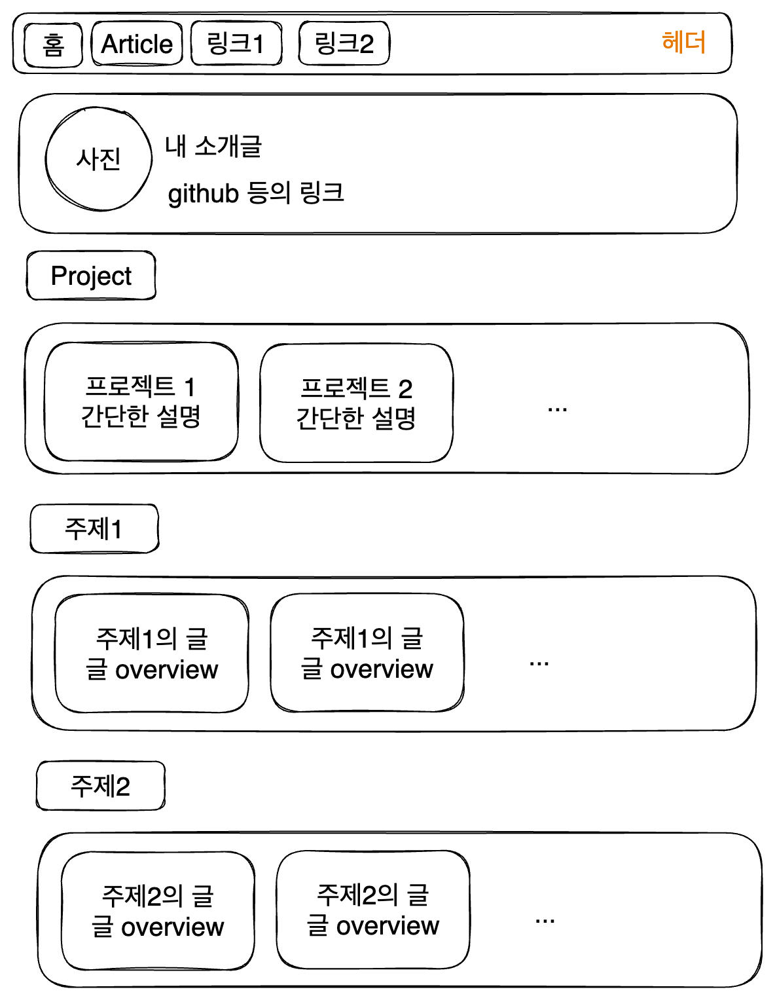

# 1. 메인 페이지의 목록

글 목록에 너무 많은 기를 쏟았기에 벌써 메인 페이지를 어떻게 했는지 가물가물하다. 메인 페이지에서는 이런 걸 표시해 주는 게 목적이었다. 내 소개와, 프로젝트와 블로그 글 목록이다.

이를 위한 `Category`와 `Card` 컴포넌트는 만들어 놓았었다. 이것들이 이제 진짜 글 목록을 표시하도록 해주자. 앞서 `allDocument`등을 통해서 글 목록을 가져오는 걸 많이 해봤으니 쉽다.

