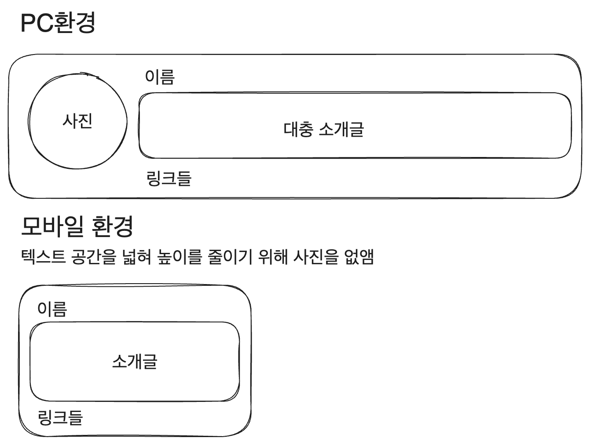

# 1. 디자인의 시작, 레이아웃


지금 내 블로그는 매우 못생겼다. 색도 하나도 안 입혀져 있고(링크에 입혀진 기본 색상 말고는), CSS도 하나도 없어서 링크들은 쨍한 파란색으로 보이고 난리가 났다.

하지만 가장 문제는 배치가 제멋대로라는 것이다. HTML 시맨틱이야 잘 짜여 있(다고 믿)지만 그냥 위에서 아래로 배열되었을 뿐이다. 레이아웃이 페이지에서 얼마나 중요한지를 생각해 보면 이는 큰 문제다.

내가 참고한 [누구나 쉽게 배우는 웹사이트 디자인의 비밀](https://product.kyobobook.co.kr/detail/S000001033015)에서도 레이아웃을 목차의 첫번째로 꼽고 있다.

또한 10년차 디자이너분의 시리즈 [누구나 디자이너가 될 수 있다](https://brunch.co.kr/@sarayun/22)에서도 디자인의 4대 핵심 요소 중 가장 기본이라고 말하고 있다. 가독성이 정말 안 좋은 페이지를 본 사람이라면 충분히 이해할 수 있는 이야기다.

따라서 이번에는 CSS를 활용해서 페이지의 레이아웃을 한번 수정해 보도록 하자. 메인 페이지부터 시작해 볼까.

모바일 우선 디자인을 적용하였다. 내 블로그를 모바일로 보는 사람도 많을 것이고 또한 일반적으로 컴퓨터가 성능이 더 좋기 때문에 모바일 우선으로 로드하고 나서 컴퓨터 환경에서 미디어 쿼리를 적용하는 게 속도 면에서 더 나을 거라고 생각했기 때문이다.

또한 css 라이브러리를 딱히 사용하지 않는 것이 처음이라 가장 고전적인 BEM 클래스 작명법을 적당히 사용하였다.

# 2. 메인 페이지 구조 분석

현재 메인 페이지는 의미적으로 4개의 영역으로 나눠져 있다고 할 수 있다. 다음과 같이 헤더, 내 소개, 글 목록, 푸터가 그 4개의 영역이다.


여기서 헤더와 푸터는 지금 당장 레이아웃이 문제가 되지는 않으므로 내 소개와 글 목록에 대해서만 생각해 보자.

## 2.1. 내 소개 영역

메인 페이지는 사용자가 내 블로그에 접속했을 때 처음으로 보게 되는 페이지다. 따라서 내 소개가 최상단에 있어야 하는 건 맞지만, 내 블로그 컨텐츠도 적절히 노출되도록 하면 좋겠다. 이는 모바일 환경에서도 마찬가지이므로 공간을 최대한 덜 차지하면서 적절해 보이는 레이아웃이 되도록 하고자 한다.

따라서 다음과 같은 반응형 레이아웃을 생각해 보았다.



이를 어떻게 구현할까? 먼저 이름, 소개글, 링크들의 배열은 어차피 기본적으로 위에서 아래로 배열되어 있으므로 굳이 수정할 필요가 없다. 하지만 이미지와 레이아웃이 섞이지 않도록 이 부분을 div로 한번 묶어주자. 그리고 CSS 모듈 파일을 `src/components/profile`에 만들어 주자. `styles.module.css`정도의 이름이면 되겠다.

이미지는 화면 너비가 클 때, 일반적으로 모바일과 데스크탑을 가르는 기준이 되는 768px를 기준으로 그보다 크면 보여주도록 한다. 이미지가 나온 후 세로로 배열된 나머지 요소들이 와야 하므로 내 소개 박스의 display를 flex로 설정하고 가로로 배열되도록 한다. 이 설정은 화면 너비가 768px보다 클 때만 해주면 된다.

그리고 링크들은 가로로 배열되었으면 한다. 따라서 링크들을 감싸는 ul 컴포넌트에 적용해 줄 flex도 설정해 주자. 여기엔 미디어 쿼리가 필요없다. 그리고 링크에는 bullet point가 필요없으므로 이를 없애주고 링크 간의 어느 정도의 간격을 준다.

이를 CSS 클래스로 구현하면 다음과 같다.

```css
// src/components/profile/profile.module.css
.profile__image{
  display:none;
}

.profile__linklist{
  display:flex;
  flex-direction:row;
  list-style:none;
  padding-left:0;
  gap:0 15px;
}

@media (min-width:768px){
  .profile__image{
    display:block;
  }

  .profile{
    display:flex;
    flex-direction:row;
  }
}
```

그리고 프로필 컴포넌트에선 다음과 같이 클래스를 사용해 준다.

```tsx
// src/components/profile/index.tsx
import styles from './profile.module.css';

function Profile() {
  return (
    <article className={styles.profile}>
      <Image className={styles.profile__image} src={blogConfig.picture} alt={`${blogConfig.name}의 프로필 사진`} width={80} height={80} />
      <div>
        <h2>{blogConfig.name}</h2>
        <p>{blogConfig.description}</p>
        <ul className={styles.profile__linklist}>
          <li>
            <Link href={blogConfig.social.github} target='_blank'>
            Github
            </Link>
          </li>
          <li>
            <Link href={blogConfig.social.BOJ} target='_blank'>
            BOJ
            </Link>
          </li>
        </ul>
      </div>
    </article>
  );
}
```

이렇게 하고 적용해 보면 내 소개 컴포넌트의 사진이 소개글 왼쪽에 보이고, 화면 너비가 작아지면 없어지는 걸 확인할 수 있다. 또 링크도 가로로 잘 배열되어 있다.

## 2.2. 글 목록 영역

글 목록의 배치에 대해 생각나는 요구 사항은 다음과 같다.

1. 모바일에서 텍스트가 답답하게 보이지 않아야 한다. PC 환경에서도 마찬가지.
2. 처음 페이지가 떴을 때 메인 페이지에서 최대한 많은 글을 보여줄 수 있어야 한다.

여기에 부합하기 위해서는, 1번 요구사항을 더 우선적으로 생각했을 때 다음과 같은 요소 배치를 생각해 보았다. 모바일에서 답답해 보이지 않기 위해서는 글 프리뷰 카드 하나가 너비를 전부 차지해야 한다고 생각했다.


이번에도 `src/components/category/styles.module.css` 생성. 그냥 화면이 일정 너비 이상이 되면 가로로 배열되도록 하기만 하면 된다. 그 외엔 bullet point를 없애주고 간격을 주는 정도만 해주자.

```css
@media (min-width:768px){
  .category__cardlist{
    display: flex;
    flex-direction:row;
    list-style:none;
    gap:20px;
  }
}
```

그리고 `src/components/category/index.tsx`의 ul태그에 `styles.category__cardlist`를 적용해 주기만 하면 된다.

여기까지 하면 배치가 이렇게 바뀐다. 아직도 엄청나게 못생겼지만 아까보다 훨씬 나아 보이는 것 같다.


# 3. 페이지 헤더와 푸터

## 3.1. 전 페이지 공통으로

현재 페이지 헤더에는 내비게이션이 있고, 푸터에는 간단한 내 이름이 있다. 현재 이 요소들은 메인 페이지에만 들어 있다. 그런데 각 헤더와 푸터에 들어 있는 정보를 생각해 볼 때 모든 페이지에 공통으로 들어가 있는 게 합리적이다.

따라서 이를 모든 페이지에 공통으로 넣어주도록 하자. `/src/pages/_app.tsx`를 수정해주면 된다.

```tsx
// src/pages/_app.tsx
import '@/styles/globals.css';
import type { AppProps } from 'next/app';

import Footer from '@/components/footer';
import Header from '@/components/header';
import blogCategoryList from 'blog-category';

export default function App({ Component, pageProps }: AppProps) {
  return (
    <div>
      <Header navList={blogCategoryList} />
      <Component {...pageProps} />
      <Footer />
    </div>
  );
}
```

그리고 `/src/pages/index.tsx`에 있던 헤더와 푸터는 지워준다.


# 참고

https://brunch.co.kr/@sarayun/22

https://merrily-code.tistory.com/154