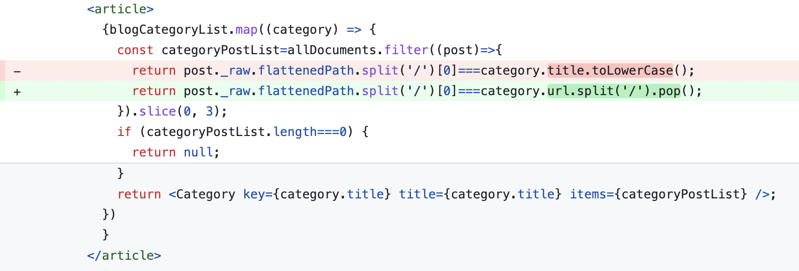

나는 디자이너가 아니기 때문에 일단 컴포넌트 하나하나를 괜찮게 만들어 본 다음 조화를 생각해서 조금씩 조율하도록 하겠다.

# 0. 색 정의

그전에 `styles/globals.css`에 색 변수를 지정해 두자. [open color](https://yeun.github.io/open-color/)의 gray, indigo 색을 사용하였다.

그리고 body의 기본 margin 8px를 없애 주는 css도 추가했다.

```css
// styles/globals.css
:root{
  --white:#fff;

  --gray0:#f8f9fa;
  --gray1:#f1f3f5;
  --gray2:#e9ecef;
  --gray3:#dee2e6;
  --gray4:#ced4da;
  --gray5:#adb5bd;
  --gray6:#868e96;
  --gray7:#495057;
  --gray8:#343a40;
  --gray9:#212529;


  --indigo0:#edf2ff;
  --indigo1:#dbe4ff;
  --indigo2:#bac8ff;
  --indigo3:#91a7ff;
  --indigo4:#748ffc;
  --indigo5:#5c7cfa;
  --indigo6:#4c6ef5;
  --indigo7:#4263eb;
  --indigo8:#3b5bdb;
  --indigo9:#364fc7;
}

body{
  margin:0;
}
```

# 1. 헤더 컴포넌트

모든 페이지에 공통으로 들어가 있는 헤더와 푸터로 시작하겠다.

부대찌개를 먹으며 고민한 결과 다음과 같은 배치를 생각했다. 그리고 About의 경우에는 다른 게시판 분류와 다른 느낌이기 때문에 살짝 다른 색으로 구분해 줄까 하고 있다. 나는 디자이너가 아니지만 최선을 다해보았다.


## 1.1. 컨테이너

헤더 높이는 다른 컨텐츠와의 조화를 생각할 때 50px가 가장 적절해 보였다. 그리고 늘 상단에 고정시켜야 하므로 `position:sticky;`와 `top:0`. 다른 페이지 요소들과 같이 `width:100%; max-width: 60rem;`로 너비 제한. `margin:0 auto`로 가운데 정렬.

배경색은 흰색 설정 후 다른 컨텐츠와의 구분을 위해 연한 회색의 하단 테두리 지정.

```css
.header{
  height:50px;
  position:sticky;
  top:0;
  width:100%;
  max-width:60rem;
  margin:0 auto;
  background-color:#FFFFFF;
  border-bottom:1px solid var(--gray3);
}
```

그다음은 header 컴포넌트 내의 nav 컴포넌트. 여기에 메뉴들이 본격적으로 들어갈 텐데, 여기서도 width를 100%로 설정하면 내비게이션이 너무 양쪽에 딱 붙어 보일 것이다. 따라서 `width:92%`로 설정한다.

또한 모바일 환경이든 PC환경이든 내부 요소가 양쪽에 몰려 있어야 하기에(게시판 메뉴들은 후에 div 박스로 묶을 것이다) flex를 space-between으로 설정. height는 당연히 100%, margin 0 auto.

```css
.header__nav{
  width:92%;
  display:flex;
  flex-direction:row;
  justify-content:space-between;
  height:100%;
  margin:0 auto;
}
```

## 1.1. 홈 버튼

이제 홈 버튼을 만들어 주자. `src/components/header/homeButton`에 index.tsx와 styles.module.css 생성

index.tsx의 HomeButton 컴포넌트 구조는 다음과 같이 한다. 링크 내부에 div를 넣고 거기에 사진과 텍스트를 넣은 간단한 구조다.

```tsx
import Image from 'next/image';
import Link from 'next/link';

import blogConfig from 'blog-config';

import styles from './styles.module.css';

function HomeButton() {
  return (
    <Link href='/' aria-label='Home' className={styles.link}>
      <div className={styles.container}>
        <Image src='/witch-hat.svg' alt='logo' width={40} height={40} />
        {blogConfig.title}
      </div>
    </Link>
  );
}

export default HomeButton;
```

그리고 링크에는 너비와 높이를 주기 위해서 block으로 설정하고 내용에 딱 맞게 너비를 설정. 링크에 기본적으로 들어가는 스타일도 없애준다. 또한 약간의 패딩을 추가하고 마우스 호버시 연한 회색의 배경색을 준다.

```css
.link{
  text-decoration:none;
  color:#000;
  display:block;
  width:fit-content;
  padding:5px;
}

.link:hover{
  background:var(--gray2)
}
```

그리고 홈 버튼의 내부 요소 배치를 위해 flex 설정을 해준 후 너비와 높이를 100%로 설정한다. 그리고 내부 요소들을 세로축에서 가운데 정렬하고 사이에 5px의 간격을 준다.

```css
.container{
  display:flex;
  flex-direction:row;
  align-items:center;
  gap:5px;
  width:100%;
  height:100%;
  font-size:24px;
}
``` 

헤더에 들어갈 이미지는 적당히 [픽사베이에서 마녀 모자를 찾아서](https://pixabay.com/vectors/magician-wizard-hat-magic-mystery-41104/)넣었다.

## 1.2. 내비게이션 메뉴

헤더 컴포넌트의 가장 큰 벽이다. 화면 너비가 작을 경우 드롭다운 메뉴를 보여줘야 하고 너비가 넓을 땐 그냥 일반적인 메뉴를 보여줘야 한다.

일단 `src/components/header/menu`에 index.tsx와 styles.module.css 생성.

이 내비게이션에서 레이아웃을 신경써야 할 부분은 다음과 같다.

1. 컨테이너
2. 드롭다운 메뉴의 토글 버튼
3. 드롭다운 메뉴 본체

그럼 컨테이너에는 별거 필요 없다. 그냥 크기만 컨텐츠에 맞게 설정해 주자.

```css
.container{
  display:flex;
  flex-direction:column;
  width:fit-content;
  height:100%;
  font-size:20px;
}
```

이제 버튼을 만들어 보자. `menu/toggler`에 index.tsx와 styles.module.css를 생성.

사실 버튼에 주어질 스타일은 별거 없다. 그냥 테두리와 배경을 없애주고 적절한 너비, 높이를 주는 것. 그리고 호버 시 배경색을 연한 회색으로 주는 것 정도.

```css
// src/components/header/menu/toggler/styles.module.css
.button{
  border:none;
  background:transparent;
  width:50px;
  height:100%;
}

.button:hover{
  cursor:pointer;
  background:var(--gray2);
}
```

그리고 버튼 내부에 들어갈 아이콘을 포함해서 컴포넌트를 작성하자. 이때 원래는 `react-icons`를 쓰려 했으나 많이 쓰지도 않을 아이콘을 위해 패키지 크기가 55MB나 하는 패키지를 깔고 싶지 않아서 그냥 적당한 svg사진을 찾아와서 썼다.

또한 메뉴의 열림 여부에 따라서 표시하는 아이콘이 달라져야 하므로 메뉴가 열려 있는지 여부와 토글 함수를 props로 받도록 했다.

```tsx
import Image from 'next/image';

import styles from './styles.module.css';

function Toggler({isMenuOpen, toggle}: {isMenuOpen: boolean, toggle: () => void}) {
  return (
    <button className={styles.button} onClick={toggle}>
      <Image
        src={isMenuOpen?'/cancel-32x32.svg':'/hamburger-32x32.svg'} 
        alt='Menu' 
        width={32} 
        height={32} 
      />
    </button>
  );
}

export default Toggler;
```

이제 메뉴 본체를 만들어 보자. `menu/dropdown`에 index.tsx와 styles.module.css를 생성.

여기서 해야 할 건 뭘까? 가장 먼저 메뉴를 보여줘야 한다. 또한 모바일 환경에서는 메뉴가 드롭다운으로 보여야 하고 PC 환경에서는 그냥 보여야 한다. 그리고 메뉴 열림 여부에 따라 보이고 말고를 결정할 수 있어야 한다.

따라서 navList와 isMenuOpen을 Dropdown 컴포넌트의 props로 받아야 한다는 것을 생각할 수 있다. 우선 다음과 같이 구조를 잡는다.

```tsx
// src/components/header/menu/dropdown/index.tsx
import Link from 'next/link';

import styles from './styles.module.css';

interface PropsItem{
  title: string;
  url: string;
}

function Dropdown({navList, isMenuOpen}: {navList: PropsItem[], isMenuOpen: boolean}) {
  return (
    <ul>
      {navList.map((item) => {
        return (
          <li key={item.title}>
            <Link
              href={item.url} 
              aria-label={item.title} 
            >
              {item.title}
            </Link>
          </li>
        );
      })}
    </ul>
  );
}

export default Dropdown;
```

어차피 CSS 모듈을 쓰므로 여기서만 쓰일 list, link, item 같은 간단한 클래스명을 주자. 또한 메뉴가 열려 있는 경우와 닫혀 있는 경우에 대해 isMenuOpen을 이용해 다른 클래스명을 적용하도록 한다.

```tsx
function Dropdown({navList, isMenuOpen}: {navList: PropsItem[], isMenuOpen: boolean}) {
  return (
    <ul className={`${styles.list} ${isMenuOpen?styles['list--active']:styles['list--inactive']}`}>
      {navList.map((item) => {
        return (
          <li key={item.title} className={styles.item}>
            <Link
              href={item.url} 
              aria-label={item.title} 
              className={styles.link}
            >
              {item.title}
            </Link>
          </li>
        );
      })}
    </ul>
  );
}
```

CSS는 다음과 같이 설정했다. 주석으로 각각에 대한 간단한 설명들을 적었다.

```css
// src/components/header/menu/dropdown/styles.module.css
/*
모바일 환경에선 세로 배열. bullet point와 패딩, 마진은 없앤다. 흰색 배경과 회색 테두리를 주고, 테두리를 크기에 포함시키기 위한 box-sizing 설정.
헤더 높이는 50px 고정이며 메뉴는 그 아래에 위치하므로 position:absolute로 설정하고 top, left 속성을 줘서 루트 태그 기준으로 배치되도록 한다(현재 조상 태그 중 relative position이 없으므로 가능)
*/
.list{
  width:100%;
  flex-direction:column;
  list-style:none;
  padding:0;
  margin:0;
  background-color:white;
  border:1px solid var(--gray2);
  box-sizing:border-box;
  position:absolute;
  top:50px;
  left:0;
}

/* 메뉴 열려 있을 땐 flex 배치, 아닐 땐 메뉴 보여주지 않기 */
.list--active{
  display:flex;
}

.list--inactive{
  display:none;
}

/* 링크의 기본 스타일링을 없애고 크기 설정이 가능하도록 블록 태그로 설정.
그리고 모바일 환경에서 약간의 들여쓰기와 가운데 위치 정렬을 한다. */
.link{
  text-decoration:none;
  color:#000;
  display:block;
  width:100%;
  height:40px;
  text-indent:30px;
  line-height:35px;
}
// 그냥 호버시 회색으로 만드는 것
.link:hover{
  background:var(--gray2)
}

// 640px이상의 넓은 화면
@media (min-width:640px){
  /*
  넓은 화면에선 드롭다운 메뉴로 보일 필요 없으므로 가로배열.
  또한 이제 드롭다운 형식이 아니므로 기본 position인 static으로 설정하고 테두리 없애기
  */
  .list{
    flex-direction:row;
    height:100%;
    position:static;
    border:none;
  }
  /* 드롭다운 메뉴가 아닐 때는 고정 너비 */
  .item{
    width:60px;
  }
  /* 넓은 너비 화면에서 메뉴는 언제나 보여야 한다. */
  .list--active{
    display:flex;
  }

  .list--inactive{
    display:flex;
  }
  /* 메뉴의 가로 배열에 적당한 크기와 텍스트 정렬 */
  .link{
    width:60px;
    height:100%;
    text-indent:0;
    line-height:50px;
    text-align:center;
  }
}
```

## 1.3. 페이지 이동시 드롭다운 닫기

그런데 문제가 있다. nextJS는 클라이언트 사이드 내비게이션을 지원하기 때문에 페이지가 이동한다고 해서 다시 렌더링되지 않는 컴포넌트들이 있다. 우리가 만든 헤더는 모든 페이지 공통으로 사용되기 때문에 `_app.js`에 넣었고 따라서 페이지가 이동한다고 해서 헤더의 `isMenuOpen` state가 바뀌지 않는다!

즉 모바일 환경에서 메뉴를 열고 다른 페이지로 이동하더라도 메뉴가 계속 열려 있는 것이다. 

이를 해결하기 위해 [nextJS 문서의 라우터 이벤트 부분](https://nextjs.org/docs/pages/api-reference/functions/use-router#routerevents)을 참고했다.

`useEffect`와 nextJS에서 제공하는 `useRouter`를 사용하자. router가 변하고 컴포넌트가 unmount될 때 `isMenuOpen`을 false로 만들어준다.

```tsx
/* src/components/header/menu/index.tsx */

function Menu({navList}: {navList: PropsItem[]}) {
  const [isMenuOpen, setIsMenuOpen] = useState<boolean>(false);

  const router=useRouter();

  useEffect(()=>{
    return router.events.on('routeChangeStart', ()=>setIsMenuOpen(false));
  }, [router]);

  return (
    <div className={styles.container}>
      <Toggler isMenuOpen={isMenuOpen} toggle={() => setIsMenuOpen(!isMenuOpen)} />
      <Dropdown navList={navList} isMenuOpen={isMenuOpen} />
    </div>
  );
}
```

## 1.4. 내비게이션 메뉴 로직 수정

이렇게 해놓고 헤더를 보니, 헤더에 있는 메뉴가 Home, CS, Front, Misc, About이 있었다. 그리고 이 이름들을 기반으로 각 카테고리별 페이지가 만들어지며 이 이름들은 `blog-category.ts`에서 관리한다.

하지만 이 이름들이 별로 마음에 들지 않았다. 일단 Home을 빼고 싶었는데 지금의 페이지 생성 방식 상 이건 문제가 없다. 그냥 `blog-category.ts`만 조금 편집하면 된다.

또 하고 싶은 건 헤더의 메뉴가 `개발`처럼 한글로 되어 있도록 하고 싶다. 따라서 먼저 `blog-category.ts`를 수정하였다. 그다음 posts의 폴더 이름 중 front도 dev로 바꿨다.

```ts
// blog-category.ts
interface Category{
  title: string;
  url: string;
}

const blogCategoryList: Category[] = [
  {title:'CS', url:'/posts/cs'},
  {title:'개발', url:'/posts/dev'},
  {title:'기타', url:'/posts/misc'},
  {title:'소개', url:'/about'},
];

export default blogCategoryList;
```

이러면 일단 `/pages/posts/[category]/index.tsx`에서 동적 라우트 생성시 문제가 생긴다. `category.title`이 바뀌기 때문이다. 따라서 이를 title 기반이 아닌 url 기반으로 동적 라우트가 생성되도록 바꾸자.

url을 `/`로 split 해준 후 마지막 요소만 취해주면 된다.

```tsx
// pages/posts/[category]/index.tsx 의 getStaticPaths
export const getStaticPaths: GetStaticPaths=()=>{
  const paths=blogCategoryList.map((category)=>{
    return {
      params: {
        category:category.url.split('/').pop(),
      },
    };
  });
  return {
    paths,
    fallback: false,
  };
};
```

메인 페이지에서 각 카테고리별 글을 보여주는 필터링을 할 때도 `category.title`을 사용했는데 이것도 `category.url`로 바꿔주자.



# 2. 푸터 컴포넌트

사실 푸터는 정말 할 게 없는 컴포넌트..라고 생각한다.

# 참고

토스 기술블로그의 디자인을 많이 참고하였다. 토스만큼 UI에 신경쓰는 큰 기업이 우리나라에 얼마나 있을까.. https://toss.tech/tech

마녀 모자 이미지 출처 https://pixabay.com/vectors/magician-wizard-hat-magic-mystery-41104/

nextJS 페이지 이동 감지를 위한 useRouter https://nextjs.org/docs/pages/api-reference/functions/use-router#routerevents