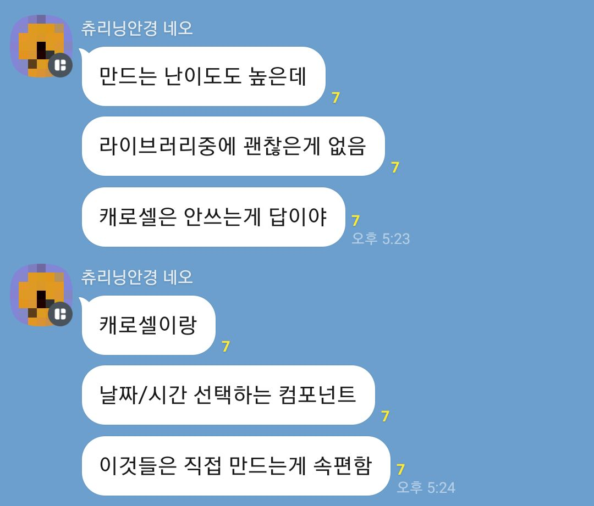

# 1. 캐로셀을 만들자

캐로셀은 여러 장의 이미지와 내용을 넘기면서 볼 수 있게 해주는 인터페이스이다. 슬라이더라고도 부르는 것 같다. 이 캐로셀은 다음과 같은 특징을 가진다.

- 웹사이트 맨 위에 있다.
- 로딩했을 때 모니터의 상당 부분을 차지한다.
- 한 번에 하나씩 여러 이미지를 보여준다.
- 캐로셀 안에는 넘길 수 있는 내용이 더 있다는 것을 알려 주는 표시자나 내비게이션이 있다.
- 이미지와 짧은 텍스트가 있다.
- 내용은 조직의 소개나 사명에 대한 것 혹은 주요 정보나 프로모션이다.

물론 캐로셀을 사용하는 것에도 장단점이 있다. 대부분의 경우에는 히어로 이미지를 사용하는 게 좋다고 한다. 그러나 여전히 캐로셀은 많이 사용되고 있고 나는 캐로셀이 그렇게 나쁜 디자인이라고 생각하지 않는다. 따라서 내가 하고 있는 프로젝트의 홈페이지에서도 캐로셀 메뉴를 사용하기로 했다.

하지만 캐로셀을 만드는 건 그렇게 녹록한 일이 아니었다. 여러 예외 상황까지 고려하면 더더욱. 그래서 캐로셀을 만들고 여러 상황들을 처리하는 내용을 여기 정리한다.

프로젝트에서는 React와 tailwind, typescript를 사용한다. 따라서 코드는 React, tailwind, typescript로 작성될 것이다. 그 외에 UI 컴포넌트 라이브러리인 DaisyUI를 사용하고 있다. 하지만 캐로셀을 만들 때 UI를 쓸 것 같았으면 그냥 DaisyUI에서 제공하는 캐로셀을 썼을 것 같다..



# 2. 첫 시작 - 기본 요소 만들기

캐로셀은 기본적으로 여러 이미지들이 있고 그것을 하나씩 보여주는 것이다. 그러면 여러 이미지들을 나열해서 렌더링한 후 하나씩만 화면에 보이게 하면 되지 않을까?


한번 코드로 작성해 보자. 캐로셀 컴포넌트는 어떤 형태가 되어야 할까? 가장 단순하게, 어떤 이미지들을 받아서 캐로셀 형태로 그려주면 된다. 따라서 먼저 이미지들을 길게 렌더링한 후 화면에 하나만 보여주면 된다. 이를 위한 캐로셀의 개별 아이템 타입은 다음과 같이 정의될 수 있다.

```tsx
interface CarouselItemType {
  id: number;
  image: string;
}
```

이를 우리가 원하는 대로 렌더링하려면 어떻게 해야 할까? 가로로 배열되어야 하므로 flex를 이용해서 배치해야 한다. 그리고 높이는 고정해야 한다. 여기서는 뷰포트의 50%가 되도록 설정하였다. 너비는 내부에 들어가는 요소들을 모두 포함할 만큼이 되도록 해야 하므로 fit-content를 사용한다. 마지막으로 화면을 넘어가는 부분은 안 보이도록 해야 하므로 상위 요소에 overflow-hidden을 설정한다. 즉 캐로셀 컴포넌트는 다음과 같이 짜인다.

```tsx
function Carousel({ items }: { items: CarouselItemType[] }) {
  return (
    <section className="overflow-hidden">
      <div className="flex flex-row w-fit h-[50vh]">
        {items.map((item) => (
          <CarouselItem key={item.id} item={item} />
        ))}
      </div>
    </section>
  );
}
```

사진이 길게 늘어진 띠 같은 것이 있고, 그 중 첫번째 사진만 화면에 보이고 나머지는 화면을 넘어가서 잘려 버린 형태라고 생각하면 된다.

그럼 `CarouselItem`은 어떻게 짜야 할까? 먼저 한번에 하나의 이미지만 보여주고 싶으므로 full width(`width:100%`)여야 한다. 그리고 이미지 너비가 축소되면 안 되기 때문에 shrink도 설정해 준다. 다음과 같이 작성했다.

```tsx
function CarouselItem({ item }: { item: CarouselItemType }) {
  return (
    <div className="w-full shrink-0">
      
    </div>
  );
}
```

이미지는 박스에 꽉 차게 들어가게 하기 위해서 full width, full height를 적용했고 object-fit 옵션도 적용하여 이미지가 컨테이너 div에 맞추느라 쪼그라드는 일을 막았다. 이렇게 하면 기본 요소들은 다 만들었다. 이제 이미지가 넘어가는 것을 만들어 보자.

# 2. 이미지가 넘어가는 동작 만들기

어떻게 하면 다음 이미지를 보여줄 수 있을까? 현재 캐로셀의 형태를 생각해 보자. 사진이 길게 늘어진 띠가 `section`태그 안에 들어가서 일정 부분만 보이는 상태라고 생각할 수 있다. 그러면 이 띠를 조금 이동시켜서 section 태그에 비치는 부분을 바꿀 수 있지 않을까?

이걸 해주는 것이 바로 `transform`의 `translate`이다. 일단 슬라이드를 옮길 버튼을 만들어 보자. Carousel 컴포넌트를 다음과 같이 바꾼다. 버튼을 캐로셀 아래에 삽입하고 section 태그가 최외곽 태그가 되도록 바꾸었지만 레이아웃에 변화는 없다.

```tsx
function Carousel({ items }: { items: CarouselItemType[] }) {
  return (
    <section>
      <div className="overflow-hidden">
        <div className="flex flex-row w-fit h-[50vh]">
          {items.map((item) => (
            <CarouselItem key={item.id} item={item} />
          ))}
        </div>
      </div>
      <button className="p-3 border border-gray-500">이전 슬라이드</button>
      <button className="p-3 border border-gray-500">다음 슬라이드</button>
    </section>
  );
}
```

이제 슬라이드를 옮기는 버튼도 생겼다. 그럼 동작만 만들어 주면 된다. 저 버튼을 누름에 따라서 일정한 정도로 translate css를 바꿔 주면 된다.

```tsx
function Carousel({ items }: { items: CarouselItemType[] }) {
  const [translation, setTranslation] = useState(0);

  // 이전 슬라이드로 넘어간다
  const prevClick = (e: React.MouseEvent<HTMLButtonElement>) => {
    e.preventDefault();
    if (translation === 0) {
      setTranslation(items.length - 1);
    } else {
      setTranslation(translation - 1);
    }
  };

  // 다음 슬라이드로 넘어간다
  const nextClick = (e: React.MouseEvent<HTMLButtonElement>) => {
    if (translation === items.length - 1) {
      setTranslation(0);
    } else {
      setTranslation(translation + 1);
    }
  };

  return (
    <section>
      <div>
        <div
          // translation state에 따라서 평행이동 정도를 바꿔 준다.
          className={`flex flex-row w-fit h-[50vh] translate-x-[-${
            translation * 100
          }%]`}
        >
          {items.map((item) => (
            <CarouselItem key={item.id} item={item} />
          ))}
        </div>
      </div>
      <button onClick={prevClick} className="p-3 border border-gray-500">
        이전 슬라이드
      </button>
      <button onClick={nextClick} className="p-3 border border-gray-500">
        다음 슬라이드
      </button>
    </section>
  );
}
```

자 이제 버튼을 누르면 캐로셀이 넘어가면서 이미지가 이동할 것이다!

---

안된다. 아무리 버튼을 눌러도 이미지가 이동하지 않는다. 개발자 도구를 열어서 css가 잘 변하고 있는지 살펴보면 css 값은 잘 바뀌고 있다. 분명 어떤 오류도 없다... 왜 안될까?

# 3. 이미지가 안 넘어가는 문제 해결

# 참고

캐로셀의 정의와 UI 디자인 원칙들 https://mytory.net/2021/08/03/carousel-usability.html
