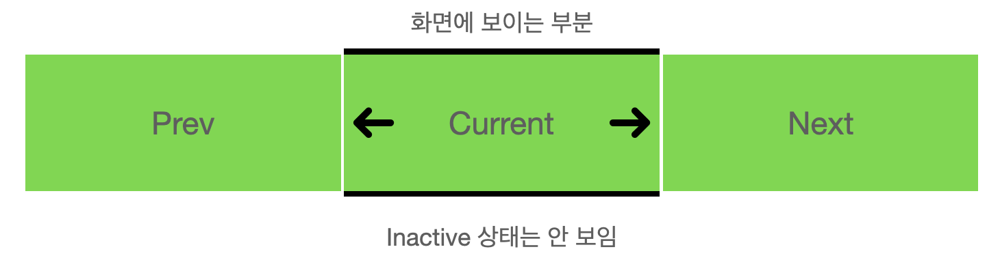

# 1. 문제를 개선한 캐로셀 만들기 시작

지난 글(https://www.witch.work/carousel-1/)에서는 tailwind를 써서 캐로셀을 만들었다. 하지만 몇 가지 문제가 있었다. 캐로셀에 들어가는 이미지들이 화면에 보이지 않을 때도 렌더링되는 문제가 있었다. 그리고 코드가 그렇게 깔끔하지 못했다. 이번 글에서는 그걸 개선하고 좀 더 코드가 깔끔하며 렌더링이 덜 일어나는 캐로셀을 제작해 본다.

# 2. 현재 보이는 사진만 렌더링해 주기

캐로셀에서 이미지를 더 적게 렌더링하려면 어떻게 해야 할까? 보이는 이미지만 렌더링해주면 된다. 따라서 현재 화면에 보이고 있는 사진, 바로 그전 차례의 사진, 바로 다음 차례의 사진만 렌더링하게 해보자. 여기서 이전과 다음 차례 사진도 렌더링해주는 이유는 추후 캐로셀의 화면 전환시 이전/다음 슬라이드로 넘어가는 애니메이션을 넣어 주기 위해서이다.

다음과 같은 타입을 먼저 정의해 주자.

```tsx
interface CarouselIndexType {
  prevIndex: number;
  currentIndex: number;
  nextIndex: number;
}
```

## 2.1 CarouselItem component

그럼 이 타입을 사용해서 어떻게 캐로셀의 이미지들을 렌더링할 것인가? `CarouselItem`컴포넌트에 현재 상태를 전달하고, 그 상태에 따라서 요소를 다른 방식으로 렌더링하는 방식을 생각해 보았다. 따라서 먼저 캐로셀이 현재 보여줘야 하는 인덱스와 캐로셀 아이템의 인덱스를 인수로 받아서 캐로셀 내부에서 아이템의 상태가 어떤지를 반환해 주는 함수를 만들었다.

```tsx
const CarouselItemStates = {
  PREV: "prev",
  CURRENT: "current",
  NEXT: "next",
  INACTIVE: "inactive",
} as const;
type CarouselItemStateType =
  typeof CarouselItemStates[keyof typeof CarouselItemStates];

function determineCarouselItemState(
  itemIndex: number,
  carouselIndex: CarouselIndexType
): CarouselItemStateType {
  switch (itemIndex) {
    case carouselIndex.prevIndex:
      return "prev";
    case carouselIndex.currentIndex:
      return "current";
    case carouselIndex.nextIndex:
      return "next";
    default:
      return "inactive";
  }
}
```

enum type을 사용하는 것보다 union type을 사용하는 것이 낫다고 해서 union type을 사용했다. enum type은 Javascript에는 존재하지 않는 기능이라 typescript 컴파일러는 즉시 실행 함수를 만들게 되는데 이렇게 되면 tree-shaking이 되지 않아서 좋지 않다고 한다. 이때 참고한 글은 LINE 엔지니어링 기술 블로그의 글인데 밑의 참고에 올려 놓겠다.

그럼 이제 `CarouselItem` 컴포넌트를 현재 아이템이 가져야 하는 상태를 인자로 받아 이에 따른 스타일을 적용해 주는 방식으로 작동하게 하자. 위의 `determineCarouselItemState`의 반환값을 이용할 것이므로 상태는 prev, current, next, inactive 를 사용할 것이다.

우리가 만들어 주고자 하는 상태는 다음과 같다.

    * prev: 왼쪽으로 이동하면 보여지는 이미지
    * current: 현재 보여지는 이미지
    * next: 오른쪽으로 이동하면 보여지는 이미지
    * inactive: 현재 보여지지 않는 이미지



이를 위해서 다음과 같은 방식을 생각해 주었다. 먼저 각 사진을 absoulte position으로 설정한다. 그리고 각 사진의 위치를 다음과 같은 className으로 설정한다.

- prev: `-translate-x-full`(transform: translateX(-100%); 와 동일)
- current: `translate-x-0`(transform: translateX(0); 와 동일. 평행이동해줄 필요가 없으므로 빈 문자열로 설정해도 된다)
- next: `translate-x-full`(transform: translateX(100%); 와 동일)
- inactive: 렌더링 안함

그리고 부모 컴포넌트를 relative position으로 설정하고 item width를 100%로 설정하면 current 상태의 item만 화면에 보여지게 될 것이다. 이전/다음 슬라이드는 각각 화면의 왼쪽과 오른쪽에 숨겨지게 될 것이다. 나머지 inactive 상태의 item은 렌더링 되지 않을 것이다.

이를 구현한 `CarouselItem` 컴포넌트는 다음과 같다.

```tsx
function CarouselItem({
  item,
  itemState,
}: {
  item: CarouselItemType;
  itemState: CarouselItemStateType;
}) {
  const carouselItemTranslateX = {
    [CarouselItemStates.PREV]: "-translate-x-full",
    [CarouselItemStates.CURRENT]: "",
    [CarouselItemStates.NEXT]: "translate-x-full",
  };

  return itemState !== CarouselItemStates.INACTIVE ? (
    <div
      className={`absolute w-full h-full shrink-0 ${carouselItemTranslateX[itemState]}`}
    >
      
    </div>
  ) : null;
}
```

이때 position이 absolute가 되면서 부모 컴포넌트의 높이에도 자동으로 들어가지 않는다. 따라서 가용 높이에 item이 맞춰서 들어갈 수 있도록 className에 `h-full`도 추가해 주었다.

## 2.2 Carousel Component

이제 `Carousel` 컴포넌트에서 `CarouselItem` 컴포넌트를 렌더링해 주면 된다. 기존의 translation state를 삭제하고 현재 캐로셀이 렌더링하고 있는 사진의 인덱스를 나타내는 `carouselIndex` state를 추가해 주었다. `prevClick` `nextClick` 함수도 거기에 맞게 수정했다. 그리고 `CarouselItem` 컴포넌트들이 렌더링되는 레벨의 상위에 relative position을 설정해서 캐로셀의 개별 요소들이 Carousel 컴포넌트가 렌더링되는 위치에 맞춰서 움직이게 했다.

```tsx
function Carousel({ items }: { items: CarouselItemType[] }) {
  const [carouselIndex, setCarouselIndex] = useState<CarouselIndexType>({
    prevIndex: items.length - 1,
    currentIndex: 0,
    nextIndex: 1,
  });

  const prevClick = (e: React.MouseEvent<HTMLButtonElement>) => {
    e.preventDefault();
    if (carouselIndex.currentIndex === 0) {
      setCarouselIndex({
        prevIndex: items.length - 2,
        currentIndex: items.length - 1,
        nextIndex: 0,
      });
    } else if (carouselIndex.currentIndex === 1) {
      setCarouselIndex({
        prevIndex: items.length - 1,
        currentIndex: 0,
        nextIndex: 1,
      });
    } else {
      setCarouselIndex({
        prevIndex: carouselIndex.currentIndex - 2,
        currentIndex: carouselIndex.currentIndex - 1,
        nextIndex: carouselIndex.currentIndex,
      });
    }
  };

  const nextClick = (e: React.MouseEvent<HTMLButtonElement>) => {
    e.preventDefault();
    if (carouselIndex.currentIndex === items.length - 1) {
      setCarouselIndex({
        prevIndex: items.length - 1,
        currentIndex: 0,
        nextIndex: 1,
      });
    } else if (carouselIndex.currentIndex === 0) {
      setCarouselIndex({
        prevIndex: 0,
        currentIndex: 1,
        nextIndex: 2,
      });
    } else {
      setCarouselIndex({
        prevIndex: carouselIndex.currentIndex,
        currentIndex: carouselIndex.currentIndex + 1,
        nextIndex: carouselIndex.currentIndex + 2,
      });
    }
  };

  return (
    <section>
      <div className="overflow-hidden">
        <div className={`relative flex flex-row w-full h-[50vh]`}>
          {items.map((item, index) => (
            <CarouselItem
              key={item.id}
              item={item}
              itemState={determineCarouselItemState(index, carouselIndex)}
            />
          ))}
        </div>
      </div>
      <button onClick={prevClick} className="p-3 border border-gray-500">
        이전 슬라이드
      </button>
      <button onClick={nextClick} className="p-3 border border-gray-500">
        다음 슬라이드
      </button>
    </section>
  );
}
```

이를 실행해 보면 우리가 의도한 대로 잘 작동하는 것을 확인할 수 있다. 또한 지난 글의 경우와 달리 tailwind style만을 적절히 사용했고 하드 코딩을 해주지도 않았다. 이제 애니메이션을 넣고 이를 좀 꾸며 보자.

# 3. 애니메이션 삽입

지금 만든 캐로셀은 화면 전환 시 딱히 전환 효과 없이 바로 화면에 표시되는 사진이 바뀐다. 하지만 일반적인 캐로셀은 사진이 넘어가는 효과가 있다. 이 효과를 삽입해 보자.

이는 간단하다. `CarouselItem` 컴포넌트에 transform에 대한 transition을 주면 된다. 이를 위해 tailwind의 transition 관련 클래스를 사용하자. 또한 tailwind의 기본 duration은 150ms인데 이는 좀 짧다고 느껴지므로 500ms로 늘려주었다. 최상위 div의 classname에 `transition-transform duration-500`가 추가된 걸 볼 수 있다.

```tsx
function CarouselItem({
  item,
  itemState,
}: {
  item: CarouselItemType;
  itemState: CarouselItemStateType;
}) {
  const carouselItemTranslateX = {
    [CarouselItemStates.PREV]: "-translate-x-full",
    [CarouselItemStates.CURRENT]: "",
    [CarouselItemStates.NEXT]: "translate-x-full",
  };

  return itemState !== CarouselItemStates.INACTIVE ? (
    <div
      className={`transition-transform duration-500 absolute w-full h-full shrink-0 ${carouselItemTranslateX[itemState]}`}
    >
      
    </div>
  ) : null;
}
```

# 4. 캐로셀 조작을 화살표로 하도록 바꿔주기

현재 캐로셀에서 이미지가 뜨는 곳 아래에는 `이전 슬라이드`, `다음 슬라이드`버튼이 있다. 이를 좀 더 사용자 친화적으로 바꿔보자. 이전 슬라이드, 다음 슬라이드 버튼을 좌우 화살표로 바꿔주고, 이를 클릭하면 캐로셀이 이동하도록 하자.

따라서 `react-icons`에 있는 화살표 아이콘을 사용하도록 하자. 이는 npm을 이용하여 설치할 수 있다. 나는 프로젝트의 다른 페이지를 만들면서 이미 `react-icons`를 설치해 놓았다. 따라서 여기 있는 `IoIosArrowForward`와 `IoIosArrowBack`를 사용하겠다.

먼저 `IoIosArrowForward`와 `IoIosArrowBack`를 import해주자. 그리고 현재 캐로셀의 구조는 다음과 같다. 캐로셀의 아이템들은 relative position으로 지정되어 있는 div 태그 내부에 있다. 또한 아이템 각각은 absolute position으로 지정되어 있다. 그런데 absolute position으로 지정된 요소는 일반적인 문서 흐름에 들어 있지 않다. 또한 페이지 레이아웃에 공간도 배정되지 않는다. 캐로셀의 각 아이템 요소는 absolute position이므로 문서 흐름에 없다는 것이다! relative position으로 지정된 div 내에는 아무 요소도 없는 것으로 간주된다.

따라서 아무 요소도 없이 비어 있는 것으로 간주되는 div 태그(relative position으로 된 것)에 화살표 아이콘을 넣어주면 된다. 이 빈 태그에 `flex flex-row justify-between`을 추가해주면 두 화살표가 좌우 끝으로 정렬되는 것을 볼 수 있다. 이 화살표의 onClick 이벤트에 기존에 있던 `prevClick`과 `nextClick`함수를 연결해 주면 된다. 코드를 보자. 위에 있는 캐로셀 코드의 컴포넌트 구조를 다음과 같이 바꿔주면 된다.

```tsx
<section>
  <div className="overflow-hidden">
    <div className="relative flex flex-row justify-between w-full h-[50vh]">
      {/* 이 CarouselItem들은 absolute position이기 때문에 레이아웃에서 공간을 차지하지 않는다 */}
      {items.map((item, index) => (
        <CarouselItem
          key={item.id}
          item={item}
          itemState={determineCarouselItemState(index, carouselIndex)}
        />
      ))}
      <button onClick={prevClick} className="z-10 h-full">
        <IoIosArrowBack className="text-base-100" size={60} />
      </button>
      <button onClick={nextClick} className="z-10 h-full">
        <IoIosArrowForward className="text-base-100" size={60} />
      </button>
    </div>
  </div>
</section>
```

# 5. 캐로셀 내에 텍스트와 링크 추가하기

일반적인 캐로셀에는 텍스트와 링크가 들어가는 경우가 많다. 이번에는 캐로셀 내에 텍스트와 링크를 추가해보자. 먼저 `CarouselItemType`을 다음과 같이 수정해주자. 캐로셀의 제목, 부제목, 간단한 내용, 그리고 그 캐로셀에 해당하는 링크를 타입에 추가해주었다.

```tsx
interface CarouselItemType {
  id: number;
  image: string;
  title: string;
  subtitle: string;
  content: string;
  link: string;
}
```

그리고 다음과 같은 내용들을 담은 샘플을 만들어 주었다. 내용은 나중에 필요한 대로 바꾸면 되니까 일단은 이렇게 해두자.

```tsx
const tempItems: CarouselItemType[] = [
  {
    id: 1,
    image: carouselImage,
    title: "환영합니다",
    subtitle: "이건 첫번째 샘플 캐로셀입니다.",
    content: "샘플 캐로셀의 내용입니다.",
    link: "/",
  },
  {
    id: 2,
    image: carouselImage2,
    title: "환영합니다 2",
    subtitle: "이건 두번째 샘플 캐로셀입니다.",
    content: "샘플 캐로셀의 내용입니다.",
    link: "/",
  },
  {
    id: 3,
    image: carouselImage3,
    title: "환영합니다 3",
    subtitle: "이건 세번째 샘플 캐로셀입니다.",
    content: "샘플 캐로셀의 내용입니다.",
    link: "/",
  },
];
```

그러면 이를 수용할 부분을 먼저 만들어 준다. 새로 추가된 제목, 부제목 등의 내용은 캐로셀 요소의 사진 위에 들어가야 한다. 이는 사진과 문서 흐름이 섞이지 않고 배치되어야 함을 뜻한다. 따라서 이 요소는 absolute position으로 지정되어야 한다. 부모에도 absolute position으로 지정된 요소가 있기 때문에 위치 지정 조상 요소에 대해서도 걱정할 필요가 없다.

앞서 말한 대로 div 태그를 구성하고 나면 내부 내용은 자유롭게 배치하면 된다. 난 그냥 위에서 아래로 쭉 늘어놓았다. 또한 링크는 daisyUI에서 제공하는 버튼을 한번 사용해 보았다. glass 효과를 한번 써보고 싶어서..그리고 링크는 react-router-dom에서 제공하는 Link 컴포넌트이다. 아무튼 캐로셀 개별 아이템은 다음과 같이 생긴 컴포넌트에 수용하였다.

```tsx
<div className="absolute flex flex-col gap-2 items-center">
  <h1 className="text-4xl text-base-100">{item.title}</h1>
  <h2 className="text-2xl text-base-100">{item.subtitle}</h2>
  <p className="text-base text-base-100">{item.content}</p>
  <Link to={item.link}>
    <button className="btn btn-primary w-32 btn-outline glass hover:glass">
      이동하기
    </button>
  </Link>
</div>
```

이렇게 사진 위에 들어갈 요소들을 디자인했으니 배치해 줘야 한다. 이는 상위 컴포넌트에 `flex flex-col justify-center items-center` 클래스를 지정해 주면 된다. 이것까지 처리한 `CarouselItem` 컴포넌트는 다음과 같다.

```tsx
function CarouselItem({
  item,
  itemState,
}: {
  item: CarouselItemType;
  itemState: CarouselItemStateType;
}) {
  const carouselItemTranslateX = {
    [CarouselItemStates.PREV]: "-translate-x-full",
    [CarouselItemStates.CURRENT]: "",
    [CarouselItemStates.NEXT]: "translate-x-full",
  };

  return itemState !== CarouselItemStates.INACTIVE ? (
    <div
      className={`absolute flex flex-col justify-center items-center w-full h-full shrink-0 transition-transform duration-500 ${carouselItemTranslateX[itemState]}`}
    >
      
      {/* 사진 위에 배치되는 글자, 링크 등의 요소들이다 */}
      <div className="absolute flex flex-col gap-2 items-center">
        <h1 className="text-4xl text-base-100">{item.title}</h1>
        <h2 className="text-2xl text-base-100">{item.subtitle}</h2>
        <p className="text-base text-base-100">{item.content}</p>
        <Link to={item.link}>
          <button className="btn btn-primary w-32 btn-outline glass hover:glass">
            이동하기
          </button>
        </Link>
      </div>
    </div>
  ) : null;
}
```

이렇게 하면 문제없이 캐로셀 요소의 이미지 위에 우리가 원하는 제목, 부제목, 컨텐츠, 링크 버튼이 배치된다. 지금까지 만든 캐로셀의 형태는 다음과 같다.


디자인은 조금 조악하지만 어쨌든 있을 건 다 있어 보이고, 버튼들도 잘 동작한다. 애니메이션 효과도 촌스럽긴 하지만 있다. 다 된 것 같은데? 싶지만 물론 그럴 리가 없다. 네비게이션도 구현해야 하고 모바일 환경을 고려해서 터치 이벤트에도 반응하도록 해야 한다. 접근성도 고민해야 한다. 캐로셀이 괜히 난이도가 높은 게 아니다. 하지만 일단 한 고비를 넘은 것 같다. 그러므로 일단 글을 마치고다음 글에서부터는 캐로셀의 네비게이션을 만들어 보도록 하겠다.

# 6. 캐로셀의 페이지네이션 구현하기

우리의 캐로셀엔 아직 문제가 많다. 첫번째로 생각나는 문제는 이 캐로셀이 현재 보여주는 이미지 외에는 아무 정보도 제공하지 않는다는 것이다. 사용자는 캐로셀에 얼마나 많은 이미지가 있는지, 각 캐로셀에 들어 있는 이미지는 무슨 의미인지 알 수가 없다. 캐로셀에 있는 특정 차례로 이동할 수도 없다. 따라서 캐로셀의 각 페이지로 이동할 수 있으며 간단한 설명이 있는 버튼들을 캐로셀 하단에 만들어 보자.

# 참고

enum type보다는 union type을 쓰자 https://engineering.linecorp.com/ko/blog/typescript-enum-tree-shaking/

position absolute https://developer.mozilla.org/ko/docs/Web/CSS/position

position css에 대한 좀더 구체적인 설명 https://velog.io/@rimu/css-%EC%9A%94%EC%86%8C%EC%9D%98-%EC%9C%84%EC%B9%98position-%EC%A0%95%EB%A6%AC
