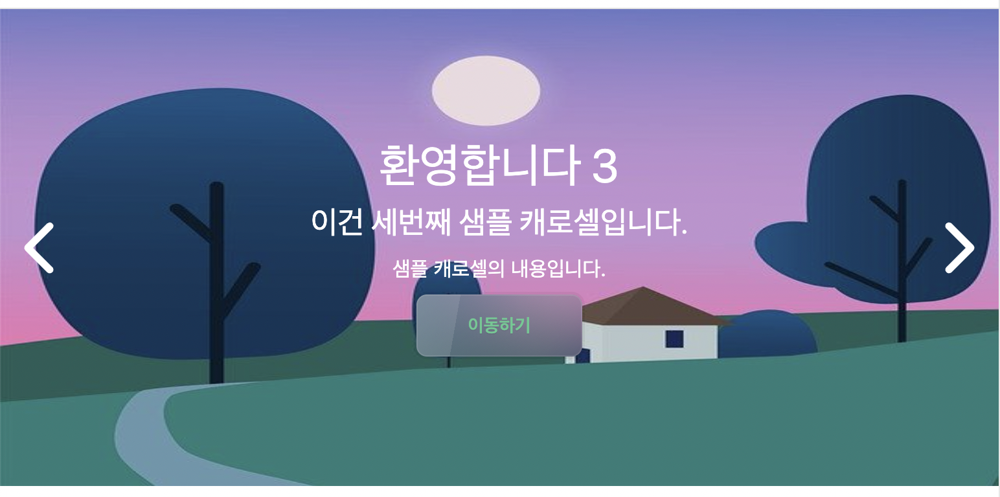

# 1. 캐로셀이 캐로셀처럼 보이지 않아..

첫번째 글에서 언급한 캐로셀의 조건 중 다음과 같은 것이 있었다.

- 캐로셀 안에는 넘길 수 있는 내용이 더 있다는 것을 알려 주는 표시자나 내비게이션이 있다.
- 이미지와 짧은 텍스트가 있다.

하지만 우리의 캐로셀은 이런 조건들을 만족하지 못하고 있다. 캐로셀을 넘기는 건 `이전 슬라이드`와 `다음 슬라이드`버튼에 의존하고 있으며 설명을 위한 짧은 텍스트도 들어가 있지 않다. 캐로셀은 사이트의 메인에 걸리는 핵심 이미지인 만큼 여기에 어떤 슬로건이나 링크 등 많은 것을 넣을 수 있을 텐데 말이다. 또한 슬라이드 전환시 밋밋하게 사진이 바뀐다. 어떤 애니메이션도 없다.

이런 디자인적인 문제들을 이 글에서는 풀어가 보려고 한다. 디자이너가 따로 있는 게 아니므로 완벽하진 않겠지만 그나마 아까보단 캐로셀처럼 보일 수 있도록.

# 2. 애니메이션 삽입

지금 만든 캐로셀은 화면 전환 시 딱히 전환 효과 없이 바로 화면에 표시되는 사진이 바뀐다. 하지만 일반적인 캐로셀은 사진이 넘어가는 효과가 있다. 이 효과를 삽입해 보자.

이는 간단하다. `CarouselItem` 컴포넌트에 transform에 대한 transition을 주면 된다. 이를 위해 tailwind의 transition 관련 클래스를 사용하자. 또한 tailwind의 기본 duration은 150ms인데 이는 좀 짧다고 느껴지므로 500ms로 늘려주었다. 최상위 div의 classname에 `transition-transform duration-500`가 추가된 걸 볼 수 있다.

```tsx
function CarouselItem({
  item,
  itemState,
}: {
  item: CarouselItemType;
  itemState: CarouselItemStateType;
}) {
  const carouselItemTranslateX = {
    [CarouselItemStates.PREV]: "-translate-x-full",
    [CarouselItemStates.CURRENT]: "",
    [CarouselItemStates.NEXT]: "translate-x-full",
  };

  return itemState !== CarouselItemStates.INACTIVE ? (
    <div
      className={`transition-transform duration-500 absolute w-full h-full shrink-0 ${carouselItemTranslateX[itemState]}`}
    >
      
    </div>
  ) : null;
}
```

# 3. 캐로셀 조작을 화살표로 하도록 바꿔주기

현재 캐로셀에서 이미지가 뜨는 곳 아래에는 `이전 슬라이드`, `다음 슬라이드`버튼이 있다. 이를 좀 더 사용자 친화적으로 바꿔보자. 이전 슬라이드, 다음 슬라이드 버튼을 좌우 화살표로 바꿔주고, 이를 클릭하면 캐로셀이 이동하도록 하자.

따라서 `react-icons`에 있는 화살표 아이콘을 사용하도록 하자. 이는 npm을 이용하여 설치할 수 있다. 나는 프로젝트의 다른 페이지를 만들면서 이미 `react-icons`를 설치해 놓았다. 따라서 여기 있는 `IoIosArrowForward`와 `IoIosArrowBack`를 사용하겠다.

먼저 `IoIosArrowForward`와 `IoIosArrowBack`를 import해주자. 그리고 현재 캐로셀의 구조는 다음과 같다. 캐로셀의 아이템들은 relative position으로 지정되어 있는 div 태그 내부에 있다. 또한 아이템 각각은 absolute position으로 지정되어 있다. 그런데 absolute position으로 지정된 요소는 일반적인 문서 흐름에 들어 있지 않다. 또한 페이지 레이아웃에 공간도 배정되지 않는다. 캐로셀의 각 아이템 요소는 absolute position이므로 문서 흐름에 없다는 것이다! relative position으로 지정된 div 내에는 아무 요소도 없는 것으로 간주된다.

따라서 아무 요소도 없이 비어 있는 것으로 간주되는 div 태그(relative position으로 된 것)에 화살표 아이콘을 넣어주면 된다. 이 빈 태그에 `flex flex-row justify-between`을 추가해주면 두 화살표가 좌우 끝으로 정렬되는 것을 볼 수 있다. 이 화살표의 onClick 이벤트에 기존에 있던 `prevClick`과 `nextClick`함수를 연결해 주면 된다. 코드를 보자. 위에 있는 캐로셀 코드의 컴포넌트 구조를 다음과 같이 바꿔주면 된다.

```tsx
<section>
  <div className="overflow-hidden">
    <div className="relative flex flex-row justify-between w-full h-[50vh]">
      {/* 이 CarouselItem들은 absolute position이기 때문에 레이아웃에서 공간을 차지하지 않는다 */}
      {items.map((item, index) => (
        <CarouselItem
          key={item.id}
          item={item}
          itemState={determineCarouselItemState(index, carouselIndex)}
        />
      ))}
      <button onClick={prevClick} className="z-10 h-full">
        <IoIosArrowBack className="text-base-100" size={60} />
      </button>
      <button onClick={nextClick} className="z-10 h-full">
        <IoIosArrowForward className="text-base-100" size={60} />
      </button>
    </div>
  </div>
</section>
```

# 4. 캐로셀 내에 텍스트와 링크 추가하기

일반적인 캐로셀에는 텍스트와 링크가 들어가는 경우가 많다. 이번에는 캐로셀 내에 텍스트와 링크를 추가해보자. 먼저 `CarouselItemType`을 다음과 같이 수정해주자. 캐로셀의 제목, 부제목, 간단한 내용, 그리고 그 캐로셀에 해당하는 링크를 타입에 추가해주었다.

```tsx
interface CarouselItemType {
  id: number;
  image: string;
  title: string;
  subtitle: string;
  content: string;
  link: string;
}
```

그리고 다음과 같은 내용들을 담은 샘플을 만들어 주었다. 내용은 나중에 필요한 대로 바꾸면 되니까 일단은 이렇게 해두자.

```tsx
const tempItems: CarouselItemType[] = [
  {
    id: 1,
    image: carouselImage,
    title: "환영합니다",
    subtitle: "이건 첫번째 샘플 캐로셀입니다.",
    content: "샘플 캐로셀의 내용입니다.",
    link: "/",
  },
  {
    id: 2,
    image: carouselImage2,
    title: "환영합니다 2",
    subtitle: "이건 두번째 샘플 캐로셀입니다.",
    content: "샘플 캐로셀의 내용입니다.",
    link: "/",
  },
  {
    id: 3,
    image: carouselImage3,
    title: "환영합니다 3",
    subtitle: "이건 세번째 샘플 캐로셀입니다.",
    content: "샘플 캐로셀의 내용입니다.",
    link: "/",
  },
];
```

그러면 이를 수용할 부분을 먼저 만들어 준다. 새로 추가된 제목, 부제목 등의 내용은 캐로셀 요소의 사진 위에 들어가야 한다. 이는 사진과 문서 흐름이 섞이지 않고 배치되어야 함을 뜻한다. 따라서 이 요소는 absolute position으로 지정되어야 한다. 부모에도 absolute position으로 지정된 요소가 있기 때문에 위치 지정 조상 요소에 대해서도 걱정할 필요가 없다.

앞서 말한 대로 div 태그를 구성하고 나면 내부 내용은 자유롭게 배치하면 된다. 난 그냥 위에서 아래로 쭉 늘어놓았다. 또한 링크는 daisyUI에서 제공하는 버튼을 한번 사용해 보았다. glass 효과를 한번 써보고 싶어서..그리고 링크는 react-router-dom에서 제공하는 Link 컴포넌트이다. 아무튼 캐로셀 개별 아이템은 다음과 같이 생긴 컴포넌트에 수용하였다.

```tsx
<div className="absolute flex flex-col gap-2 items-center">
  <h1 className="text-4xl text-base-100">{item.title}</h1>
  <h2 className="text-2xl text-base-100">{item.subtitle}</h2>
  <p className="text-base text-base-100">{item.content}</p>
  <Link to={item.link}>
    <button className="btn btn-primary w-32 btn-outline glass hover:glass">
      이동하기
    </button>
  </Link>
</div>
```

이렇게 사진 위에 들어갈 요소들을 디자인했으니 배치해 줘야 한다. 이는 상위 컴포넌트에 `flex flex-col justify-center items-center` 클래스를 지정해 주면 된다. 이것까지 처리한 `CarouselItem` 컴포넌트는 다음과 같다.

```tsx
function CarouselItem({
  item,
  itemState,
}: {
  item: CarouselItemType;
  itemState: CarouselItemStateType;
}) {
  const carouselItemTranslateX = {
    [CarouselItemStates.PREV]: "-translate-x-full",
    [CarouselItemStates.CURRENT]: "",
    [CarouselItemStates.NEXT]: "translate-x-full",
  };

  return itemState !== CarouselItemStates.INACTIVE ? (
    <div
      className={`absolute flex flex-col justify-center items-center w-full h-full shrink-0 transition-transform duration-500 ${carouselItemTranslateX[itemState]}`}
    >
      
      {/* 사진 위에 배치되는 글자, 링크 등의 요소들이다 */}
      <div className="absolute flex flex-col gap-2 items-center">
        <h1 className="text-4xl text-base-100">{item.title}</h1>
        <h2 className="text-2xl text-base-100">{item.subtitle}</h2>
        <p className="text-base text-base-100">{item.content}</p>
        <Link to={item.link}>
          <button className="btn btn-primary w-32 btn-outline glass hover:glass">
            이동하기
          </button>
        </Link>
      </div>
    </div>
  ) : null;
}
```

이렇게 하면 문제없이 캐로셀 요소의 이미지 위에 우리가 원하는 제목, 부제목, 컨텐츠, 링크 버튼이 배치된다. 지금까지 만든 캐로셀의 형태는 다음과 같다.



디자인은 조금 조악하지만 어쨌든 있을 건 다 있어 보이고, 버튼들도 잘 동작한다. 애니메이션 효과도 촌스럽긴 하지만 있다. 다 된 것 같은데? 싶지만 물론 그럴 리가 없다. 네비게이션도 구현해야 하고 모바일 환경을 고려해서 터치 이벤트에도 반응하도록 해야 한다. 접근성도 고민해야 한다. 캐로셀이 괜히 난이도가 높은 게 아니다. 하지만 일단 한 고비를 넘은 것 같다. 그러므로 일단 글을 마치고 다음 글에서부터는 캐로셀의 네비게이션을 만들어 보도록 하겠다.

# 참고

enum type보다는 union type을 쓰자 https://engineering.linecorp.com/ko/blog/typescript-enum-tree-shaking/

position absolute https://developer.mozilla.org/ko/docs/Web/CSS/position

position css에 대한 좀더 구체적인 설명 https://velog.io/@rimu/css-%EC%9A%94%EC%86%8C%EC%9D%98-%EC%9C%84%EC%B9%98position-%EC%A0%95%EB%A6%AC
