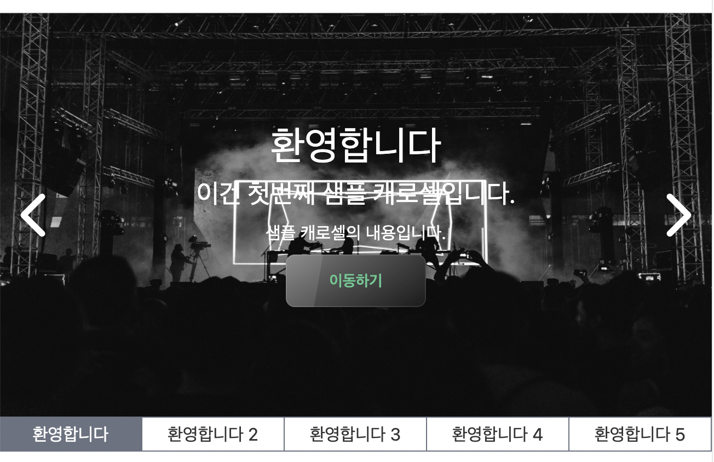

# 1. 캐로셀 네비게이션 구현 시작

지난 글들에서는 캐로셀에서 각 이미지들이 넘어가는 동작을 구현해 보고 버튼 등의 UI를 구현해 보았다. 우리의 캐로셀은 점점 발전하고 있다. 이제 웬만큼 캐로셀처럼 보이기는 한다. 하지만 아직 우리는 할 게 많다. 네비게이션도 구현해야 하고 모바일 환경을 고려해서 터치 이벤트에도 반응하도록 해야 한다. 접근성도 고민해야 한다. 캐로셀이 괜히 난이도가 높은 게 아니다. 그중에 이번 글에서는 캐로셀의 네비게이션을 구현해 본다. 단순히 버튼만 나열하는 것이 아니라 나름대로 깔끔하게, 또 사용하기 편하게 구현해 보고자 한다.

네비게이션을 만드는 이유는 이 캐로셀이 현재 보여주는 이미지 외에는 아무 정보도 제공하지 않기 때문이다. 사용자는 캐로셀에 얼마나 많은 이미지가 있는지, 각 캐로셀에 들어 있는 이미지는 무슨 의미인지 알 수가 없다. 설명이 있기는 하지만 그것도 결국 그 이미지까지 캐로셀을 넘겨 봐야 알 수 있다.

또한 내가 보고 싶은 게 어디 있는지 알아서 캐로셀의 그 이미지로 이동하려고 하더라도 캐로셀에 있는 특정 차례로 바로 이동할 수도 없다. 따라서 캐로셀의 각 페이지로 이동할 수 있으며 간단한 설명이 있는 네비게이션 버튼들을 캐로셀 하단에 만들어 보자.

# 2. 네비게이션 버튼 만들기

우리는 이미 각 이미지에 대한 간략한 정보를 제공하는 속성을 가지고 있다. `CarouselItemType`타입에는 이미 `title`이라는 속성이 붙어 있다. 이 속성을 이용해서 각 이미지에 대한 설명이 표시된 네비게이션 버튼을 만들어 보자. 먼저 한 줄에 버튼이 모두 들어가게 만들어 보자.

캐로셀의 현재 영역 아래에 div 태그를 하나 더 만들고 full width를 부여한 후 flex를 이용해서 가로로 배열시킨다. 그리고 각 버튼은 flex-1 클래스(`flex:1 1 0;`)을 부여해서 버튼들이 부모 컨테이너를 같은 크기로 분할하도록 한다. 이를 코드로 짠 버튼 묶음 컴포넌트는 다음과 같다.

```tsx
<div className="flex flex-row w-full">
  {items.map((item) => (
    <button className="flex-1 h-8 border border-gray-500" key={item.id}>
      {item.title}
    </button>
  ))}
</div>
```

이를 Carousel 컴포넌트의 하단에 추가하면 다음과 같은 모습으로 렌더링되게 된다.


## 2.1 겹치는 테두리 제거

그런데 렌더링된 걸 잘 보면 두 버튼이 만나는 곳의 테두리가 겹치는 것을 볼 수 있다. 이를 해결하는 건 간단하다. 버튼이 겹치는 곳에는 테두리를 안 만들면 된다. 먼저 버튼의 오른쪽 테두리를 제거한다. 단순한 `border` 클래스 대신 `border-y border-l` 클래스를 주면 된다. 이렇게 하면 오른쪽 테두리는 제거되고 위쪽과 왼쪽 테두리는 그대로 남게 된다.

아직 하나의 문제가 있다. 우리가 오른쪽 테두리를 제거해 준 것은 다음에 오는 버튼의 왼쪽 테두리가 있어서 이 버튼의 오른쪽 테두리 역할도 겸해 줄 거라고 생각했기 때문이다. 하지만 맨 오른쪽 버튼의 경우 다음에 오는 버튼이 없다. 즉 맨 오른쪽 버튼의 경우 오른쪽 테두리가 아예 없게 된다.

이는 현재 버튼이 한 줄에 다 들어가 있으므로 last-child 선택자를 이용해서 맨 오른쪽 버튼의 오른쪽 테두리를 다시 만들어 주는 걸로 해결해 줄 수 있다. 나중에 버튼이 2줄 이상이게 되면 또 문제가 발생하겠지만 일단은 이렇게 해결해 주자.

```tsx
<div className="flex flex-row w-full">
  {items.map((item) => (
    <button
      className="flex-1 h-8 border-y border-l last:border-r border-gray-500"
      key={item.id}
    >
      {item.title}
    </button>
  ))}
</div>
```

이렇게 하면 현재 코드에서는 버튼의 테두리 겹침이 일어나지 않는다.

# 3. 네비게이션 버튼의 현재 위치 표시

사용자가 지금 보고 있는 페이지가 어디인지 알 수 있게 해주는 정보도 제공해 보자. 간단하게, 캐로셀이 현재 위치한 페이지의 경우 해당 버튼이 활성화되었다는 표시로 색을 입혀 주는 정도면 될 것이다. 그리고 이왕이면 활성화된 버튼이 네비게이션의 가운데 위치하면 좋을 것이다.

이제 네비게이션의 코드가 복잡해지기 시작하므로 네비게이션 버튼 묶음을 컴포넌트로 분리해 주자. 이름은 `CarouselNavigation`정도로 짓자. 다시 한번 코드를 쓰면 이런 식이 될 것이다.

```tsx
function CarouselNavigation({
  items,
  currentIndex,
}: {
  items: CarouselItemType[];
  currentIndex: number;
}) {
  return (
    <div className="flex flex-row w-full">
      {items.map((item) => (
        <button
          className="flex-1 h-8 border-y border-l last:border-r border-gray-500"
          key={item.id}
        >
          {item.title}
        </button>
      ))}
    </div>
  );
}
```

이제 우리가 원하는 작업을 진행시켜 보자. 캐로셀 네비게이션의 각 버튼도 컴포넌트로 분리할 것이다. 가져야 할 상태를 props로 받고(active, pending, inactive 정도의 상태가 있을 것)거기에 따라 적절한 방식으로 렌더링해주는 컴포넌트로 만들 예정이다. 그전에 먼저 캐로셀 네비게이션 컴포넌트를 완성시켜 보자.

캐로셀 네비게이션엔 기본적으로 현재 활성화되어 있는 페이지의 버튼, 그리고 그 앞뒤 2개씩의 인덱스에 해당하는 버튼까지 5개의 버튼이 들어가도록 할 것이다. 나머지 버튼은 일단은 화면에 보이지 않도록 한다. 각 버튼은 이에 해당하는 상태를 props로 받아서 거기에 맞게 적절한 버튼을 렌더링하거나 아무것도 렌더링하지 않을 것이다.

이에 맞게 캐로셀 네비게이션 컴포넌트를 다음과 같이 작성한다.

```tsx
function CarouselNavigation({
  items,
  currentIndex,
}: {
  items: CarouselItemType[];
  // 현재 캐로셀이 보여주고 있는 인덱스
  currentIndex: number;
}) {
  //버튼의 상태를 결정하는 함수
  const determineCarouselButtonState = (buttonIndex: number) => {
    switch (currentIndex) {
      // 캐로셀의 현재 인덱스
      case buttonIndex:
        return "active";
      // 현재 캐로셀이 초반부에 있을 경우
      case 0:
      case 1:
        return buttonIndex < 5 ? "pending" : "inactive";
      // 현재 캐로셀이 후반부에 있을 경우
      case items.length - 1:
      case items.length - 2:
        return buttonIndex >= items.length - 5 ? "pending" : "inactive";
      default:
        return currentIndex - 2 <= buttonIndex &&
          buttonIndex <= currentIndex + 2
          ? "pending"
          : "inactive";
    }
  };

  return (
    <div className="flex flex-row w-full">
      {items.map((item, index) => (
        <CarouselNavigationButton
          item={item}
          buttonState={determineCarouselButtonState(index)}
        />
      ))}
    </div>
  );
}
```

그러면 이렇게 버튼의 상태를 props로 받아서 적절하게 버튼을 렌더링해주는 `CarouselNavigationButton` 컴포넌트를 만들어보자. 코드는 다음과 같다. 첫번째 글에서 설명했던, 객체를 이용해서 tailwind의 className을 결정해 주는 방식을 썼다.

```tsx
function CarouselNavigationButton({
  item,
  buttonState,
}: {
  item: CarouselItemType;
  buttonState: string;
}) {
  // active는 현재 캐로셀에서 보이고 있는 아이템에 해당하는 버튼의 상태
  // pending은 화면에는 보이지만 활성화되어 있지 않은 버튼의 상태
  const carouselButtonConfig: { [key: string]: string } = {
    active: "border-none bg-gray-500 text-base-100 hover:bg-gray-600",
    pending:
      "border-y border-l last:border-r border-gray-500 hover:bg-gray-200",
  };

  return buttonState !== "inactive" ? (
    <button
      className={`flex-1 h-8 ${carouselButtonConfig[buttonState]}`}
      key={item.id}
    >
      {item.title}
    </button>
  ) : null;
}
```

여기까지 완료하고 캐로셀을 렌더링해보면 아래와 같이 보인다. 디자인이 그렇게 훌륭하지는 않지만 어쨌든 각 페이지에 해당하는 버튼이 표시되고, 주변 페이지의 버튼도 네비게이션에 잘 표시된다. 캐로셀이 초반 페이지나 후반 페이지에 있을 때에도 꽤 일반적으로 잘 작동한다. 네비게이션은 언제나 5개(물론 캐로셀에 5개 미만의 요소가 있을 때는 제외)의 버튼을 가지고 활성화된 페이지의 버튼을 잘 감지한다.



## 3.1 네비게이션 버튼에도 애니메이션 넣기

네비게이션에서 활성화된 버튼이 바뀔 때에도 애니메이션 효과를 줄 수 있다. 하지만 위에서 캐로셀 페이지가 전환될 때 이미 translation에 대한 애니메이션이 있다. 따라서 네비게이션의 전환에도 현란한 전환 효과를 넣는 건 좋지 않아 보인다. 따라서 색상에 대한 transition 효과만 주자. duration은 적당히 700ms로 주자. `transition-colors duration-700` className만 추가하면 된다. 이를 추가한 `CarouselNavigationButton`컴포넌트는 다음과 같다.

```tsx
function CarouselNavigationButton({
  item,
  buttonState,
}: {
  item: CarouselItemType;
  buttonState: string;
}) {
  // active는 현재 캐로셀에서 보이고 있는 아이템에 해당하는 버튼의 상태
  // pending은 화면에는 보이지만 활성화되어 있지 않은 버튼의 상태
  const carouselButtonConfig: { [key: string]: string } = {
    active: "border-none bg-gray-500 text-base-100 hover:bg-gray-600",
    pending:
      "border-y border-l last:border-r border-gray-500 hover:bg-gray-200",
  };

  return buttonState !== "inactive" ? (
    <button
      className={`flex-1 h-8 transition-colors duration-700 ${carouselButtonConfig[buttonState]}`}
      key={item.id}
    >
      {item.title}
    </button>
  ) : null;
}
```

# 4. 네비게이션 버튼 동작 구현

하지만 지금은 캐로셀의 네비게이션 버튼을 눌렀을 때 그 페이지로 이동하는 기능이 없다. 기존에 있는 화살표를 통해 이동하면 거기에 맞는 버튼 색이 바뀔 뿐이다. 이제 네비게이션 버튼의 기능을 구현해 보자.

# 참고

자식 요소들의 너비를 균등하게 분배하기 https://stackoverflow.com/questions/23930684/allocate-equal-width-to-child-elements-with-css

`flex:1 1 0;`의 의미 https://heewon26.tistory.com/275

버튼 테두리가 겹치는 현상 막기 https://stackoverflow.com/questions/12692089/preventing-double-borders-in-css
