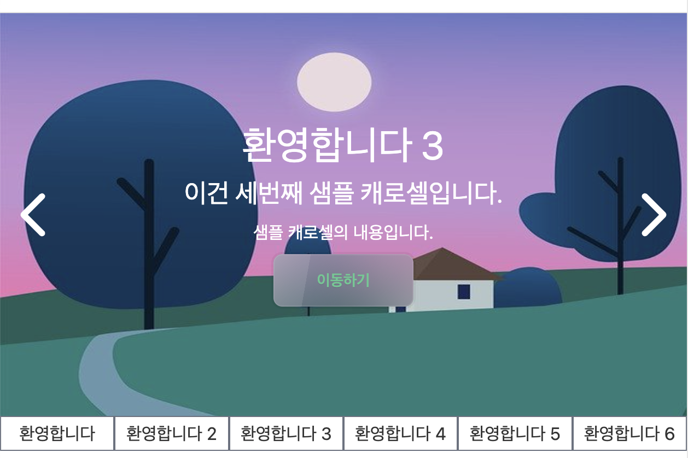

# 1. 캐로셀 네비게이션 구현 시작

지난 글들에서는 캐로셀에서 각 이미지들이 넘어가는 동작을 구현해 보고 버튼 등의 UI를 구현해 보았다. 우리의 캐로셀은 점점 발전하고 있다. 이제 웬만큼 캐로셀처럼 보이기는 한다. 하지만 아직 우리는 할 게 많다. 네비게이션도 구현해야 하고 모바일 환경을 고려해서 터치 이벤트에도 반응하도록 해야 한다. 접근성도 고민해야 한다. 캐로셀이 괜히 난이도가 높은 게 아니다. 그중에 이번 글에서는 캐로셀의 네비게이션을 구현해 본다. 단순히 버튼만 나열하는 것이 아니라 나름대로 깔끔하게, 또 사용하기 편하게 구현해 보고자 한다.

네비게이션을 만드는 이유는 이 캐로셀이 현재 보여주는 이미지 외에는 아무 정보도 제공하지 않기 때문이다. 사용자는 캐로셀에 얼마나 많은 이미지가 있는지, 각 캐로셀에 들어 있는 이미지는 무슨 의미인지 알 수가 없다. 설명이 있기는 하지만 그것도 결국 그 이미지까지 캐로셀을 넘겨 봐야 알 수 있다.

또한 내가 보고 싶은 게 어디 있는지 알아서 캐로셀의 그 이미지로 이동하려고 하더라도 캐로셀에 있는 특정 차례로 바로 이동할 수도 없다. 따라서 캐로셀의 각 페이지로 이동할 수 있으며 간단한 설명이 있는 네비게이션 버튼들을 캐로셀 하단에 만들어 보자.

# 2. 네비게이션 버튼 만들기

우리는 이미 각 이미지에 대한 간략한 정보를 제공하는 속성을 가지고 있다. `CarouselItemType`타입에는 이미 `title`이라는 속성이 붙어 있다. 이 속성을 이용해서 각 이미지에 대한 설명이 표시된 네비게이션 버튼을 만들어 보자. 먼저 한 줄에 버튼이 모두 들어가게 만들어 보자.

캐로셀의 현재 영역 아래에 div 태그를 하나 더 만들고 full width를 부여한 후 flex를 이용해서 가로로 배열시킨다. 그리고 각 버튼은 flex-1 클래스(`flex:1 1 0;`)을 부여해서 버튼들이 부모 컨테이너를 같은 크기로 분할하도록 한다. 이를 코드로 짠 버튼 묶음 컴포넌트는 다음과 같다.

```tsx
<div className="flex flex-row w-full">
  {items.map((item) => (
    <button className="flex-1 h-8 border border-gray-500" key={item.id}>
      {item.title}
    </button>
  ))}
</div>
```

이를 Carousel 컴포넌트의 하단에 추가하면 다음과 같은 모습으로 렌더링되게 된다.



## 2.1 겹치는 테두리 제거

그런데 렌더링된 걸 잘 보면 두 버튼이 만나는 곳의 테두리가 겹치는 것을 볼 수 있다. 이를 해결하는 건 간단하다. 버튼이 겹치는 곳에는 테두리를 안 만들면 된다. 먼저 버튼의 오른쪽 테두리를 제거한다. 단순한 `border` 클래스 대신 `border-y border-l` 클래스를 주면 된다. 이렇게 하면 오른쪽 테두리는 제거되고 위쪽과 왼쪽 테두리는 그대로 남게 된다.

아직 하나의 문제가 있다. 우리가 오른쪽 테두리를 제거해 준 것은 다음에 오는 버튼의 왼쪽 테두리가 있어서 이 버튼의 오른쪽 테두리 역할도 겸해 줄 거라고 생각했기 때문이다. 하지만 맨 오른쪽 버튼의 경우 다음에 오는 버튼이 없다. 즉 맨 오른쪽 버튼의 경우 오른쪽 테두리가 아예 없게 된다.

이는 현재 버튼이 한 줄에 다 들어가 있으므로 last-child 선택자를 이용해서 맨 오른쪽 버튼의 오른쪽 테두리를 다시 만들어 주는 걸로 해결해 줄 수 있다. 나중에 버튼이 2줄 이상이게 되면 또 문제가 발생하겠지만 일단은 이렇게 해결해 주자.

```tsx
<div className="flex flex-row w-full">
  {items.map((item) => (
    <button
      className="flex-1 h-8 border-y border-l last:border-r border-gray-500"
      key={item.id}
    >
      {item.title}
    </button>
  ))}
</div>
```

이렇게 하면 버튼의 테두리 겹침이 일어나지 않는다.

# 참고

자식 요소들의 너비를 균등하게 분배하기 https://stackoverflow.com/questions/23930684/allocate-equal-width-to-child-elements-with-css

`flex:1 1 0;`의 의미 https://heewon26.tistory.com/275

버튼 테두리가 겹치는 현상 막기 https://stackoverflow.com/questions/12692089/preventing-double-borders-in-css
