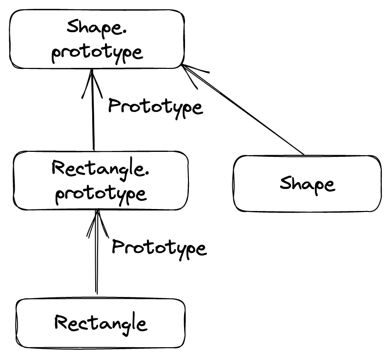

# 1. 내장 객체의 프로토타입

함수에는 기본적으로 prototype이라는 프로퍼티가 있으며, 이는 함수 자기 자신을 가리키는 constructor 프로퍼티 하나만 가지는 객체이다. 그리고 이는 함수가 new와 함께 쓰여 생성자 함수로 이용될 때 새로운 객체의 prototype이 된다.

내장 생성자 함수에도 prototype이 있다. 그럼 이는 어떻게 사용되는가?

## 1.1. Object.prototype

JS를 하는 사람이라면 다음과 같은 코드에서 나오는 `[object Object]`를 한번쯤 본 기억이 있다. 이는 어떻게 만들어지는 걸까?

```js
let obj = {
  a: 1,
  b: 2,
};
alert(obj);
// [object Object]
```

프로토타입을 따로 지정하지 않은 모든 객체는 Object.prototype을 프로토타입으로 가진다. 즉 위의 obj 객체의 `[[Prototype]]`은 Object.prototype이다. 이때 Object.prototype의 프로토타입은 없다.

이 Object.prototype에는 toString과 같은 다양한 메소드가 구현되어 있다. 그래서 기본적으로 모든 객체는 toString을 사용할 수 있고 위의 obj도 마찬가지다. 그리고 그 결과물은 `[object Object]`이다.

```js
let obj = {
  a: 1,
  b: 2,
};
console.log(obj.toString());
// [object Object]
```

왜 저렇게 변환되는지는 다른 글로 정리하고, 여기서는 객체들이 Object.prototype을 프로토타입으로 가지는 것만 알고 넘어가자.

또한 배열의 Array.prototype이나 함수의 Function.prototype과 같이 다른 내장 객체들의 프로토타입도 있는데 이들 모두 Object.prototype을 최상위 프로토타입으로 가진다.

또한 각 내장 객체 프로토타입들은 중복 메서드를 가질 수 있다. 예를 들어서 `Object.prototype.toString`과 `Array.prototype.toString`은 다른 동작을 한다.

```js
let a = [1, 2, 3];
// [object Array]
console.log(Object.prototype.toString.call(a));
// 1,2,3
console.log(Array.prototype.toString.call(a));
```

console.dir을 이용해 객체 상속 관계도 확인 가능하다.

## 1.2. 프로토타입 조작하기

문자열, 숫자와 같은 원시값은 객체가 아닌데, 우리가 알다시피 이런 값들에도 메서드나 몇몇 프로퍼티를 사용할 수 있다. 이는 래퍼 객체를 통해 가능한 것이다.

그리고 명세서를 보면 이런 각 자료형에 해당하는 래퍼 객체 메서드를 prototype을 통해 구현한다. 예를 들어 String.prototype에는 문자열 전용 메서드가 구현되어 있다.

이를 이용하면 원시값의 프로토타입도 조작할 수 있다. 예를 들어 문자열의 프로토타입에 메서드를 추가할 수 있다. 

```js
String.prototype.show = function () {
  alert(this);
};

let myName = "김성현";
myName.show();
```

그러나 이는 전역으로 영향을 미치기 때문에 추천할 만한 방식은 아니다. 폴리필을 만들 때나 사용할 만 하다.

# 2. 프로토타입 메서드와 __proto__없는 객체

`__proto__`를 통해서 객체의 프로토타입을 설정할 수 있다. 그러나 이는 낡은 방법이기 때문에 사용이 권장되지 않는다. 대신 다음과 같은 메서드들이 제공된다.

## 2.1. Object.create

`Object.create(proto)`는 객체를 생성하는데 사용된다. 이 메서드는 프로토타입을 인수로 받고 설명자를 선택적 인수로 받아서 빈 객체를 만든다.

이를 이용해서 상속을 구현할 수 있다. 단일 상속의 예시이다.

```js
function Shape() {
  this.x = 0;
  this.y = 0;
}

Shape.prototype.move = function (x, y) {
  this.x += x;
  this.y += y;
  console.log(`Shape moved to (${this.x}, ${this.y}).`);
};

function Rectangle() {
  Shape.call(this);
}

/* Shape.prototype을 프로토타입으로 하는 Rectangle.prototype을 생성
그럼 Rectangle 인스턴스의 프로토타입은 Shape.prototype을 프로토타입으로갖는 어떤 객체이고
Shape.prototype은 constructor로 Shape 자신을 갖는 객체가 된다.
*/
Rectangle.prototype = Object.create(Shape.prototype);
Rectangle.prototype.constructor = Rectangle;

let rect = new Rectangle();
rect.move(1, 1); // Shape moved to (1, 1).
```

위의 예시 코드의 상속 구조를 다음과 같이 생각할 수 있다. [이 사이트](https://excalidraw.com/)로 그림을 그려보았다.



## 2.2. Object.getPrototypeOf, Object.setPrototypeOf

`Object.getPrototypeOf`는 객체의 프로토타입을 반환한다. `Object.setPrototypeOf`는 객체의 프로토타입을 설정한다.


