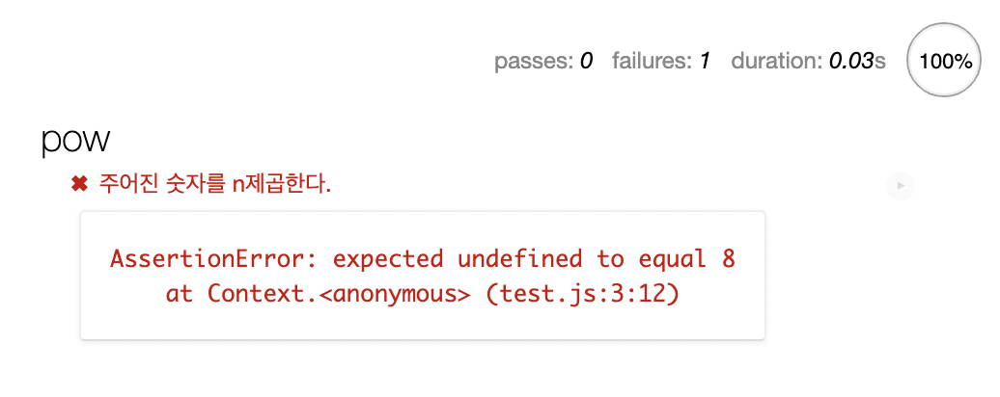

# 1. 테스트 자동화와 Mocha

우리는 개발하면서 끊임없이, 내가 개발한 기능이 잘 동작하는지 테스트한다. 이를 통해 우리는 코드를 개선하고, 새로운 기능을 추가할 수 있다. 이러한 테스트를 수동으로 진행하는 것은 귀찮고, 시간이 오래 걸린다. 

그래서 우리는 자동화된 테스트를 만들어야 한다. 많은 테스트 케이스를 만들어서 함수를 수정할 때마다 이 테스트를 통과하는지를 시험하는 것이다.

여기서는 예를 들어 x의 n제곱을 반환하는 함수 pow(x, n)을 만드는 상황을 생각해보자. 코드를 바로 작성하기 전에 먼저 명세서를 작성해야 한다.

명세서는 decribe, it, assert 3가지 요소로 이루어진다. 이 요소들의 기능은 다음과 같다.

- describe는 테스트를 그룹화한다. 그리고 구현하고자 하는 기능에 대한 설명을 적는다.
- it는 특정 기능에 대한 설명이 들어가고 2번째 인수에는 테스트를 수행하는 함수가 들어간다.
-  assert는 테스트를 수행하는 함수 내부에 들어간다. 이 함수는 테스트를 통과하지 못하면 에러를 반환하도록 되어 있다. 예를 들어 assert.equal(pow(2, 3), 8)은 pow(2, 3)과 8이 같은지를 체크하여 다르면 에러를 반환한다.

```javascript
describe("pow", function() {
  it("주어진 숫자를 n제곱한다.", function() {
    assert.equal(pow(2, 3), 8);
  });
});
```

이 명세서를 이용해 함수를 테스트하는 데에는 Mocha라는 테스트 프레임워크가 사용된다.

## 1.1. 실행해보기

[보고 있는 글](https://ko.javascript.info/testing-mocha)에 나와 있는 대로 HTML 페이지를 작성해보자.

```html
<!DOCTYPE html>
<html>
  <head>
    <meta charset="utf-8" />
    <title>Test Page</title>
    <!-- 결과 출력에 사용되는 mocha css를 불러옵니다. -->
    <link
      rel="stylesheet"
      href="https://cdnjs.cloudflare.com/ajax/libs/mocha/3.2.0/mocha.css"
    />
    <!-- Mocha 프레임워크 코드를 불러옵니다. -->
    <script src="https://cdnjs.cloudflare.com/ajax/libs/mocha/3.2.0/mocha.js"></script>
    <script>
      mocha.setup("bdd"); // 기본 셋업
    </script>
    <!-- chai를 불러옵니다 -->
    <script src="https://cdnjs.cloudflare.com/ajax/libs/chai/3.5.0/chai.js"></script>
    <script>
      // chai의 다양한 기능 중, assert를 전역에 선언합니다.
      let assert = chai.assert;
    </script>
  </head>
  <body>
    <script>
      function pow(x, n) {
        /* 코드를 여기에 작성합니다. 지금은 빈칸으로 남겨두었습니다. */
      }
    </script>

    <!-- 테스트(describe, it...)가 있는 스크립트를 불러옵니다. -->
    <script src="test.js"></script>

    <!-- 테스트 결과를 id가 "mocha"인 요소에 출력하도록 합니다.-->
    <div id="mocha"></div>
    <!-- 테스트를 실행합니다! -->
    <script>
      mocha.run();
    </script>
  </body>
</html>
```

그리고 아까 작성한 명세서를 test.js에 넣는다.

```javascript
//test.js
describe("pow", function () {
  it("주어진 숫자를 n제곱한다.", function () {
    assert.equal(pow(2, 3), 8);
  });
});
```

이 상태로 위의 HTML 파일을 크롬에서 열면 아래와 같은 결과를 볼 수 있다. 당연하지만 테스트가 통과되지 않았다고 한다. 아직 함수를 전혀 작성하지 않았으니 당연하다.

