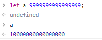

# 1. 원시값의 메서드

원시값은 객체가 아니기 때문에 프로퍼티나 메서드가 있을 수 없다. 하지만 `toUpperCase`와 같이 원시값에 적용되는 메서드가 분명히 있다. 문자열의 length와 같은 프로퍼티도 있다. 어떻게 된 걸까?

## 1.1. 원시값 래퍼 객체

JS의 원시값에 메서드를 사용하기 위해 이런 방식이 사용된다.

먼저 원시값은 원시값 그대로 형태를 유지한다. 그리고 원시값이 메서드나 프로퍼티에 접근하려고 할 시 추가 기능을 제공하는 특수한 임시 래퍼 객체를 만들어 주고 메서드/프로퍼티 접근을 적용한다. 객체는 그 접근이 끝나면 삭제된다.

즉 원시값의 메서드나 프로퍼티에 접근하게 되면 원시값은 임시로 객체처럼 작동한다. 따라서 원시값의 프로퍼티 접근도 시도할 수 있다.

```js
a="test";
console.log(a.foo); //undefined
```

JS 엔진들은 이런 래퍼 객체 최적화에 신경을 쓰기 때문에 이를 사용하는 건 그렇게 많은 자원을 필요로 하지 않는다.

## 1.2. 래퍼 객체 생성자

래퍼 객체를 직접 만들 수도 있다. Number, Boolean, String과 같은 문법을 생성자 함수로 사용하면 된다. 그렇게 하면 각 원시값의 래퍼 객체가 생긴다.

그러나 이를 사용하는 것은 좋지 않다. 원시값으로 취급되어야 하는 값이 객체로 취급되는 건 혼동을 부를 수 있기 때문이다. 예를 들어 `new Number(0)`으로 값을 생성한다면 0값을 가진 Number 임시 객체가 생성될 것이다.

그런데 이를 논리 평가에 사용한다면, 객체는 언제나 논리 평가 시 참이기 때문에 `Number{0}`은 참이 될 것이다. 하지만 숫자 0은 일반적으로 false로 평가되는 게 맞으므로 원치 않는 동작이 생길 수 있다.

# 2. 숫자형

JS에서 숫자는 BigInt를 제외하고 IEEE-754 형식으로 저장된다.

## 2.1. 진법 표현

일반적으로 JS에서 모든 수는 10진수로 취급된다. `1e9`와 같이 과학적 표기법도 가능하다.

그러나 16진수, 8진수, 2진수도 지원하는데 이는 각각 0x, 0o, 0b라는 접두사로 표현 가능하다. 하지만 비교 연산자를 사용할 시 같은 수 판단은 진수에 상관없이 이루어진다. 예를 들어 `0b11===3`은 true이다.

만약 다른 진법을 사용해서 정수를 쓰고 싶다면 parseInt를 써야 한다.

## 2.1.1. toString(base)로 진법 다루기

`num.toString(base)`는 num을 base진법으로 표현한 후 문자열로 변환해서 반환해 준다. base는 2~36까지 쓸 수 있다.

```js
let a=33;
console.log(a.toString(16)); //21
```

## 2.2. 부정확한 계산

JS에서 숫자는 BigInt를 제외하면 내부적으로 IEEE-754 형식으로 표현된다. 정확히 64비트에 저장되는데 이때 52비트가 숫자를 저장하고 11비트는 소수점 위치를, 1비트는 부호를 저장한다.

그런데 만약 너무 큰 수가 저장되면 64비트 공간이 넘쳐서 Infinity로 처리되기도 한다. 예를 들어 `1e500`과 같은 수를 출력해 보면 `Infinity`가 출력된다.

또한 유명한 예시인 `0.1+0.2===0.3`이 false인 것도 IEEE754 저장 방식의 문제이다. 0.1, 0.2 와 같은 소수를 2진법의 IEEE754 형식으로 정확하게 표현할 수 없기 때문이다.

이를 해결하는 방법 중 하나는 toFixed를 사용하는 것이다. 이때 toFixed는 문자열을 반환하므로 숫자형 변환을 위해 단항 연산자 `+`를 사용한다.

```js
let res=0.1+0.2;
console.log(+res.toFixed(2)); //0.3
```

비슷한 정밀도 손실 예시로 너무 큰 수를 표현하게 되면 유효숫자가 손실되어 부정확하게 표현되는 것이 있다.



## 2.3. 숫자형 관련 메서드 몇개

`Infinity`, `-Infinity`, `NaN`은 숫자형에 속한다. 그러나 일반적인 숫자는 아니기 때문에 그것인지 확인하는 함수도 존재한다. `isNaN`과 `isFinite`이다.

이때 `isNaN`이 필요한 이유는 `NaN`이 다른 모든 값과 같지 않기 때문이다. 심지어 자기 자신과도 같지 않다.

```js
alert(NaN === NaN) //false
```

`isFinite`는 인수로 받은 숫자가 NaN, Infinity, -Infinity가 아닌 일반적인 숫자일 경우 true를 반환한다.

또한 불가능할 때까지 문자열에서 숫자를 읽는 parseInt, parseFloat 함수가 존재한다. 문자열을 읽는 도중 숫자가 아닌 게 나오면 그때까지 수집된 숫자를 반환한다.

```js
console.log(parseInt('120px')); //120
console.log(parseFloat('12.5rem')); //12.5
```

`parseInt("a")`와 같이 읽을 수 있는 숫자가 없을 경우 NaN을 반환한다. 그리고 parseInt의 2번째 인수에 2~36을 넘겨주면 파싱할 때 사용할 진수를 사용할 수 있다.

```js
console.log(parseInt('0xff', 16));
```

## 2.4. Object.is

`Object.is`는 값을 비교할 때 사용하는 메서드인데 `===`과 다른 결과를 반환하는 2가지 케이스가 있다.

1. `NaN===NaN`은 false지만 `Object.is(NaN, NaN)`은 true
2. `0===-0`은 true지만 `Object.is(0, -0)`는 false

Object.is의 비교방식을 SameValue라고 한다.

## 2.5. 그 외 메서드

### 2.5.1. Math.random()

0~1 사이의 난수를 반환한다. 여기서 반환되는 난수에 1은 제외이다.

### 2.5.2. Math.max, Math.min

인수로 받은 수들 중 최댓값, 최솟값을 반환한다. 인수 중 숫자가 아닌 문자열이 있으면 숫자로 반환되고 이게 실패하면 NaN이 반환된다.

### 2.5.3. Math.pow(n, p)

n을 p제곱한 값을 반환한다. 이때 실수 제곱도 가능하다.

# 3. 문자열