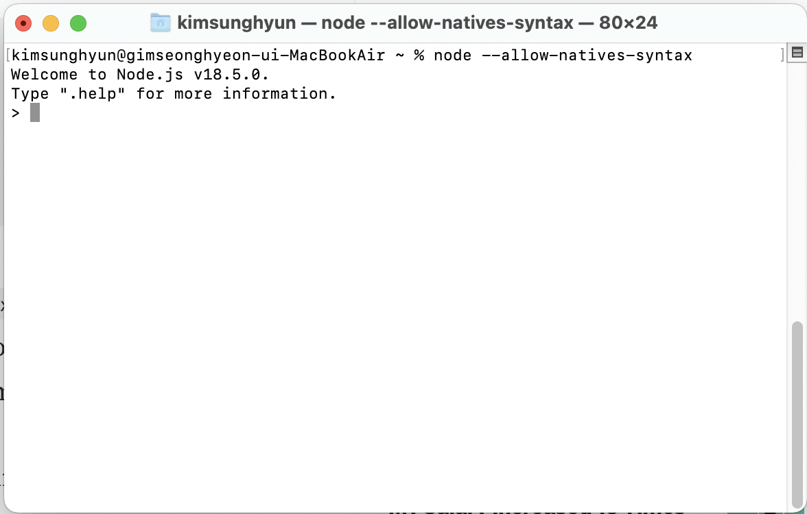

# 1. 시작

threejs의 공부를 시작하고 공식 문서를 보고 있었다. 그런데 다음과 같은 코드를 발견하였다.

```js
const points = [];
points.push(new THREE.Vector3(-10, 0, 0));
points.push(new THREE.Vector3(0, 10, 0));
points.push(new THREE.Vector3(10, 0, 0));
```

뭔가 이상하다. const로 선언된 배열에 push를 하고 있다. C++같으면 당연히 에러가 나야 하는 일이다.

```cpp
#include <iostream>

int main(){
	const int arr[3]={1,2,3};
  // const 배열 조작은 당연히 에러
	arr[1]=10;
	return 0;
}
```

하지만 생각해 보니 배열에 push 메서드 같은 게 있는 것도 말이 안된다. 자료구조에서 배운 배열은 이런 게 아니었는데..JS 배열은 C++의 vector 같은 것에 더 가깝게 동작하는 것처럼 보인다.

# 2. JS 배열의 구조

참고 페이지에 써놓은 Poiemaweb에서는 JS배열의 구조를 다음과 같은 코드로 까본다.

```js
console.log(Object.getOwnPropertyDescriptors([1, 2, 3]));
```

개발자 도구에서 위 코드를 실행시켜 보면 배열이 인덱스를 key로 가지고 length 프로퍼티를 가지고 있다는 것을 알 수 있다.

```js
{
  0: {value: 1, writable: true, enumerable: true, configurable: true},
  1: {value: 2, writable: true, enumerable: true, configurable: true},
  2: {value: 3, writable: true, enumerable: true, configurable: true},
  length: {value: 3, writable: true, enumerable: false, configurable: false}
}
```

그 외에도 잡다한 속성들이 붙어 있는 것도 볼 수 있다. 하지만 기본적으로 JS배열은 인덱스 프로퍼티에 대하여 프로퍼티 값 객체 중 value를 대응시켜 주는 식으로 동작한다고 추측할 수 있다.

이런 식으로 정의되기 때문에 JS배열은 C같은 언어에선 상상도 할 수 없는, 서로 다른 타입으로 구성된 배열도 만들 수 있는 것이다. 그냥 value에 다른 값을 대응시켜 주면 되기 때문이다.

```js
b = [1, "me", 3, null];
```

그러나 만약 JS의 배열이 해시 테이블로 관리되는 객체와 같다면 C 등에서 사용하는 배열보다 느릴 수밖에 없다. 따라서 현대적인 자바스크립트 엔진들은 배열을 일반 객체와 구별하여 보다 배열처럼 동작하도록 최적화하여 구현한다고 한다.([출처](https://poiemaweb.com/js-array-is-not-arrray))실제 테스트를 해보면 배열이 일반 객체보다 약 2배 정도 빠르다고 한다.

# 3. JS 배열, 더 깊이

JS의 배열에는 배열답지 않은 push, pop, shift, unshift와 같은 메서드들이 있다. 이 메서드들은 어떻게 동작할까? 앞서 보았던 배열의 구조를 볼 때 push, pop은 아마 `array[length-1]`에 대한 편집을 하지 않을까 싶다. O(1)에 가능할 것이다.

그러면 shift, unshift는? 맨 앞의 원소(JS배열이 객체라는 걸 생각해 볼 때 이 단어가 적절한지는 모르겠지만 아무튼 맨 첫 인덱스의 원소)를 삽입하거나 삭제하므로 기존 원소들의 인덱스를 바꿔 줘야 할 것으로 보인다. O(n)이 될 것이다.

하지만 [나와 같이 배열 메서드의 시간복잡도를 질문한 글](https://stackoverflow.com/questions/11514308/big-o-of-javascript-arrays)에서, 현대 JS엔진들은 배열이 sparse하지 않은 한 배열을 해시테이블로 관리하지 않는다고 한다.

```
댓글 전문
Worth mentioning this answer is no longer correct. Modern engines do not store Arrays (or objects with indexed integer keys) as hashtables (but like well... arrays like in C) unless they're sparse. To get you started here is a 'classical' benchmark illustrating this –
Benjamin Gruenbaum
```

그럼 대체 어떻게 한다는 것인가! 열심히 검색해 보니 [Understanding Array Internals](https://itnext.io/v8-deep-dives-understanding-array-internals-5b17d7a28ecc)라는 보석같은 글이 있었다. V8에서 배열을 어떻게 구현한지를 다룬 글이었다. 이 글을 간단히 이해한 대로 정리해 본다.

## 3.1 시작

JS 이전에 우리가 이미 알던 배열 같은 경우 연속된 메모리 덩어리와 같다. 배열의 시작 주소부터 배열의 크기만큼의 메모리를 가지는 자료구조이다. 그러나 JS배열은 위에서 대강 살펴보았다시피 그것과는 조금 다르다. push, pop과 같은 메서드부터 이상하다.

물론 C++이나 JAVA의 Vector처럼 원소의 삽입/삭제가 가능한 동적 배열도 있다. 그러나 그것들은 내부적으로 보면 결국 배열의 크기를 정해 놓고 크기 상한에 도달하면 새로운 배열을 동적 할당하는 방식이다. 하지만 JS 배열은 그런 식으로 동작하지 않는다.

따라서 V8에서 제공하는 %DebugPrint 함수를 이용하여 내부를 들여다보자. 먼저 node REPL을 켠다. 엔진의 고유 함수를 실행 가능하도록 하기 위해 --allow-natives-syntax 옵션을 사용하자.



## 3.2 빈 배열

%DebugPrint 함수를 이용하여 빈 배열의 정보를 출력해 보자.

```
const arr=[];
undefined
> %DebugPrint(arr);
DebugPrint: 0x1458667c9379: [JSArray]
 - map: 0x2699696c3c39 <Map(PACKED_SMI_ELEMENTS)> [FastProperties]
 - prototype: 0x266f4d105d79 <JSArray[0]>
 - elements: 0x3f94f0541329 <FixedArray[0]> [PACKED_SMI_ELEMENTS]
 - length: 0
 - properties: 0x3f94f0541329 <FixedArray[0]>
 - All own properties (excluding elements): {
    0x3f94f05455f1: [String] in ReadOnlySpace: #length: 0x2d848adb4c29 <AccessorInfo> (const accessor descriptor), location: descriptor
 }
0x2699696c3c39: [Map]
 - type: JS_ARRAY_TYPE
 - instance size: 32
 - inobject properties: 0
 - elements kind: PACKED_SMI_ELEMENTS
 - unused property fields: 0
 - enum length: invalid
 - back pointer: 0x3f94f05415b9 <undefined>
 - prototype_validity cell: 0x2d848adb5169 <Cell value= 1>
 - instance descriptors #1: 0x266f4d105d49 <DescriptorArray[1]>
 - transitions #2: 0x31d900141ad1 <TransitionArray[8]>Transition array #2:
     0x3f94f0546609 <Symbol: (elements_transition_symbol)>: (transition to HOLEY_SMI_ELEMENTS) -> 0x2699696c3fe1 <Map(HOLEY_SMI_ELEMENTS)>
     0x36411fa7daf1: [String] in OldSpace: #level: (transition to (const data field, attrs: [WEC]) @ Any) -> 0x309ae03d40f1 <Map(PACKED_SMI_ELEMENTS)>

 - prototype: 0x266f4d105d79 <JSArray[0]>
 - constructor: 0x266f4d13eb09 <JSFunction Array (sfi = 0x199b37c84611)>
 - dependent code: 0x3f94f0541251 <Other heap object (WEAK_ARRAY_LIST_TYPE)>
 - construction counter: 0
[]
```

여기서 element 부분을 보자. elements: 0x3f94f0541329 <FixedArray[0]> [PACKED_SMI_ELEMENTS] 라고 되어 있다.

이는 우리가 선언한 빈 배열이 데이터를 저장하기 위해서 우리가 아는 것과 같은 고정된 크기의 배열을 사용하고 있다는 것을 의미한다. FixedArray[0]이므로 현재 고정 크기 배열의 크기는 0이다.

## 3.3 배열의 원소 타입 추적

위에서 elements kind로 표시되는 PACKED_SMI_ELEMENTS는 배열의 원소가 모두 정수형이라는 것을 의미한다. PACKED_SMI_ELEMENTS는 small int를 뜻하는데(그렇게 작지는 않지만) -2^31에서 2^31-1 사이의 범위를 갖는 정수형을 의미한다.

V8은 배열 연산의 최적화를 위해서 배열의 원소들의 타입을 추적하고 있는데 이것이 elements kind에 표시되고 있는 것이다. 이런 추적을 통해서 V8은 배열의 원소들을 다룰 때 불필요한 타입 변환이나 체크를 하지 않고 최적화된 코드를 실행할 수 있다.

그리고 배열이 수정될 때 이 elements kind는 그에 따라 변경된다. 이 변경은 더 일반적인 타입으로 변경되는 것이다. 예를 들어, 배열의 원소가 처음에 정수형이었다가 문자열이 되면 elements kind는 PACKED_SMI_ELEMENTS에서 PACKED_ELEMENTS로 변경된다. 이렇게 한번 배열의 elements kind가 변경되면 다시 원래의 타입으로 변경되지 않는다.

그리고 이 elements kind는 배열의 원소들이 변경될 때마다 변경된다. 예를 들어, 배열의 원소가 처음에 정수형이었다가 문자열이 되면 elements kind는 PACKED_SMI_ELEMENTS에서 PACKED_ELEMENTS로 변경된다.

이를 실험하기 위해 아까 비어 있던 배열에 `witch`라는 문자열을 삽입한 후 다시 %DebugPrint()를 실행해보자.

```
> arr.push("witch")
1
> arr
[ 'witch' ]
> %DebugPrint(arr);
...
elements: 0x0ebe131cc2a1 <FixedArray[17]> [PACKED_ELEMENTS]
...
```

elements kind가 PACKED_ELEMENTS로 변경되었다.

이때 arr.pop()으로 배열의 원소를 제거하여 다시 빈 배열로 바꾼 후 다시 %DebugPrint()를 실행해도 elements kind는 PACKED_ELEMENTS로 남아있다.

## 3.4 배열의 공간 할당

앞에서 문자열을 추가한 배열에 %DebugPrint함수를 사용한 결과를 다시 보자. elements kind가 PACKED_ELEMENTS로 변경되었고, elements는 0x0ebe131cc2a1 <FixedArray[17]>로 표시되었다.

여기서 볼 것은 FixedArray size가 17로 바뀌었다는 것이다. 그런데 우리는 원소를 하나밖에 추가하지 않았다.. 그럼 왜 size가 17이 되었을까? 이는 JS배열이 동적으로 동작하므로, 배열의 저장 공간이 부족해졌을 때 얼만큼의 메모리를 추가 할당하는지에 관련되어 있다.

새로운 메모리 capacity 할당은 다음과 같은 식을 따른다.

$new\_capacity = (old\_capacity + old\_capacity / 2) + 16$

old_capacity는 (기존 배열의 capacity + 삽입된 원소 수) 이므로 여기서는 1이다.(빈 배열에 원소 1개 삽입) 따라서 new_capacity는 1 + 1/2 \* 1 + 16 = 17이 된다. 위에서 나온 FixedArray size와 같다.

그럼 배열에 할당된 메모리가 줄기도 할까? 만약 배열에 pop등이 많이 가해져서 배열에 할당된 메모리의 50% 이상이 사용되지 않게 되면 배열의 메모리를 줄이는 작업이 일어난다.

방금만 해도 원소가 하나뿐인 배열에 pop을 가하니까 FixedArray[17]이 FixedArray[0]로 줄어들었다.

## 3.5 hole

위에서 `witch`라는 문자열을 배열에 삽입한 후 %DebugPrint()를 실행한 결과를 다시 보자.

```
> arr
[ 'witch' ]
> %DebugPrint(arr);
DebugPrint: 0x2a0ee8b8711: [JSArray] in OldSpace
 - map: 0x2699696c4d19 <Map(PACKED_ELEMENTS)> [FastProperties]
 - prototype: 0x266f4d105d79 <JSArray[0]>
 - elements: 0x0ebe131cc2a1 <FixedArray[17]> [PACKED_ELEMENTS]
 - length: 1
 - properties: 0x3f94f0541329 <FixedArray[0]>
 - All own properties (excluding elements): {
    0x3f94f05455f1: [String] in ReadOnlySpace: #length: 0x2d848adb4c29 <AccessorInfo> (const accessor descriptor), location: descriptor
 }
 - elements: 0x0ebe131cc2a1 <FixedArray[17]> {
           0: 0x0f0d12e0eea9 <String[5]: #witch>
        1-16: 0x3f94f0541689 <the_hole>
 }
0x2699696c4d19: [Map]
 - type: JS_ARRAY_TYPE
 - instance size: 32
 - inobject properties: 0
 - elements kind: PACKED_ELEMENTS
 - unused property fields: 0
 - enum length: invalid
 - back pointer: 0x2699696c4d61 <Map(HOLEY_DOUBLE_ELEMENTS)>
 - prototype_validity cell: 0x2d848adb5169 <Cell value= 1>
 - instance descriptors #1: 0x02a0ee8b9789 <DescriptorArray[2]>
 - transitions #4: 0x0b116d9199c1 <TransitionArray[12]>Transition array #4:
     0x3f94f0546609 <Symbol: (elements_transition_symbol)>: (transition to HOLEY_ELEMENTS) -> 0x2699696c4df1 <Map(HOLEY_ELEMENTS)>
     0x36411fa7daf1: [String] in OldSpace: #level: (transition to (const data field, attrs: [WEC]) @ Any) -> 0x09ad648c34a1 <Map(PACKED_ELEMENTS)>
     0x3f94f0545d31: [String] in ReadOnlySpace: #raw: (transition to (const data field, attrs: [___]) @ Any) -> 0x309ae03c6e01 <Map(PACKED_ELEMENTS)>
     0x3f94f0546681 <Symbol: (frozen_symbol)>: (transition to frozen) -> 0x2699696c4e39 <Map(PACKED_FROZEN_ELEMENTS)>

 - prototype: 0x266f4d105d79 <JSArray[0]>
 - constructor: 0x266f4d13eb09 <JSFunction Array (sfi = 0x199b37c84611)>
 - dependent code: 0x3f94f0541251 <Other heap object (WEAK_ARRAY_LIST_TYPE)>
 - construction counter: 0

[ 'witch' ]
```

빈 배열일 때와 달리 `elements`항목이 새로 생겼다. 0인덱스에는 당연히 우리가 삽입한 문자열이 들어 있다. 하지만 1-16 인덱스에는 the_hole이 들어 있다고 한다.

이 the_hole은 V8에서 아직 원소가 할당되지 않았거나 삭제된 배열의 원소를 표현하기 위해 사용하는 특수한 값이다. 즉, 배열의 원소가 할당되지 않은 상태를 hole이라고 한다. 우리의 예시에선 배열에 할당은 되었지만 아직 사용되지 않은 인덱스들에 the_hole이 들어가 있다.

# 4. JS 상수 배열

다시 원래 이야기로 돌아와서 그러면 어떻게 배열의 각 원소를 변경 불가능하게, 즉 immutable로 만들까? 길게 돌아왔지만, 그냥 `Object.freeze()`라는 함수를 사용하면 된다..

```js
Object.freeze(arr);
```

# 참고

[JS배열은 배열이 아니다](https://poiemaweb.com/js-array-is-not-arrray)

[상수 배열 선언 실패](https://morohaji.tistory.com/55)

[상수 배열 선언하기](https://stackoverflow.com/questions/62771790/how-to-create-a-constant-array-that-is-not-modified-by-its-reference-in-javascri)

[V8의 배열 내부 구현](https://itnext.io/v8-deep-dives-understanding-array-internals-5b17d7a28ecc)

[DebugPrint 해석에 참고](https://saki-chan.dev/Elements_Kinds/)
