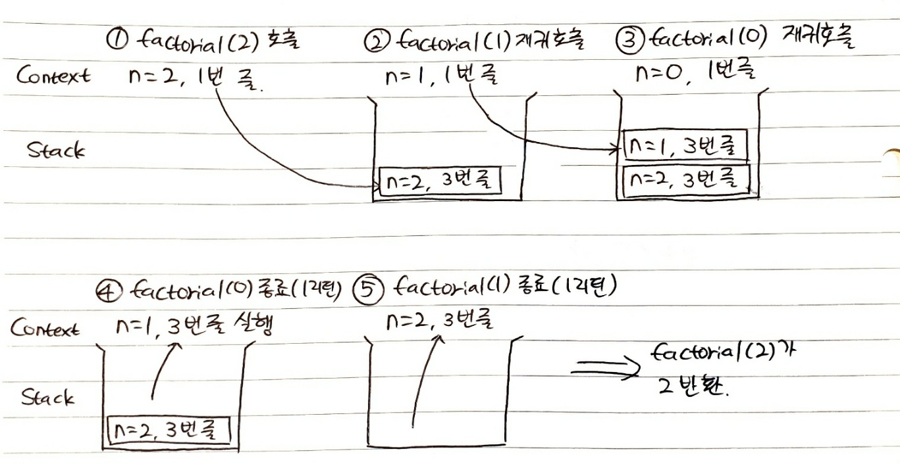

# 1. 재귀

재귀 함수는 자기 반복적인 구조를 가진 함수를 작성할 때 아주 좋다. 예를 들어서 팩토리얼 함수를 작성할 때 재귀 함수를 사용하면 아래와 같이 작성할 수 있다.

```js
function factorial(n) {
  return n ? n * factorial(n - 1) : 1;
}
```

만약 `factorial(2)`을 호출한다고 해보자. 그러면 그 함수 내부에선 `factorial(1)`이 호출되고 또 그 내부에선 `factorial(0)`이 호출되어 1을 리턴할 것이다. 

그럼 코드에선 다시 `factorial(1)`의 실행으로 들어가서 `1 * factorial(0)`을 리턴하고, 다시 `factorial(2)`의 실행으로 들어가서 `2 * factorial(1)`을 리턴할 것이다.

그럼 이렇게 다음 재귀 호출되는 함수로 진입할 때, 이전까지 실행된 정보는 어떻게 저장되는가? 이것이 바로 실행 컨텍스트이다.

# 2. 실행 컨텍스트

실행 컨텍스트는 함수 실행에 대한 세부 정보를 담고 있는 내부 데이터 구조이다. 제어 흐름의 현재위치, 변수들의 현재 값, this의 값 등을 담고 있다. 그리고 함수 호출이 1번 될 때마다 1개씩 생성된다.

그리고 함수 내부에서 다른 함수가 호출되면 기존에 실행되던 함수는 일시 중지되고 중지된 함수의 실행 컨텍스트는 콜스택에 쌓인다. 그리고 새로 호출된 함수가 생성한 실행 컨텍스트가 실행된다. 새로 실행된 함수의 실행이 끝나면 아까 일시 중지된 함수의 실행 컨텍스트를 스택에서 꺼내와서 실행을 재개한다.

이것이 바로 재귀를 가능하게 한다. 예를 들어서 `factorial(2)`를 호출했을 때의 실행 컨텍스트가 어떻게 흘러가는지를 보자. 실행 흐름 추적이 쉽도록 하기 위해 삼항 연산자를 if문으로 바꾸었다.

```js
function factorial(n) {
  if(n){
    return n * factorial(n - 1);
  } else {
    return 1;
  }
}
```

내부 함수의 실행이 종료되면 내부 함수의 실행 컨텍스트는 스택에서 제거되고 내부 함수의 실행으로 인해 중지되었던 외부 함수의 실행 컨텍스트가 스택에서 꺼내져서 실행이 재개되는 식이다. 실행 컨텍스트에는 함수가 어느 시점까지 실행되고 있었는지도 저장되므로 거기부터 재개하면 된다.



이때 JS 코드가 처음 실행할 때 생기는 전역 컨텍스트도 스택에 쌓이지만 이는 생략하였다.

즉 실행 컨텍스트는 함수 실행에 대한 정보들을 담고 스택에 쌓임으로써 함수 중첩 실행을 가능하게 한다. 또한 실행 컨텍스트가 활성화될 때 JS엔진은 해당 컨텍스트에 관련된 코드에 필요한 정보들을 수집해서 알아서 실행 컨텍스트에 저장한다.

그럼 여기에는 무엇이 저장되는 걸까?

# 3. 실행 컨텍스트의 정보

