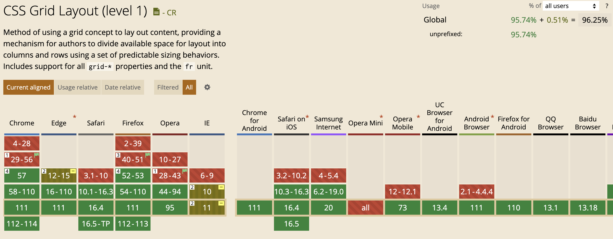

CSS는 Cascading Style Sheets의 약자로 웹 페이지의 스타일을 지정하는 언어이다. CSS를 통해 HTML에 스타일을 지정할 수 있다. 프론트의 장벽 중 하나이기도 하다. 이를 MDN 튜토리얼을 통해 공부해보자.

# 1. CSS란?

CSS는 사용자에게 문서를 표시하는 방법을 지정한다. 폰트의 크기라든가, 문서의 배경색이라든가 하는 것들을 말한다. 이때 문서라는 건 보통 마크업 언어로 구성된 텍스트 파일이다. HTML일 수도 있고 SVG나 XML일 수도 있다.

## 1.1. CSS 구문

CSS는 selector를 통해 특정 요소나 요소의 그룹을 선택하고 그 요소에 스타일을 적용한다. 이때 selector는 요소의 이름이나 클래스, 아이디 등을 사용할 수 있다. 그리고 스타일은 속성과 값으로 구성된다. 예를 들어 다음과 같다.

```css
h1 {
  color: red;
  font-size: 5em;
}
```

h1 요소들을 선택하고 `속성:값;` 형태로 스타일을 지정했다. 이때 각 스타일의 구분은 `;`로 한다. 이때 이 속성은 CSS 프로퍼티라고 하는데 각 프로퍼티에 따라 허용되는 값이 있다. color 프로퍼티에는 색상만 올 수 있는 식이다.

## 1.2. CSS 사양

다른 웹 표준 기술과 마찬가지로 CSS 또한 표준 조직이 있다. W3C의 CSS Working Group에서 만들고 있다. 새로운 CSS 기능도 여기서 개발한다.

하지만 새로운 기능을 개발할 땐 언제나 하위 호환성이 고려된다. 오래된 웹사이트도 브라우저에서 잘 작동하도록 하기 위해서이다.

## 1.3. 브라우저 지원

브라우저에 따라서 CSS를 지원하는 정도가 다르다. 브라우저에 구현되지 않은 CSS를 사용하면 화면에 출력되지 않는다. 최신 사양의 경우 브라우저에 따라 구현된 브라우저와 안 된 브라우저가 있다.

이렇게 브라우저가 특정 CSS를 구현했는지를 [caniuse.com](https://caniuse.com/)에서 확인할 수 있다. 예를 들어서 `grid`를 검색하면 다음과 같이 나온다.



# 2. CSS 시작하기

CSS 실습을 위한 HTML 파일을 만들어보자. `index.html` 파일을 만들고 다음과 같이 작성한다.

```html