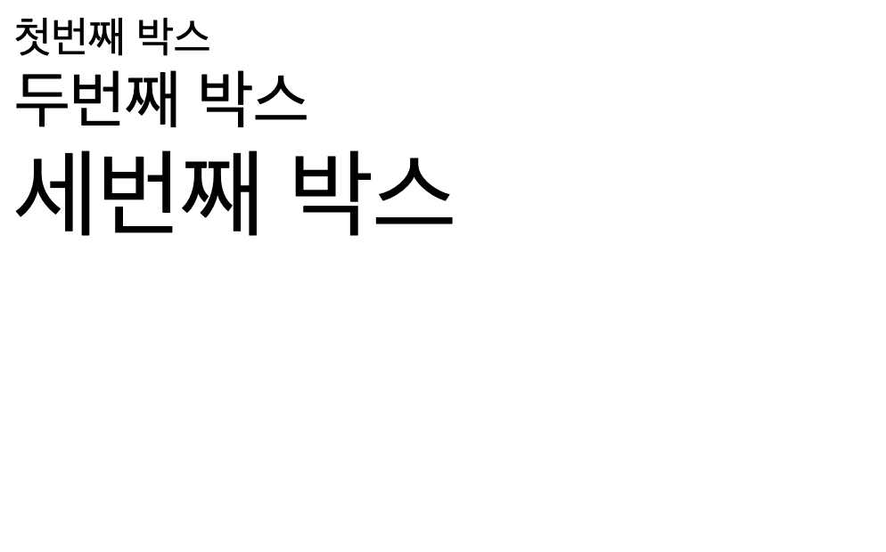

# 1. CSS 값과 단위

[참고글 링크](https://developer.mozilla.org/ko/docs/Learn/CSS/Building_blocks/Values_and_units)

CSS의 모든 속성에는 허용되는 값이 있다. 이런 값은 색, 크기 등이 있는데 이런 값의 이름은 흔히 `<color>`와 같이 꺽쇠로 묶여서 표현된다. CSS 속성과 구별하기 위해서이다.

자주 접할 수 있는 몇 가지 유형의 값을 알아보자.

숫자, 길이, 백분율 값들이 CSS에서 가장 골치를 썩인다.

`<integer>`는 정수를 나타내고, `<number>`는 이를 확장하여 10진수 실수까지 포괄한다. `<dimension>`은 number에 단위가 붙어 있는, `10px`와 같은 것이다. 그리고 `<percentage>`는 부모 요소의 길이 등 어떤 다른 값을 기준으로 하는 백분율을 나타낸다.

길이는 절대 단위와 상대 단위로 나뉘는데, 절대 단위는 cm, mm, in 등 항상 동일한 크기로 간주된다. 이런 값들은 인쇄에 사용될 때 유용하며 보통은 px만 사용한다.

상대 길이 단위는 상위 요소의 글꼴 크기 등 페이지의 다른 요소와 관련이 있다. em, rem, vw, vh 등이 있다.

## 1.1. em, rem

em과 rem은 가장 많이 쓰이는 2개의 상대 길이이다. 두 개의 차이는 어떤 요소의 글꼴 크기를 기준으로 하느냐이다.

em 단위는 부모 요소의 글꼴 크기를 가져온다. 그리고 rem 단위는 루트 요소의 글꼴 크기를 가져온다. 루트 요소는 보통 html 요소이다.

따라서 다음과 같은 html을 작성하고 rem과 em을 사용해보자.

```html
<div class="box">
  첫번째 박스
  <div class="box">
    두번째 박스
    <div class="box">세번째 박스</div>
  </div>
</div>
```

```css
.box {
  font-size: 1.5em;
}
```

그러면 각각의 중첩된 박스에서 부모의 글꼴 크기를 가져와서 그 1.5배로 글꼴 크기를 설정하므로 박스가 중첩되므로 글꼴이 점점 커진다.



rem은 루트 요소의 글꼴 크기를 가져오므로 다음과 같이 설정하면 모든 박스의 글꼴 크기가 html 요소의 글꼴 크기의 1.5배가 된다.

```css
.box {
  font-size: 1.5rem;
}
```


따라서 html 요소의 글꼴 크기를 변경할 시 모든 rem의 기준이 변한다.

## 1.2. 백분율

백분율은 당연히 그 의미상 다른 값에 상대적으로 설정된다. 이는 부모 요소의 같은 값에 대응한다. 예를 들어, 부모 요소의 너비가 100px이고 자식 요소의 너비가 50%라면 자식 요소의 너비는 50px이 된다.

width 등의 여러 값에서 길이, 백분율 둘 다 쓸 수 있다. 그런데 길이만 허용하는 때도 있는데 이럴 경우 속성이 허용하는 값에 `<length>`만 적혀 있다.

## 1.3. 숫자

opacity 등의 속성의 경우 단위 없이 숫자만 허용한다.

# 2. 항목 크기 조정

[CSS에서 항목 크기 조정](https://developer.mozilla.org/ko/docs/Learn/CSS/Building_blocks/Sizing_items_in_CSS)

CSS에서의 사물의 여러 크기에 대해 알아보자. 먼저 HTML 요소는 CSS로 크기를 설정하기 이전에도 고유한 크기를 가진다. 예를 들어서 img 태그에 이미지를 삽입 시 이미지의 원래 크기만큼의 크기를 가질 것이다.

그러나 우리는 width, height로 요소의 크기를 따로 설정해 줄 수도 있다.

마진과 패딩을 백분율로 설정할 수 있다. 예를 들어서 `margin: 10%`라고 설정하면 부모 요소의 너비의 10%만큼의 마진이 설정된다. 그런데 이때 백분율은 인라인 크기를 기준으로 계산된다. 따라서 `margin-top:10%`가 부모 요소의 높이를 기준으로 계산되지 않는 것이다. 늘 부모 요소의 너비를 기준으로 계산된다.

min-height, max-height, max-width, max-height 등의 속성으로 요소의 최소, 최대 크기를 설정할 수 있다.

각각 뷰포트 너비의 1%, 높이의 1%를 나타내는 vw, vh도 사용할 수 있다.