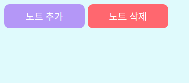
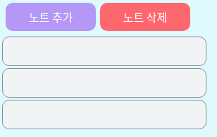

# 1. 시작

우리가 만들어야 할 페이지는 현재 설계로는

1. 메모장 페이지
2. 로그인 페이지
3. 회원가입 페이지

정도가 있다. 아무래도 이 프로젝트의 목적은 회원별로 관리되는 "메모장"을 만드는 것이므로 메모장 페이지를 가장 처음으로 만들고자 한다.

먼저 나는 부드러운 느낌을 주는 색을 좋아하므로 그쪽 계열의 색을 이용해 작업할 것이다. 색을 고를 때는 주로 [open color](https://yeun.github.io/open-color/) 를 참고한다. 그러나 나는 디자인 전문가도 아니고, 아주 미려한 디자인을 목표로 하는 프로젝트도 아니므로 내 눈에 아주 거슬리지 않을 정도로만 작업하려고 한다. 

만약 누군가 이 프로젝트를 본다면, 내가 쓴 색이 전혀 부드러워 보이지 않을 수도 있고 내 디자인이 마음에 들지 않을지도 모른다. 따라서 만약 디자인에 대한 대안이 있다면 언제나 지적해 주면 좋을 것 같다. 또한 이런 색 선정에 어떤 업계 표준이 있다면 댓글이나 메일 등으로 내게 알려준다면 정말 감사할 것이다.


먼저 아주 기본적인 배경만 넣어 보자. `src/note.js` 를 새로 생성한다.

```react
//note.js
import React from 'react';

const Note = () => (
  <>
    <h1>메모장 페이지입니다</h1>
  </>
);

export default Note;

```

이 컴포넌트는 아직 간단한 텍스트 한 줄을 띄우는 것 뿐이다. 참고로 `<>` 이 빈 태그는 React.Fragment의 축약형으로 여러 태그들을 하나로 묶는 기능만 하고 싶을 때 자주 쓰인다. `<div>`로 묶을 수도 있지만 `<div>`를 쓰면 태그의 깊이가 하나 더 늘어나 버린다는 단점이 있어서 `<>` 를 사용하였다.

이제 이 텍스트를 홈 페이지에 띄우고, 배경을 넣어주도록 하자. `src/App.js` 로 향한다.

```react
//App.js
import React from 'react';
import { Route } from 'react-router-dom';
import { createGlobalStyle } from 'styled-components';
import Note from './note';

const NoteGlobalStyle = createGlobalStyle`
  body{
    background:#e3fafc
  }
`;

function App() {
  return (
    <div>
      <NoteGlobalStyle />
      <Route path="/" component={Note} />
    </div>
  );
}

export default App;

```

`createGlobalStyle` 은 styled-components 에서 body와 같은, 모든 곳에 적용되는 스타일을 지정하고 싶을 때 쓰는 키워드이다. 이걸로 아주 연한 cyan 색의 배경을 페이지 전체에 설정해 줄 수 있다.

그리고 홈 페이지(`/` 경로)에는 Note 컴포넌트를 띄워 주도록 설정하였다. 이대로 `yarn start`를  실행하면 연한 cyan 색 배경에 `메모장 페이지입니다` 라는 굵은 글씨가 뜬 페이지가 뜰 것이다. 

이때 주의해 줄 점은 `yarn start`를 통해 실행되는 index.js에서도 React Router를 쓸 수 있도록 설정해 줘야 한다는 것이다.

```js
import React from 'react';
import ReactDOM from 'react-dom';
import './index.css';
import { BrowserRouter } from 'react-router-dom';
import App from './App';
import reportWebVitals from './reportWebVitals';

// BrowserRouter 사용을 설정한 index.js

ReactDOM.render(
  <React.StrictMode>
    <BrowserRouter>
      <App />
    </BrowserRouter>
  </React.StrictMode>,
  document.getElementById('root'),
);

// If you want to start measuring performance in your app, pass a function
// to log results (for example: reportWebVitals(console.log))
// or send to an analytics endpoint. Learn more: https://bit.ly/CRA-vitals
reportWebVitals();

```

# 2. 기본적인 레이아웃 만들기 

## 2.1 버튼 만들기

먼저 노트에 쓰일 기본적인 블럭을 만들어 준다. 내부를 가운데 정렬해 주고 폰트를 흰색으로 칠해 주는 등 기본적인 디자인을 넣어주고 모서리를 적당히 둥글게 만들어서 모양을 다듬는다. 그리고 색을 props로 넣어줄 수 있는 기능 정도를 추가한다.

노트에 쓰일 버튼들은 이 `NoteBasicBlock` 의 디자인을 상속해서 만들어질 것이다.

```css
const NoteBasicBlock = styled.div`
  background: ${(props) => props.color || 'white'};
  color:white;
  display: flex;
  justify-content: center;
  align-items: center;
  border-radius: 10px;
  font-size:1rem;
  margin:3px;
`;
```

이제 노트 추가, 삭제를 위한 버튼을 만들 것인데 이건 그저 위의 블럭을 상속해서 크기만 지정해 주면 된다.

```css
const NoteListButton = styled(NoteBasicBlock)`
  width:8rem;
  height:2.5rem;
`;
```

그럼 이제 이를 이용해서 노트 추가, 삭제를 위한 버튼을 쉽게 만들어줄 수 있다.

간단히 이를 이용해서 버튼을 만들어 준 후 임시로 flex 컨테이너를 만들어서 배치해 주었다.

```react
//App.js
import React from 'react';
import styled from 'styled-components';

const FlexContainer = styled.div`
  display:flex;
  margin:5px;
`;

const NoteBasicBlock = styled.div`
  background: ${(props) => props.color || 'white'};
  color:white;
  display: flex;
  justify-content: center;
  align-items: center;
  border-radius: 10px;
  font-size:1.2rem;
  margin:3px;
`;

const NoteListButton = styled(NoteBasicBlock)`
  width:9rem;
  height:3rem;
`;

const Note = () => (
  <>
    <FlexContainer>
      <NoteListButton color="#b197fc">노트 추가</NoteListButton>
      <NoteListButton color="#ff6b6b">노트 삭제</NoteListButton>
    </FlexContainer>
  </>
);

export default Note;

```

이대로 App.js를 바꿔준 후 `yarn start` 로 프로젝트를 실행하면 연한 청색 화면에 두 개의 버튼이 떠오를 것이다. 

앞으로 눈에 거슬리지 않을 정도로만 조화를 맞추면서 개별적인 색이나 작은 사이즈 변경 정도는 있을 수 있다. 다만 커다란 어떤 설계상의 변경이 있다면 이전 글로 돌아와서 그 부분도 수정할 것이다. 가령 상속 관계가 바뀐다거나 하는 것들 말이다. 아주 탄탄한 설계를 하고 시작하는 프로젝트가 아니기 때문에 설계도 조금씩 바뀔 수 있다.



텍스트에 써 있는 대로, 이 버튼을 통해 노트 추가/삭제가 가능하도록 할 것이다. 하지만 레이아웃을 위한 디자인을 모두 구성할 때까지 이런 기능 구현은 잠시 미뤄 두도록 하자.

## 2.2 개별 메모장 블럭 만들기

설계상으로는, 저 노트 추가/삭제 버튼 밑으로 개별 메모들의 미리보기들이 쭉 늘어져 있고 몇몇 메모를 묶어서 폴더로 관리할 수도 있도록 하고 싶다.일단은 개별 메모들의 미리보기를 관리하기 위한 블럭을 디자인하고자 한다. 아까 만들었던 `NoteBasicBlock` 을 활용하자.

```css
const NoteListBlock = styled(NoteBasicBlock)`
  width:18rem;
  height:2.5rem;
  border:solid 1px #868e96;
  background:#f1f3f5;
`;
```

이제 이를 시험삼아 몇 개 배치해 보면 잘 되는 것을 확인할 수 있다.

```react
const Note = () => (
  <>
    <FlexContainer>
      <NoteListButton color="#b197fc">노트 추가</NoteListButton>
      <NoteListButton color="#ff6b6b">노트 삭제</NoteListButton>
    </FlexContainer>
    <NoteListBlock />
    <NoteListBlock />
    <NoteListBlock />
  </>
);
```



## 2.3 노트 편집 창 만들기

