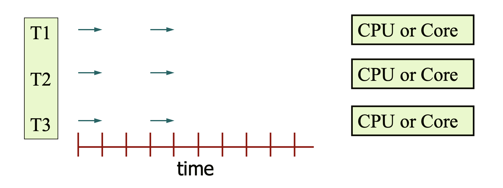
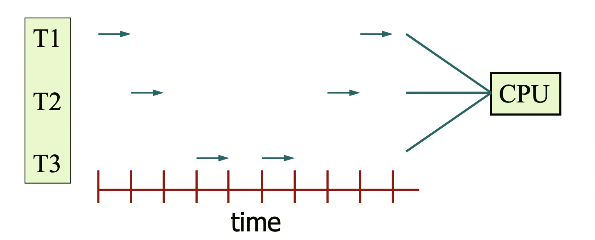

운영체제 4단원, 스레드와 병행성 부분을 정리한다.

# 1. 스레드

하나의 프로세스가 오직 하나의 실행 흐름만 가지고 있다고 하자. 그러면 하나의 어플리케이션은 여러 프로세스를 만들어야 한다. 예를 들어서 웹브라우저에 관련된 프로세스는 하나는 웹페이지를 렌더링하고 하나는 네트워크에서 데이터를 검색한다고 생각할 수 있다.

하지만 이렇게 하나의 어플리케이션을 여러 프로세스로 나누는 것은 비효율적이다. 프로세스 생성 횟수도 많아지고, 컨텍스트 스위칭도 많이 발생하고 프로세스 간 통신도 많아진다. 그래서 운영체제는 프로세스 내에서 여러 실행 흐름을 만들 수 있도록 스레드라는 개념을 도입했다.

## 1.1 스레드의 개념

스레드는 CPU 이용의 기본 단위라고 할 수 있다. 일종의 실행 흐름이라고 생각하면 된다. 이는 스레드 id(tid), 각자의 PC, 레지스터 집합, 스택으로 구성된다. 그리고 스레드는 프로세스 내에 여러 개 있을 수 있는데 같은 프로세스의 다른 스레드와 코드, 데이터 영역 등의 운영체제 자원을 공유한다.

즉 하나의 프로세스가 여러 개의 실행 흐름(스레드)을 가질 수 있다는 것이다. 이런 다중 스레드 프로그래밍의 장점은 다음과 같다.

- 여러 실행 흐름이 동시에 진행되므로 대화형 프로그램에서 사용자에게 더 즉각적인 응답을 제공할 수 있다.
- 스레드는 프로세스 내 자원을 공유하므로 자원을 프로세스에 비해서 더 쉽게 공유할 수 있다.
- 스레드를 만들고 스레드간 흐름을 스위칭하는 건 프로세스로 같은 작업을 하는 것보다 훨씬 비용이 적다.
- 다중 처리기 시스템에서는 각 스레드가 다른 처리기에서 병렬로 수행될 수 있다.

## 1.2 멀티코어 프로그래밍

요즘 나오는 컴퓨터 시스템은 하나의 컴퓨팅 칩에 여러 코어를 설치한다. 그리고 운영체제는 각 코어를 하나의 CPU로 인식하게 된다. 이런 멀티코어 시스템에서는 하나의 프로세스를 여러 개의 스레드로 나누어서 각각의 스레드를 다른 코어에서 동시에 실행시킬 수 있다. 이는 일부 스레드가 정말로 동시에, 병렬적으로 실행될 수 있음을 의미한다.

여기서 동시성(concurrency)과 병렬성(parallelism)의 차이가 나온다. 병렬성은 코어(혹은 cpu)여러 개를 사용하여 실제로 스레드 여러 개를 동시에 실행하는 것이다. 아래 사진을 보면 스레드 여러 개가 정말로 같이 진행되는 것을 볼 수 있다.

하지만 코어가 하나뿐이라도 여러 개의 작업을 동시에 진행할 수는 있다. 여러 개의 스레드 사이를 빠르게 전환해 가며 하나의 프로세서에서 실행시키면 사용자는 여러 개의 작업이 동시에 진행되는 것처럼 느낄 수 있다. 이렇게 여러 작업을 동시에 진행하는 것을 동시성(concurrency)이라고 한다.

다음 사진은 동시성에 관한 사진인데 CPU가 하나밖에 없어서 스레드 3개가 번갈아가면서 실행되는 것을 볼 수 있다. 따라서 병렬성 없이도 동시성이 가능하다.

CPU가 하나뿐이라도 동시성을 실현해서 여러 스레드를 프로세서에 올리는 게 뭐가 좋을까? 아무런 이득도 없을 것 같지만 계산이 빨라진다. 여러 스레드 중 입출력 작업이 많은 스레드 블럭을 진행할 때(I/O bound block) 다른 스레드는 계산을 진행할 수 있기 때문이다. 이렇게 하면 하나의 프로세서라도 더 효율적으로 작업할 수 있다.

하지만 이런 병렬 프로그래밍은 쉽지 않다. 먼저 프로그램을 분석해서 독립된 병렬 가능한 작업으로 나눌 수 있어야 한다. 그리고 그 작업들을 코어마다 균등하게 나눠서 진행할 수 있어야 하고 각 작업이 접근하는 데이터가 독립적으로 나눠져 있어야 한다. 그리고 마지막으로 작업들이 서로 의존하지 않아야 한다. 이렇게 작업들이 독립적이고 서로 의존하지 않는다면 병렬 프로그래밍이 가능하다. 병렬 프로그래밍은 디버깅도 일반적인 단일 스레드 프로그래밍보다 어렵다.

# 2. 다중 스레드 모델

## 2.1 스레드의 유형

스레드는 사용자 스레드와 커널 스레드로 분류될 수 있다.

### 2.1.1 사용자 스레드

사용자 스레드는 사용자 공간에서 제공되고 커널의 지원 없이 관리된다. 그리고 스레드 라이브러리를 통해 관리된다. 모든 것이 커널에 의존하지 않고 사용자 영역에서 이루어지므로 운영체제에서 스레드를 지원할 필요가 없고 OS 스케줄러에서 컨텍스트 스위칭이 발생하지도 않는다. 같은 이유로 커널을 호출하지 않기 때문에 인터럽트 발생 시 커널 스레드보다 오버헤드가 적다.

### 2.1.2 커널 스레드

커널 스레드는 커널 레벨에서 동작하고 커널에 의해 직접 관리된다. 따라서 커널에 종속적이다. 이는 장점도 있는데 커널이 각 스레드를 개별적으로 관리해 줄 수 있고 커널이 직접 관리하는 스레드라 안정성과 다양한 기능이 제공된다.

단 사용자 모드-커널 모드 전환이 빈번해 성능 저하가 발생하고 구현이 어렵다. 또한 자원도 더 많이 소비하는 편이다. 스케줄링, 동기화를 위해 커널 스레드에서 커널을 호출할 때 이 연산이 무겁고 오래 걸리는 단점도 있다.

단 이 커널 스레드의 수는 병렬성의 성능을 결정하는데 멀티스레드 환경에서 결국 연산을 처리하는 것은 커널 스레드이기 때문이다.

## 2.2 스레드 매핑 모델

스레드에는 사용자 스레드와 커널 스레드가 있지만 멀티스레드 환경의 경우 둘 사이에는 모종의 연관이 존재해야 한다. 멀티스레드 환경이 아니라면 유저 레벨 스레드가 그냥 프로세서에서 바로 실행되면 되므로 굳이 매핑이 필요 없다.

하지만 현재 대부분의 운영체제 환경은 멀티스레드이므로 이 유저 스레드-커널 스레드 매핑은 중요하다. 다대일 모델, 일대일 모델, 다대다 모델이 존재한다.

### 2.2.1 다대일 모델

다대일 모델은 유저 스레드가 여러 개 있을 때 이를 하나의 커널 스레드로 매핑하는 방식이다. 스레드 관리는 사용자 공간의 스레드 라이브러리가 한다.

문제는 하나의 스레드가 block 시스템 콜을 하면 유일한 커널 스레드가 봉쇄되므로 다른 스레드도 모두 block 되어 버린다는 것이다(blocking problem). 그리고 멀티프로세서나 멀티코어 환경에서 효율적으로 사용하기 어렵다.

한 번에 하나의 스레드만 커널에 접근할 수 있기 때문에 실제 연산의 흐름이 하나뿐이기 때문이다.(사용자 스레드에서 아무리 많은 작업을 실행하더라도 결국 실제 연산은 커널 레벨에서 이루어지니까)

### 2.2.2 일대일 모델

일대일 모델은 하나의 유저 스레드를 하나의 커널 스레드로 매핑한다. 하나의 스레드가 blocking 시스템 콜을 호출해도 다른 커널 스레드가 연산을 처리할 수 있기 때문에 더 많은 병렬성을 제공한다.

사용자 스레드를 만들기 위해서는 하나의 커널 스레드를 만들어야 하기 때문에 커널 스레드가 많아지면 많아질수록 오버헤드가 커진다는 것이 단점이다. 윈도우, 리눅스에서 이 모델을 쓴다.

### 2.2.3 다대다 모델

다대다 모델은 여러 유저 스레드를 그보다 작거나 같은 수의 커널 스레드로 매핑한다.

# 참고

사용자 스레드와 커널 스레드에 관하여 https://www.crocus.co.kr/1255
