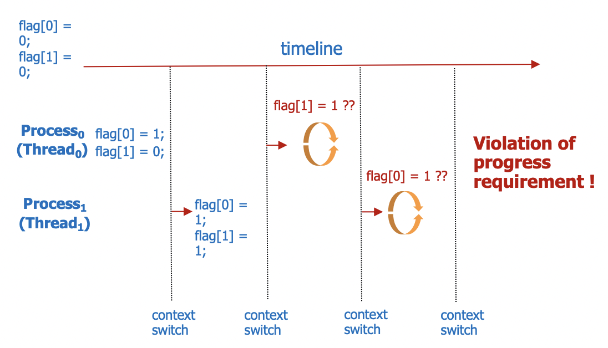

운영체제 6단원, 동기화 도구에 관해 정리한다.

# 1. 동기화 도구의 배경

앞서 프로세스끼리 영향을 주고받는 방법에는 공유 데이터와 메시지 전달이 있다고 했다. 그런데 공유 데이터를 사용할 때는 동기화 문제가 발생할 수 있다. 예를 들어 A 프로세스가 공유 데이터에 쓰고 있는데 B 데이터도 공유 데이터에 접근해서 쓰기를 시도한다면 어떤 데이터가 공유 데이터에 쓰여질지 알 수 없다.

이렇게 여러 프로세스가 동일한 데이터에 접근하여 조작하고 실행 결과가 접근의 특정 순서와 어떤 프로세스가 먼저 종료되는지에 따라 달라지는 상황을 race condition이라 한다. 이런 문제를 해결하기 위해 동기화가 필요하다.

동기화에 요구되는 것은 원자적인 연산인데 원자적 연산이란 연산이 실행되는 동안에는 다른 프로세스가 해당 연산을 실행할 수 없는 연산을 말한다. 예를 들어 공유 데이터에 쓰기를 하는 연산이 원자적이라면 하나의 프로세스가 공유 데이터에 write를 하는 동안 다른 프로세스가 공유 데이터에 쓰기를 시도할 수 없다.

또한 다중 스레드 환경이 일반적이 되어감에 따라 동기화 문제가 발생할 수 있는 상황이 더 많아졌다. 그래서 동기화 도구의 필요성은 더 증가하고 있다.

# 2. 임계 구역 문제

임계 구역(critical section)은 둘 이상의 프로세스가 동시에 접근해서는 안 되는 공유 데이터 영역에 접근하는 코드를 이야기한다. 즉 하나의 프로세스가 임계 구역을 수행하는 동안에는 다른 프로세스들이 그 프로세스의 임계 구역에 접근할 수 없다.

그리고 임계구역 문제(critical section problem)은 프로세스들이 각자의 활동을 동기화할 때 사용할 수 있는 프로토콜을 설계하고 임계 구역에서 하나의 프로세스만 실행되도록 하는 문제를 말한다.

## 2.1 문제 해결의 조건

임계 구역 문제를 해결하는 방법은 여러 가지가 있다. 그러나 어떤 방법이든 다음 조건을 충족해야 한다.

1. 상호 배제(mutual exclusion) : 임계 구역에는 하나의 프로세스만 접근할 수 있다.
2. 진행(progress) : 자신의 임계구역에서 실행되고 있는 프로세스가 없고 각자의 임계구역에 진입하고자 하는 프로세스들이 있다면 그 임계구역에 진입하고자 하는 프로세스의 선택은 무기한 연기될 수 없다. 이 말은 임계 구역에서 작업중인 프로세스가 없고 거기에 진입하고자 하는 프로세스가 있다면 그 프로세스는 무기한 연기되지 않고 임계 구역에 진입할 수 있어야 한다는 것이다.
3. 한정된 대기(bounded waiting) : 특정 프로세스가 자신의 임계 구역에 진입하고자 하는 요청을 한 이후 그 요청의 허용까지, 다른 프로세스들이 각자의 임계 구역에 진입하도록 하는 횟수에 제한이 있어야 한다. 즉 임계구역에 진입하고자 하는 프로세스를 무한정 기다리게 해선 안된다.

## 2.2 용어 정리

critical section과 관련된 용어들을 정리한다.

- entry section : 각 프로세스는 자신의 임계구역으로 진입하기 위해 진입 허가를 요청한다. 임계 구역에 진입하기 위한 이런 요청을 보내는 부분을 entry section이라고 한다.
- exit section : 임계 구역에서 실행을 마치고 나가기 위해 임계 구역을 떠나는 부분을 exit section이라고 한다.
- remainder section : entry section, critical section, exit section을 제외한 나머지 부분을 remainder section이라고 한다.

일반적인 프로세스의 구조는 다음과 같다.

```c
while(true){
  entry section;
  critical section;
  exit section;
  remainder section;
}
```

## 2.3 생각할 수 있는 해결책

Peterson's Algorithm이라는 해결책이 있지만 먼저 단순하게 생각할 수 있는 해결책을 생각해보자.

프로세스는 P0, P1 2가지밖에 없다고 생각하자. 그럼 먼저 다음과 같은 해결책을 생각할 수 있다.

### 2.3.1 첫번째 시도

turn이라는 변수를 두어서, 초기에는 turn=0이고 만약 turn==i이면 Pi, 즉 i번 프로세스가 임계 구역에 진입할 수 있다고 가정하자. 그럼 다음과 같은 코드를 i번 프로세스에서 실행하는 해결책을 생각할 수 있다.

```c
do{
  while(turn != i);
  // critical section
  turn = j;
  // remainder section
}while(1);
```

프로세스 0이 시작하고 임계 구역에서 작업하고, 그게 끝나고 나면 다른 프로세스(여기서는 넘길 프로세스가 1뿐)에 임계 구역을 넘기고 하면서 잘 작동할 것처럼 보인다.

하지만 이는 progress 조건을 위배한다. turn==0이고 P1이 준비 상태가 되어 임계 구역에 진입하려고 하면 turn!=1이기 때문에 P1은 계속해서 while문을 돌게 된다. 그러면 P1은 계속해서 임계 구역에 진입할 수 없게 된다.

### 2.3.2 두번째 시도

프로세스 개수만큼의 원소를 갖는 boolean flag[N]를 선언한다. 여기서는 프로세스가 2개이므로 flag[2] 이다. 초기값은 모두 false로 한다. 그리고 flag[i]가 true이면 i번 프로세스가 준비된 것이라고 가정하자. 그럼 다음과 같은 코드를 i번 프로세스에서 실행하는 해결책을 생각할 수 있다.

```c
do{
  flag[i] = true;
  while(flag[j]);
  // critical section
  flag[i] = false;
  // remainder section
}while(1);
```

이 코드는 상호 배제를 만족하지만 역시 progress에서 안된다. P0에서 flag[0]이 true가 되고 P0이 critical section에 진입하기 전에 P1에서 flag[1]을 true로 만들게 되면 아직 임계 구역에는 아무 프로세스도 진입하지 않았는데 P0, P1 모두 무한히 대기하게 된다.



### 2.3.3 세번째 시도(Peterson's Algorithm)

turn, flag 모두 사용한다. turn==i이면 i번째 프로세스가 임계 구역에 진입할 수 있다고 가정하자. 그리고 flag[i]가 true이면 i번 프로세스가 준비된 것이라고 가정하자. 그럼 다음과 같은 코드를 i번 프로세스에서 실행하는 해결책을 생각할 수 있다.

```c
do{
  flag[i] = true;
  turn = j;
  while(flag[j] && turn == j);
  // critical section
  flag[i] = false;
  // remainder section
}while(1);
```

i번 프로세스는 임계 구역으로 진입하기 위해 먼저 flag[i]를 true로 만들고 turn을 j로 지정한다. 만약 j번 프로세스가 준비가 된다면 프로세스에 진입할 수 있도록 하기 위해서이다.

두 프로세스가 동시에 진입을 원한다고 해도 결국 turn이 어떤 값이 되는지에 따라서 임계 구역에 진입하는 프로세스가 결정될 것이다.

이 방식은 앞의 3가지 조건을 모두 만족한다. 하지만 최신 컴퓨터 아키텍처에서는 컴파일러가 종속성 없는 읽기/쓰기 작업의 순서를 변경할 가능성이 있기 때문에 Peterson's Algorithm은 최신 컴퓨터 아키텍처에서의 동작을 보장할 수 없다.

또다른 상호 배제 알고리즘으로 Dekker's Algorithm이 있다. 여기 관심 있다면 다음 링크를 참고한다. [Peterson's Algorithm, Dekker's Algorithm difference](https://cs.stackexchange.com/questions/12621/contrasting-peterson-s-and-dekker-s-algorithms), [crocus 블로그의 Dekker's Algorithm](https://www.crocus.co.kr/1370)

하지만 앞서 살펴본 알고리즘들은 모두 최신 컴퓨터 아키텍처에서의 동작을 보장할 수 없다. 따라서 우리는 앞으로 설명할 적절한 동기화 도구를 사용해야 한다. 이 동기화 도구는 하드웨어적인 지원부터 고수준 API까지 다양하다. 하나씩 보자.

# 3. 동기화를 위한 하드웨어 지원

## 3.1 Memory Barrier

앞서 보았던 Peterson's Algorithm의 문제는 시스템이 명령어 순서를 재정렬할 수 있다는 점에서 온다. 즉 한 프로세스의 메모리 변경 사항이 다른 프로세스에게 즉시 반영되지 않을 수 있다는 것이다. 이러한 문제를 해결하기 위해 하드웨어적으로 지원하는 동기화 기능이 바로 Memory Barrier이다.

Memory Barrier 명령어는 시스템에서 후속으로 오는 load, store 연산이 실행되기 전에 현재 프로세스에서 진행되고 있는 저장 작업이 메모리에서 완료되도록 한다. 그래서 그 후의 load, store 연산이 메모리에 반영된 최신 값을 읽거나 쓸 수 있도록 한다.

즉 한 프로세서의 메모리 변경 결과가 다른 프로세서들에게 모두 보이도록 하여 메모리를 동기화하는 것이다.

## 3.2 Test and Set

TestAndSet 명령은 한 워드의 내용을 검사하고 변경한다.

```c
// 데이터를 읽으면서 쓰기
int TestAndSet(int *target) {
    int rv = *target;
    *target = TRUE;
    return rv;
}
```

중요한 건 이 명령이 atomic하게 실행된다는 것이다. 만약 서로 다른 두 코어에서 이 명령을 동시에 실행한다면 lock 변수를 써서 동기화를 해야 한다.

```c
do{
  while(TestAndSet(&lock));
  // critical section
  lock = FALSE;
  // remainder section
} while(TRUE);
```

임계 구역 접근이 끝나고 나면 lock 변수를 FALSE로 바꾸어 다른 프로세스가 접근할 수 있도록 한다. 단 이 코드는 lock 변수가 TRUE일 경우 프로세스가 준비되어도 계속해서 대기하게 된다. 즉 bounded waiting은 만족하지 못한다.

## 3.3 Swap

Swap 명령은 두 워드의 내용을 교환한다.

```c
void Swap(int *x, int *y) {
    int tmp = *x;
    *x = *y;
    *y = tmp;
}
```

# 참고

박성범 님의 블로그, 공룡책으로 정리하는 운영체제 Ch6 https://parksb.github.io/article/10.html

```

```
