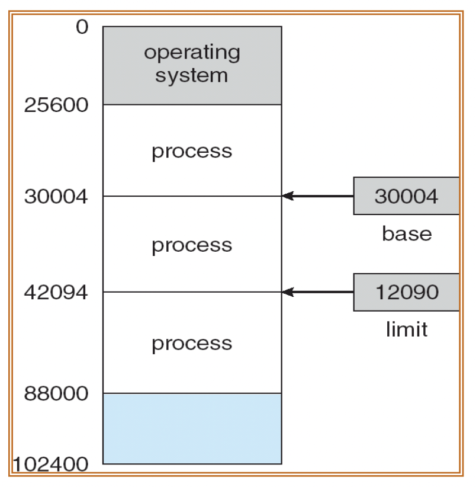

운영체제 9단원, 메인 메모리에 관하여 정리한다. 주로 메모리를 관리하는 다양한 방법에 대해 설명한다.

# 1. 배경

프로그램은 기본적으로 메모리에 올라간 코드이다. 그리고 다음과 같은 과정을 거쳐서 실행된다.

메모리에서 명령어 하나를 가져온다(fetch)
명령어를 해독한다(decode)
필요한 경우 메모리에서 피연산자를 가져온다(operation fetch)
피연산자를 이용하여 연산을 수행한다(execute)
연산 결과를 메모리에 저장한다(store)

이때 메모리는 주소에 의해서 접근되는데, 이런 메모리는 어떻게 관리되는가?

## 1.1 기본 하드웨어

CPU는 레지스터와 메인 메모리에 직접 접근할 수 있다. 디스크에는 직접 접근할 수 없다. 따라서 모든 명령어와 사용되는 데이터는 메모리에 올라와 있어야 한다.

하지만 레지스터의 접근은 1사이클만에 가능한 데 반해 메인 메모리에 접근하는 것은 훨씬 더 많은 사이클이 소요된다. 따라서 메인 메모리를 사용하는 명령의 경우 필요한 데이터가 없어서 명령어의 실행이 지연되는 현상이 나타나는데 이를 stall이라 한다.

이를 해결하는 방법으로는 CPU와 메인 메모리 사이에 캐시 메모리를 추가하는 방법이 있다.

## 1.2 메모리 보호

시스템의 올바른 동작을 위해서는 메모리에 있는 프로그램이 다른 프로그램의 메모리에 접근하지 못하도록 해야 한다. 이를 위해서 각 프로세스가 독립된 공간을 가지도록 한다.

이 독립된 공간은 다음과 같이 base와 limit를 통해서 정의된다. 특정 프로세스에 대해 legal한 메모리라 함은 base에서 base+limit까지이다.

이 base, limit는 커널 모드에서 정해지며 사용자 프로그램은 이를 변경할 수 없다. 또한 다른 프로세스의 메모리에 접근하게 되면 운영체제는 이를 오류로 감지하고 트랩(소프트웨어 인터럽트)을 발생시킨다.

## 1.3 주소 바인딩

프로세스는 메모리의 어느 위치에 올라가게 되는가? 이를 정해주는 것을 주소 바인딩이라 한다. 그리고 어느 시점에 이루어지는지에 따라 다음과 같이 나눠진다.

- compile time : 컴파일 시점에 물리 주소가 정해진다. 프로세스가 메모리 내에서 들어갈 위치를 컴파일 시간에 미리 알 수 있다. 그러나 주소를 완전히 고정해 버리기 때문에 비효율 혹은 충돌이 발생할 수 있다.
- load time : 컴파일 타임에 메모리 위치를 알 수 없다면 이진 코드는 재배치 가능한 코드로 만들어진다. 그리고 이 코드는 프로그램이 메인 메모리로 적재되는 시점에 메모리에 올라가는 위치에 따라서 주소가 바인딩된다.
- Execution time : MMU(Memory Management Unit)가 실행 시간에 논리 주소를 물리 주소로 변환해 준다.

## 1.4 동적 라이브러리, 정적 라이브러리

라이브러리는 정적 라이브러리, 동적 라이브러리가 있다.

### 1.4.1 정적 라이브러리

프로그램이 실행되기 전 컴파일 타임에 링커가 정적 라이브러리 내용을 실행 파일에 포함시킨다. 그러나 프로그램이 실행되는 동안에는 라이브러리의 내용을 변경할 수 없다. 그리고 실행 파일 크기가 커질 수 있다.

### 1.4.2 동적 라이브러리

사용자 프로그램이 실행되는 시점(런타임)에 프로그램에 연결되는 라이브러리이다. 프로그램이 동적 라이브러리에 있는 코드를 참조하는 시점에 로더가 DLL파일을 찾아서 필요한 경우 메모리에 올린다.

당연히 라이브러리가 있는 주소로 계속 점프하기 때문에 성능 저하가 발생한다. 하지만 메모리가 적게 들고 실행 파일 크기가 작아지며 라이브러리 갱신이 쉽다. 동적으로 링킹되기 때문에 DLL파일 하나만 수정하면 그 파일을 사용하는 모든 실행 파일에서 수정된 DLL을 사용할 수 있다.

## 1.5 Dynamic Loading, Dynamic Linking

### 1.5.1 Dynamic Loading

동적 적재는 loading, linking을 실행 시점까지 미룬다. 그리고 특정 루틴이 필요해지면 그 루틴이 메모리에 있는지를 먼저 검사한다. 만약 그 루틴이 메모리에 적제되지 않은 상태라면 relocatable linking loader가 그 루틴을 메모리에 적재한다. 그리고 그 루틴을 호출한다.

POSIX의 dlopen(), window의 LoadLibrary()가 이를 지원하는 API이다.

### 1.5.2 Dynamic Linking

동적 링킹은 실행시에 linking을 하는 것이다. 실행 파일은 메모리에서 적절한 라이브러리 루틴으로 이동하는 코드를 가지고 있고 OS가 이를 실행시에 해석한다. 실행 파일에 들어 있지 않은 루틴과 동적 라이브러리 루틴을 운영체제가 연결한다.

## 1.6 Swapping

실제 물리 메모리보다 크기가 큰 프로세스를 실행하는 등의 이유로 메모리가 부족하면 메모리에 있는 프로세스 중 일부를 디스크로 내보내는 것을 swapping이라고 한다. 예를 들어서 [메인 메모리보다 큰 파일을 정렬하는 경우](https://yuni.vercel.app/external-sorting/)

Swap에 걸리는 시간 대부분은 디스크로 전송하는 시간이라고 한다. 또한 우선순위가 낮은 프로세스를 밀어내고 우선순위가 높은 프로세스를 메모리에 올리는 Swap을 roll out, roll in이라고도 한다.

# 2. 연속 메모리 할당

# 참고

[박성범 님의 블로그, 공룡책으로 정리하는 운영체제 Ch8](https://parksb.github.io/article/12.html)
