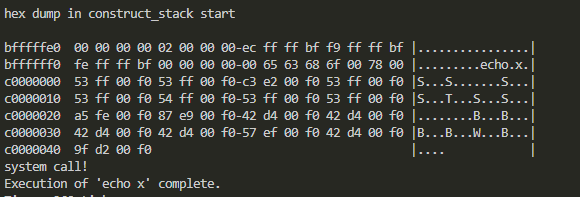

# 1. 본격적인 프로젝트 시작

이번 과제는 시스템 콜 핸들러와 시스템 콜 일부가 작동하도록 하는 것이다.

먼저 pintos 폴더의 src/userprog 와 src/examples 디렉토리에서 make를 실행한 후 src/userprog 디렉토리에서 다음 커맨드를 실행해 본다.

```
pintos --filesys-size=2 -p ../examples/echo -a echo -- -f -q run 'echo x'
```

원래는 `echo x`를 실행하면 `x`가 출력되어야 하지만, 현재는 아무것도 출력되지 않는다. 커맨드를 운영체제에 전달하는 부분이 모두 빠져 있기 때문이다.

핀토스에서 커맨드가 실행되는 방식은 다음과 같다. `echo x`라는 명령이 전달되면 `echo`, `x` 가 유저 스택에 쌓이고, 이 인자들이 커널에 전달되고 커널은 그 인자를 받아 시스템 콜 핸들러를 실행한다. 시스템 콜 핸들러는 적절한 시스템 콜을 실행해 준다.

하지만 아직 핀토스에는 유저 스택, 스택의 인자를 커널에 전달하는 로직, 시스템 콜 핸들러가 구현되어 있지 않기 때문에 `echo x`를 실행하면 아무것도 출력되지 않는다. 즉 유저와 커널이 연결되어 있지 않다.(커널에는 적절한 시스템 콜들이 이미 구현되어 있다) 이번 프로젝트1에서는 이 연결 부분 일부를 구현해야 한다.

# 2. 유저 스택 구현

## 2.1 분석

유저 스택은 커널이 아닌 유저 프로그램이 사용하는 스택이다. 유저 프로그램이 커널에게 시스템 콜을 요청할 때, 인자를 유저 스택에 쌓아두고, 커널에게 전달한다. 커널은 유저 스택에 있는 인자를 꺼내서 시스템 콜을 실행한다.

이 유저 스택에 인자를 쌓는 것을 80x86 호출 규약에 따라서 구현해야 한다. 그럼 이걸 어디서 구현해야 하는가?

먼저 핀토스에서 프로그램을 실행하는 과정을 파헤쳐 본다. `threads/init.c`의 메인 함수가 실행되면서 `run_actions` 함수를 호출한다. 이때 `run` 옵션이 주어져 있으면 `run_task`함수가 호출되고 `run_task`에서는 `process_execute`함수를 이용하여 유저 프로세스를 생성한다. 또한 이 생성된 프로세스는 `process_wait` 내에 들어가서 핀토스가 유저 프로세스 종료까지 기다리게 한다(`process_wait` 부분은 아직 구현되어 있지 않긴 하다. 원래는 그렇다는 것).

그러면 이 프로세스 생성은 어떻게 되는가? `process_execute`함수에서는 `thread_create` 함수를 이용해서 새로운 스레드를 생성한다. 그리고 이 스레드는 `thread_create`를 통해 만들어지면서 `start_process` 함수를 실행하고 run queue에 올라간다.

`start_process` 함수는 `load` 함수를 호출하여 유저 프로그램을 메모리에 올린다(만약 메모리에 로드가 실패할 시 스레드 종료). 그리고 `setup_stack` 함수를 호출하여 유저 스택을 초기화한다. 그럼 우리는 `load`함수에서 유저 스택에 인자를 쌓는 것을 구현하면 된다. 그러면 그 스택이 메모리에 로드되어 있는 유저 프로그램에 전달될 것이다.


## 2.2 실행 파일 이름 수정

먼저 load 함수의 file name이 무엇인지 체크하자. load에 `printf`로 file_name을 출력하는 코드를 추가한다. 단 아직 `process_wait`이 구현되어 있지 않으므로 `printf`의 결과가 출력되기 전에 핀토스가 종료될 수 있다. 그래서 `process_wait`을 일단 2초 정도 대기하는 것으로 대체했다. 여기는 `src/devices/timer.h`의 `timer_msleep`을 사용하였다.

```c
int process_wait (tid_t child_tid UNUSED) {
  // timer_msleep는 milisecond 단위로 대기한다.
  timer_msleep(2000);
  return -1;
}
```

그리고 아까의 커맨드인 `pintos --filesys-size=2 -p ../examples/echo -a echo -- -f -q run 'echo x'`를 실행하면 `echo x`가 출력되는 것을 확인할 수 있다. 이게 load의 인자로 주어진 file_name이다.

여기서는 file_name은 `filesys_open`함수에 인자로 넘어간다. 따라서 `file_name`의 내용을 제목으로 갖는 파일을 열게 되는 것이다. 하지만 현재 `file_name`은 명령줄 전체를 가리키고 있다. 명령이 `echo x`라면 echo만 파일 이름이 되어야 하는데 명령 전체가 파일명으로 인식되는 것이다. 따라서 `file_name`을 수정해야 한다.

이는 file_name을 공백을 통해 구분하여 첫 번째 단어를 파일명으로 인식되게 하면 된다. 따라서 `load` 함수의 첫 부분을 다음과 같이 수정한다. `file_name_first_word`에 file_name의 첫 단어를 넣고 이를 filesys_open에 넘겨주는 것이다. 또한 malloc을 했으면 free를 해주는 걸 잊으면 안 된다.

```c
/* Allocate and activate page directory. */
  t->pagedir = pagedir_create ();
  if (t->pagedir == NULL)
    goto done;
  process_activate ();

  /* parse the first word of file_name */
  file_name_copy=malloc(sizeof(char)*(strlen(file_name)+1));
  strlcpy(file_name_copy, file_name, (strlen(file_name)));
  file_name_copy[strlen(file_name)]='\0';
  file_name_first_word=strtok_r(file_name_copy, " ", &save_ptr);
  printf("\n\n%s\n\n", file_name_first_word);
  /* Open executable file. */
  file = filesys_open (file_name_first_word);
  if (file == NULL)
    {
      printf ("load: %s: open failed\n", file_name_first_word);
      free(file_name_copy);
      goto done;
    }
    free(file_name_copy);
```

다시 `src/userprog`에서 make를 하고 `pintos --filesys-size=2 -p ../examples/echo -a echo -- -f -q run 'echo x'`를 실행하면 `file_name_first_word`의 값으로 `echo`가 출력되는 것을 확인할 수 있다. 물론 페이지 폴트가 뜨지만 이건 유저 스택을 구성하면 해결된다.

## 2.3 유저 스택 구성

이제 80x86 호출 규약에 따라서 유저 스택을 구성해 주자. 이 내용은 [pintos 공식 매뉴얼](https://web.stanford.edu/class/cs140/projects/pintos/pintos.pdf)의 35-38쪽에 자세히 나와 있다.

만약 다음과 같은 커맨드가 들어왔다고 하자.

```bash
/bin/ls -l foo bar
```

호출 규약에 따르면 다음과 같이 스택에 쌓여야 한다. 이 작업을 시작하자.


### 2.3.1 스택에 인자 넣기

이 작업은 전달받은 커맨드 라인과 스택 포인터를 통해서 이루어진다. 커맨드 라인의 인자들과 주소 등을 유저 스택에 쌓으면서 스택 포인터(esp)를 이동시켜 주는 것이다. 따라서 그 둘을 받는 함수 `construct_stack`을 `src/userprog/process.c`에 추가하고 프로토타입도 `src/userprog/process.h`에 추가한다.

먼저 인자들을 문자열 형태로 스택에 쌓아 줘야 한다. 단 거꾸로 쌓아줘야 하므로 이 동작을 위해서는 전체 인자의 개수를 알아야 한다. 따라서 먼저 인자의 개수를 세어 주자. 먼저 문자열을 공백으로 구분하기 위해 <string.h>의 `strtok_r`함수를 사용할 것인데 이 함수는 인자로 들어오는 문자열을 훼손시키므로 먼저 복사본을 만들어 주자.

```c
void construct_stack(const char* file_name, void** esp){
  int argc, idx;
  char** argv;
  int total_arg_len, cur_arg_len;
  char* file_name_token, *save_ptr;
  char* file_name_copy;

  file_name_copy=malloc(sizeof(char)*(strlen(file_name)+2));
  strlcpy(file_name_copy, file_name, strlen(file_name)+1);
  file_name_copy[strlen(file_name)]='\0';
}
```

그리고 하나하나 파싱해 가며 인자 개수를 센다. 중간중간 주석에 있는 출력 코드는 디버깅을 위한 것인데 저런 식으로 복사된 것이나 토크나이징된 결과를 출력하면서 코드를 짰다.

```c
  argc=0;
  // count arg
  // function name parse
  // file_name_token=strtok_r(file_name_copy, " ", &save_ptr);
  // Argument number count
  for(file_name_token=strtok_r(file_name_copy, " ", &save_ptr);file_name_token!=NULL;file_name_token=strtok_r(NULL, " ", &save_ptr)){
    //printf("tokenized file name : %s\n", file_name_token);
    argc++;
  }
  //printf("arg count : %d\n\n",argc);
```

그 다음으로는 인자들(문자열)을 넣어 줘야 한다. 하지만 호출 규약에 맞추려면 인자가 주어진 순서와 반대로 스택에 넣어야 한다. 따라서 먼저 인자들을 저장할 공간을 할당해 주자. 그리고 다시 토크나이징을 해서 인자들을 저장해 준다. 이때 추후를 위해서 인자들이 들어간 전체 공간의 길이도 `total_arg_len`으로 저장한다.

```c
  argv=malloc(sizeof(char)*(argc+1));
  strlcpy(file_name_copy, file_name, strlen(file_name)+1);
  file_name_copy[strlen(file_name)]='\0';
  idx=0;
  total_arg_len=0;
  for(file_name_token=strtok_r(file_name_copy, " ", &save_ptr);file_name_token!=NULL;file_name_token=strtok_r(NULL, " ", &save_ptr)){
    total_arg_len+=strlen(file_name_token)+1;
    argv[idx]=file_name_token;
    idx++;
  }
```

이제 드디어 인자들을 스택에 넣을 차례다. 인자들의 주소를 저장한 배열 argv를 역순으로 순회하면서 인자들을 문자열 형태로 스택에 담아 준다. 그러면서 이후 스택에 인자들의 주소도 담을 것을 대비해서 argv배열에는 각 인자들의 시작 주소를 저장해 둔다.

```c
  for(idx=argc-1;idx>=0;idx--){
    cur_arg_len=strlen(argv[idx]);
    *esp-=cur_arg_len+1; // include null character
    strlcpy(*esp, argv[idx], cur_arg_len+1);
    // 각 인자들의 시작 주소 저장
    argv[idx]=*esp;
    //printf("file name token %s\n", *esp);
  }
```

그 다음으로는 word alignment, NULL, 인자들의 시작 주소, argv주소, argc, return address를 차례로 넣어 준 후 동적 할당한 메모리를 해제해 준다. 이렇게 해서 구성된 `construct_stack` 함수는 다음과 같다.

```c
void construct_stack(const char* file_name, void** esp){
  int argc, idx;
  char** argv;
  int total_arg_len, cur_arg_len;
  char* file_name_token, *save_ptr;
  char* file_name_copy;

  file_name_copy=malloc(sizeof(char)*(strlen(file_name)+2));
  strlcpy(file_name_copy, file_name, strlen(file_name)+1);
  file_name_copy[strlen(file_name)]='\0';

  argc=0;
  // count arg
  // function name parse
  // file_name_token=strtok_r(file_name_copy, " ", &save_ptr);
  // Argument number count
  for(file_name_token=strtok_r(file_name_copy, " ", &save_ptr);file_name_token!=NULL;file_name_token=strtok_r(NULL, " ", &save_ptr)){
    //printf("tokenized file name : %s\n", file_name_token);
    argc++;
  }
  //printf("arg count : %d\n\n",argc);

  argv=malloc(sizeof(char)*(argc+1));
  strlcpy(file_name_copy, file_name, strlen(file_name)+1);
  file_name_copy[strlen(file_name)]='\0';
  idx=0;
  total_arg_len=0;
  for(file_name_token=strtok_r(file_name_copy, " ", &save_ptr);file_name_token!=NULL;file_name_token=strtok_r(NULL, " ", &save_ptr)){
    total_arg_len+=strlen(file_name_token)+1;
    argv[idx]=file_name_token;
    idx++;
  }

  for(idx=argc-1;idx>=0;idx--){
    cur_arg_len=strlen(argv[idx]);
    *esp-=cur_arg_len+1; // include null character
    strlcpy(*esp, argv[idx], cur_arg_len+1);
    argv[idx]=*esp;
    //printf("file name token %s\n", *esp);
  }

  /* word alignment */
  if(total_arg_len%4){
    *esp-=4-(total_arg_len%4);
  }
  /* NULL pointer seltinel ensures that argv[argc] is NULL
  (required by C standard) */
  *esp-=4;
  **((uint32_t**)esp)=0;

  for(idx=argc-1;idx>=0;idx--){
    *esp-=4;
    **((uint32_t**)esp)=argv[idx];
  }

  //argv
  *esp-=4;
  **((uint32_t**)esp)=*esp+4;

  //argc
  *esp-=4;
  **((uint32_t**)esp)=argc;

  //return address
  *esp-=4;
  **((uint32_t**)esp)=0;

  free(argv);
  free(file_name_copy);
}
```

이때 스택에 인자들이 잘 담겼는지 디버깅을 위해서는 `hex_dump`함수를 이용할 수 있다. `construct_stack`함수의 끝에 다음과 같은 코드를 추가해 보자.

```c
printf("hex dump in construct_stack start\n\n");
hex_dump(*esp, *esp, 100, true);
```

그 상태에서 `src/userprog`에서 make를 하고 이를 실행하면 다음과 같이 메모리가 hex형태로 출력되어 나온다. 이게 호출 규약에 맞게 잘 구성된 메모리인지를 직접 계산해서 확인할 수 있다.

```
pintos --filesys-size=2 -p ../examples/echo -a echo -- -f -q run 'echo x'
```



# 참고

한양대학교 핀토스 ppt https://oslab.kaist.ac.kr/wp-content/uploads/esos_files/courseware/undergraduate/PINTOS/Pintos_all.pdf

어떤 선배님의 네이버 블로그
https://m.blog.naver.com/adobeillustrator/220843740425
