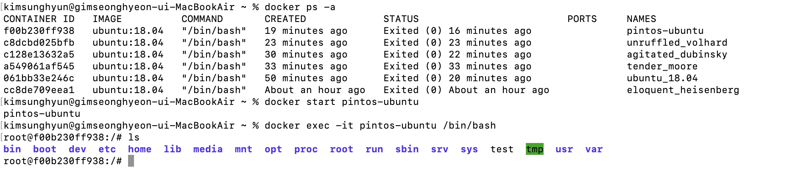

오랜 시간이 지나 핀토스로 돌아왔다. 면접을 준비하며 운영체제를 복습해야 하는데 그럴 겸, 내가 가장 열심히 했던 과제 중 하나인 핀토스를 보강해 볼까 한다.

원래는 로컬에서 돌려 보려고 했는데, 4시간의 사투 끝에 마음이 꺾여 버렸다. 그 이후로도 서강대 핀토스를 돌려 보려고 애쓴 수많은 일들이 있었다. 가령 i386-elf-gcc가 없어서 i686-elf-gcc로 한 다음 일단 threads make까진 성공했지만 userprog에서 막힌다든지. 그래서 그냥 stanford에서 제공하는 핀토스를 하기로 했다.

우분투 환경을 만들기 위해 도커로 Ubuntu 18.04를 돌린 후 거기서 QEMU를 돌리기로 했다. cspro를 쓰며 이 글을 보는 누군가들은 이런 걸 할 필요가 없지만, 한 게 아까워서 간략하게 과정을 정리한다. 예전에 연구실에서 ROS 하겠다고 설치면서 도커를 깔던 기억이 난다. 그땐 내가 로보틱스 할 줄 알았는데...아무튼 해보자. 그땐 도커 가지고 일주일은 삽질했는데 이제는 하루에 해서 다행이라고 해야 하나..

# 1. 도커 설치

[갓대희 님의 블로그](https://goddaehee.tistory.com/312)를 참고하였다.

[도커 공식 홈페이지](https://www.docker.com/products/docker-desktop/)에서 애플 맥을 위한 도커를 내려받는다. 내려받은 파일을 설치하면 된다. `docker --version` 명령어로 버전을 확인하고 잘 설치되었는지 확인할 수 있다.

그리고 우분투 18.04 이미지를 내려받자. 원래는 실행하는 명령어지만 이미지가 없는 상태에서 이렇게 하면 이미지를 다운받게 된다.

```
docker run ubuntu:18.04
```

이제 도커를 실행해야 한다. 여기부터는 [이 글](https://velog.io/@peeeeeter_j/Docker%EC%97%90%EC%84%9C-Ubuntu-20.04-%EC%82%AC%EC%9A%A9%ED%95%98%EA%B8%B0)을 참고했다.

docker run명령을 통해 컨테이너를 생성할 수 있다. 이 명령어 형식은 다음과 같다.

```
docker run [OPTIONS] IMAGE[:TAG|@DIGEST] [COMMAND] [ARG...]
```

`[]`로 감싸인 것들은 선택적으로 사용된다. options에는 `-i`, `-t`, `--name name`등 옵션들이 올 수 있다. 그리고 IMAGE에는 우리가 실행할 이미지를 넣는다. 지금같은 경우 방금 받은 `ubuntu 18.04`가 될 것이다. 또한 command는 이 컨테이너로 실행할 명령어인데 우리는 우분투 터미널을 실행할 것이므로 `/bin/bash`를 넣어준다. 따라서 우리가 쓸 명령어는 다음과 같다. 

앞서 설명한 것 같은 도커 명령어에 대한 설명은 [여기](https://www.daleseo.com/docker-run/)로.

```
docker run -it --name pintos-ubuntu ubuntu:18.04 /bin/bash
```

`-i`는 표준 입력을 컨테이너에 연결하며 `-t`는 가상 터미널을 제공한다. `--name`은 다음에 오는 단어로 컨테이너의 이름을 지정한다. 이제 이 명령어를 실행하면 우분투 터미널이 실행된다. 

그 우분투 터미널에 있는 상태로 `exit`를 입력하면 빠져나올 수 있는데 그 상태에서 `docker ps`로 컨테이너들의 상태를 확인할 수 있다. 만약 나오지 않는다면 `docker ps -a`에서 종료된 컨테이너들까지 확인하자.

## 1.1. 컨테이너 사용하기

이제 컨테이너가 생겼다. 도커를 쓸 때는 컨테이너 생성 -> 컨테이너 실행 -> 컨테이너에서 명령어 실행의 순서를 따른다. 생성은 방금 `docker run`에서 했다. 실행은 `docker start`를 통해 할 수 있다. `docker ps`명령어를 통해 컨테이너 상태를 확인할 수 있으면 컨테이너가 실행중인 것이다.

명령어 실행은 `docker exec` 명령을 사용한다. 나머지 형식은 `docker run`과 같다.

```bash
docker exec -it pintos-ubuntu /bin/bash
```

그러면 우분투 환경이 잘 실행되는 것을 터미널에서 확인할 수 있다.



이 상태에서 exit를 하면 다시 나갈 수 있다. 그런데 `docker ps`를 해보면 아직 컨테이너가 살아 있다. 이 컨테이너를 멈추려면 `docker stop`을 사용하자.

```bash
docker stop pintos-ubuntu
```

이렇게 하고 나면 `docker ps`의 결과에 해당 컨테이너가 없는 것을 확인 가능하다. 물론 데이터는 보존되어서, 후에 `docker start`로 다시 컨테이너를 실행시키면 다시 쓸 수 있다.

## 1.2. pintos 설치

여기부터는 [카이스트 핀토스 페이지](https://oslab.kaist.ac.kr/pintosslides/)의 설치 슬라이드와 [카이스트의 핀토스 가이드](https://casys-kaist.github.io/pintos-kaist/introduction/getting_started.html), [어떤 서강대생 블로그](https://eomtaegyung.tistory.com/4), [스탠포드 공식 가이드](https://www.scs.stanford.edu/23wi-cs212/pintos/pintos_1.html)등을 참고했다.

우분투 컨테이너에 접속했다면 이제 패키지 업데이트를 진행한다. 그리고 필수 유틸리티 설치.

```bash
apt-get update
apt-get install g++ xorg-dev ncurses-dev vim
```

그리고 vim과 pintos를 돌릴 QEMU를 설치하자. qemu는 설치에 시간이 좀 걸린다.

```
apt-get install vim
apt-get install qemu
```

그리고 심볼릭 링크 생성

```
ln -s /usr/bin/qemu-system-i386 /usr/bin/qemu
```

gcc 설치

```
apt-get install libc6-dev g++ gcc
```

그리고 pintos 폴더를 생성 후 거기에 코드를 클론해 온다.

이제 pintos/src/threads로 들어가서 make. 그러면 make not found가 뜬다. 바로 `apt-get install build-essential`

이번에는 i386-elf-gcc를 찾지 못했다고 한다. $PATH에 i386-elf-ld 경로를 추가해주자. 어..그런데 죽어도 i386-elf-ld가 없다.

이틀의 삽질을 했다. 그리고 그냥 우분투 pc를 준비하는 게 낫겠다는 결론을 내렸다. cspro가 그립다2.

예전에 쓰던, 우분투 18.04가 깔린 노트북을 다시 꺼냈다. 여기에 ssh로 원격 작업 환경을 만들자.

# 1. priority-donation

이전 글에서 핀토스 프로젝트 3 중 서강대에서 요구하는 부분을 마쳤다. 하지만 threads 폴더의 테스트 중 아직 통과를 못하는 부분이 있다. `priority-donate`로 시작하는 테스트들이다. 이 부분을 구현해서 all pass를 받고 나서 Virtual memory로 넘어가자.


# 참고

https://oslab.kaist.ac.kr/pintosslides/ 의 installing pintos 슬라이드

ubuntu 설치 https://tistory.joonhyung.xyz/2

https://www.cs.jhu.edu/~huang/cs318/fall21/project/setup.html

https://velog.io/@peeeeeter_j/Docker%EC%97%90%EC%84%9C-Ubuntu-20.04-%EC%82%AC%EC%9A%A9%ED%95%98%EA%B8%B0

https://subicura.com/2017/01/19/docker-guide-for-beginners-2.html