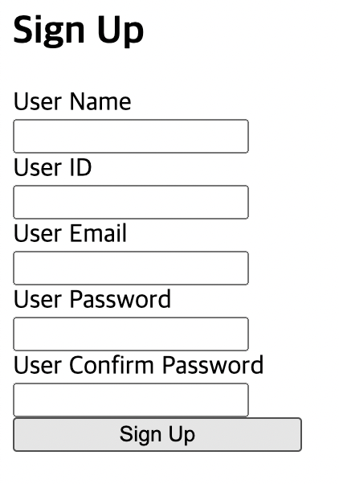

# 1. 시작

이번 글에서는 useReducer를 왜 사용하는지에 대해 알아보고자 한다.

# 2. useReducer의 활용

그럼 이제 useReducer가 어떤 문법으로 작동하는지도 알았고 백엔드와 같이 특정 데이터를 api를 통해 관리하는 모델처럼 볼 수 있다는 점도 알았다. 이제 useReducer를 어떻게 활용할 수 있는지 알아보자.

여러 시행착오와 많은 사람들([이창희](https://xo.dev/)와 [유동근](https://github.com/CreeJee)님 등등)에게 물어본 결과, 일단 useReducer를 기본적으로 잘 쓰지는 않지만 쓰게 되면 이점은 다음과 같다고 한다.

1. 상태 관리 로직을 분리함으로써 상태 업데이트의 내부 로직을 알지 않아도 상태를 사용할 수 있게 되어 복잡한 상태 관리가 편해진다는 점. 즉 상태 업데이트 로직을 은닉할 수 있다는 점
2. 상태 업데이트 시 새로운 상태를 검증하는 등, 어떤 동작을 같이 해 줘야 할 경우 새로운 함수를 만들지 않고도 reducer에 로직을 추가하는 식으로 작성할 수 있다는 점
3. 상태 업데이트를 담당하는 dispatch가 순수 함수이므로 테스팅에 이점이 있다는 점
4. useState를 사용하는 것에 비해 리렌더링을 덜 하게 되는 경우가 생길 수 있는 점

이 각각의 경우를 하나씩 알아보도록 하자.

# 3. 복잡한 state를 관리하는 경우

## 3.1 useState를 사용

useReducer를 사용하면 상태 로직을 컴포넌트에서 분리하여 여러 개의 state를 편리하게 관리할 수 있다는 장점이 있다. 예를 들어서 회원가입 컴포넌트를 만든다고 하자. 이 컴포넌트는 이름, 아이디, 이메일, 비밀번호, 비밀번호 확인 등의 정보를 입력받아야 한다. 일단 이 5개의 요소만 받아서 회원가입을 시켜준다고 해보자. 이렇게 여러 개의 state를 관리해야 하는 경우에는 useState를 사용하면 다음과 같이 폼 관리 로직을 작성할 수 있다.

물론 회원가입 폼의 정보를 담는 객체를 이용해서 단순화할 수도 있을 것이다. 하지만 하나의 컴포넌트에서 여러 개의 상태를 관리해야 하며 객체를 이용한 단순화가 힘든 경우는 분명 생긴다. 그것의 모델링이라 생각하자.

```tsx
function SignUpForm() {
  const [userName, setUserName] = useState("");
  const [userID, setUserID] = useState("");
  const [userEmail, setUserEmail] = useState("");
  const [userPassword, setUserPassword] = useState("");
  const [userConfirmPassword, setUserConfirmPassword] = useState("");

  const handleUserNameChange = (e: React.ChangeEvent<HTMLInputElement>) => {
    setUserName(e.target.value);
  };

  const handleUserIDChange = (e: React.ChangeEvent<HTMLInputElement>) => {
    setUserID(e.target.value);
  };

  const handleUserEmailChange = (e: React.ChangeEvent<HTMLInputElement>) => {
    setUserEmail(e.target.value);
  };

  const handleUserPasswordChange = (e: React.ChangeEvent<HTMLInputElement>) => {
    setUserPassword(e.target.value);
  };

  const handleUserConfirmPasswordChange = (
    e: React.ChangeEvent<HTMLInputElement>
  ) => {
    setUserConfirmPassword(e.target.value);
  };

  return (
    <section>
      <h1>Sign Up</h1>
      <form
        style={{ display: "flex", flexDirection: "column", width: "180px" }}
      >
        <label>
          User Name
          <input type="text" onChange={handleUserNameChange} />
        </label>
        <label>
          User ID
          <input type="text" onChange={handleUserIDChange} />
        </label>
        <label>
          User Email
          <input type="text" onChange={handleUserEmailChange} />
        </label>
        <label>
          User Password
          <input type="text" onChange={handleUserPasswordChange} />
        </label>
        <label>
          User Confirm Password
          <input type="text" onChange={handleUserConfirmPasswordChange} />
        </label>
        <button type="submit">Sign Up</button>
      </form>
    </section>
  );
}
```

스타일링을 하지 않아서 별로 볼품은 없지만 다음과 같은 간단한 회원가입 폼이 완성되었다. 제출 동작은 콘솔에 폼의 내용을 출력하는 것으로 구현했다.



## 3.2 useReducer를 이용한 경우

useReducer를 이용하면 다음과 같은 코드가 된다. 객체를 이용해 좀더 세련되게 짜보았다.

```tsx
interface SignUpFormType {
  "User Name": string;
  "User ID": string;
  "User Email": string;
  "User Password": string;
  "User Confirm Password": string;
}

const initialSignUpForm: SignUpFormType = {
  "User Name": "",
  "User ID": "",
  "User Email": "",
  "User Password": "",
  "User Confirm Password": "",
};

const signUpReducer = (
  state: SignUpFormType,
  action: { type: string; payload: { key: string; value: string } }
) => {
  switch (action.type) {
    case "UPDATE":
      return {
        ...state,
        [action.payload.key]: action.payload.value,
      };
    default:
      throw new Error(`Unknown action type: ${action.type}`);
  }
};

const ReducerSignUpForm = () => {
  const [state, dispatch] = useReducer(signUpReducer, initialSignUpForm);

  const handleSubmit = (e: FormEvent<HTMLFormElement>) => {
    e.preventDefault();
    console.log(state);
  };

  const handleChange = (e: React.ChangeEvent<HTMLInputElement>) => {
    dispatch({
      type: "UPDATE",
      payload: {
        key: e.target.name,
        value: e.target.value,
      },
    });
  };

  return (
    <section>
      <h1>Sign Up</h1>
      <form
        style={{ display: "flex", flexDirection: "column", width: "180px" }}
        onSubmit={handleSubmit}
      >
        {Object.keys(state).map((key) => (
          <label key={key}>
            {key}
            <input type="text" id={key} name={key} onChange={handleChange} />
          </label>
        ))}
        <button type="submit">Sign Up</button>
      </form>
    </section>
  );
};
```

## 3.3 useState, useReducer의 비교

타입을 사용하면서 코드 자체는 좀 길어졌다. 하지만 상태 업데이트 함수도 간소하게 바뀌었고 업데이트 함수를 사용하는 측에서는 Action만 잘 전달하면 상태 업데이트 내부 로직을 신경쓰지 않아도 코드를 짤 수 있게 되었다.

useReducer를 사용한 코드의 경우 회원가입 정보를 객체에 담아서 좀더 세련되게 작성되어 있다. 타입도 사용하였다. 하지만 주목할 점은 그게 아니다. 회원가입 폼 정보를 객체에 담아서 회원가입 폼을 좀더 깔끔하게 짜는 건 useState를 써도 얼마든지 할 수 있는 일이다.

정말 달라진 점은 상태 관리 로직이 컴포넌트와 분리되었다는 것이다. 이제 회원가입 폼 상태를 사용하는 측에서는 action만 잘 만들어서 reducer에 그리고 순수 함수만을 이용해서 상태 관리 로직을 작성했다는 것이다. 이것이 useReducer를 사용한 이유이다.

# 4. state를 설정할 때 특정 작업을 함께하는 경우

# 참고

벨로퍼트의 모던 리액트 useReducer 항목 [20. useReducer 를 사용하여 상태 업데이트 로직 분리하기 · GitBook](https://react.vlpt.us/basic/20-useReducer.html)

React 공식 문서의 useReducer https://ko.reactjs.org/docs/hooks-reference.html#usereducer

useReducer의 사용에 관한 구체적인 글 https://devtrium.com/posts/how-to-use-react-usereducer-hook

useReducer가 최적화에 도움이 될 때 https://stackoverflow.com/questions/54646553/usestate-vs-usereducer

useReducer를 언제 써야 하는지와 써야하는 이유에 관한 짧은 글 https://dev.to/spukas/3-reasons-to-usereducer-over-usestate-43ad#:%7E:text=useReducer()%20is%20an%20alternative,understand%20for%20you%20and%20colleagues
