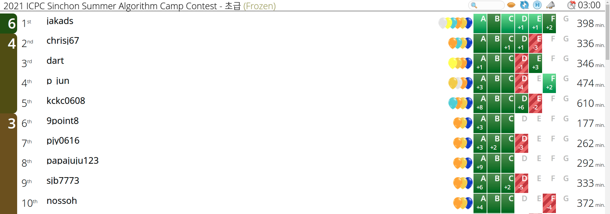
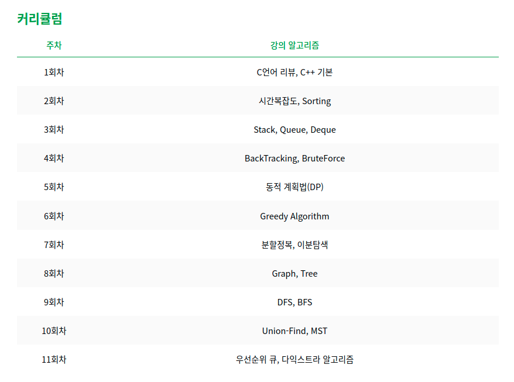

# 신촌연합 알고리즘 캠프 후기

# 1. 모의고사 3등



신촌연합 알고리즘 캠프 초급반 모의고사에서 3등을 했다. 꽤 괜찮은 성적이라고 생각한다. 사실 내가 내 스스로의 힘으로, 내가 그럭저럭 만족할 만한 어떤 결과를 낸 것이 처음이기에 조금은 홀가분한 마음으로 TMI 투성이인 후기를 쓴다. 게다가 후기를 쓰면 추첨을 통해 경품을 주는 이벤트도 진행 중이라 안 쓸 수가 없었다.

# 2. 나에 대하여


방학 시작할 때의 프로필이 없어서 올리는 현재의 내 프로필

---

나는 꽤 알고리즘을 오래 해왔다. 이번 방학이 시작할 때 내 티어는 이미 https://solved.ac/ 기준 플래티넘 4였고, 푼 문제는 800문제를 넘어갔던 것 같다. 단순히 시작한 날짜로 따지면 2년 정도가 되었으니 이상한 일은 아니다.

그러면서 YunGoon, dlstj0923, snowflake, gs11008 등 많은 알고리즘 고수들을 만났고 같은 학교의 고수들인 raararaara, shiftpsh, wbcho0504, djs100201, seastar105 등과도 알게 되었다. 직접 알게 된 사람들 외에도 한두 번 이야기를 나눠본 고수들은 셀 수도 없다. 그리고 그런 사람들처럼 빛나는 사람이 되고 싶어 컴퓨터공학 복수전공을 시작하기도 했다. 또 나보다 훨씬 잘하는 그런 사람들을 모아서 스터디를 이끌어보는 영광을 안기도 했다. 그러면서 내 실력이 꽤 괜찮다고 사람들이 인식하게 된 듯 하다. 

그러나 나는 늘 내 실력이 거품이라고 생각해왔다. 지금도 그렇게 생각한다. 내가 완전 뉴비급으로 못하는 건 아니라는 걸 알지만 그렇다고 플래티넘이라는 티어에 걸맞는 사람이라고 생각하지도 않는다. 한때 쓸데없이 마음만 급해져서 고급 알고리즘에 손끝만 대어 본 덕분일 뿐이다. 내가 푼 문제에는 네트워크 플로우라든지 무슨 고급 테크닉 문제들이 몇 개 있지만 지금에 와서 그런 것들은 하나도 기억나지 않는다. 원리는 전혀 이해하지 못한 채로 거의 코드만 베껴와서 적어넣는 수준이었으니 말이다.

그래서 늘 처음부터 다시 시작하는 것을 생각해 왔다. 그러나 계속 시간이 없어서, 또는 내 쓸데없는 자만심이 그걸 막아서 못해왔었다. 이번 방학에서야 신촌연합 알고리즘 캠프 초급반을 듣는 것으로 겨우 그것을 실현하게 되었다.

# 3. 신촌연합 알고리즘 캠프

```
안녕하세요 신촌지역 대학교 프로그래밍 동아리 연합입니다. 서강대학교, 숙명여자대학교, 연세대학교, 이화여자대학교, 홍익대학교 프로그래밍 동아리의 연합 동아리로, 각 학교 컴퓨터공학과 전공생 180명으로 구성되어 있습니다. 2020년 겨울부터 활동을 시작하여 매 시즌 정기적인 활동을 이어 나가고 있습니다.
```

https://icpc-sinchon.io/ 에서 발췌

---

알고리즘 학회에 들어가서 가만히 있었는데 갑자기 신촌지역 대학들이 모여서 연합이란 걸 만들고 양질의 강의를 제공하기 시작했다. 원래 학회에서도 고수 분들이 좋은 강의를 해주었지만 아무래도 멘토라든지, 시험 등의 시스템이 부족했다. 그런 것들을 할 수 있을 만큼 서강대 학회의 인원이 충분하지도 않았을 것이다.

하지만 신촌연합이 만들어지고 인원이 충분해지면서 여러가지 시스템이 만들어졌고 마음만 있다면 훨씬 더 괜찮은 환경에서 알고리즘을 배울 수 있게 되었다. 강의 보증금 시스템이라든지 멘토라든지 하는, 알고리즘을 배우고 싶어하는 사람들을 도울 수 있는 여러가지 시스템들이 갖춰졌다.

나는 거의 연합이 생길 때부터 있었지만 제대로 참여해 본 적은 별로 없는 것 같다. 늘 강의는 듣는둥 마는둥 연습문제도 푸는둥 마는둥 했다. 다른 할 게 있다는 핑계로 딱히 제대로 참여하지 않았다. 게다가 중급반을 참여했기에, 실력의 기반이 부족한 내가 이해하기에는 어려운 알고리즘들이 많아서 잘 머리에 들어오지도 않았다.(신촌연합 중급반에서는 중급이라고 하기 힘들 정도로 어려운 알고리즘을 다뤘었다)

하지만 이번에는 마음을 잡고 초급반을 신청했다. 커리큘럼의 대부분이 한번쯤 들어 보고 문제도 몇 개는 풀어 보았던 알고리즘들이라 다시 복습하면서 기반을 탄탄하게 잡는다는 마음이었다.


아쉽게도 모든 출석문제를 풀지는 못했다.

---

그래서 이번에는 최대한 모든 문제를 내 손으로 풀어 보고자 했다. 정 안 되면 풀이를 볼 수도 있지만, 무턱대고 남의 코드를 보고 대충 이해한 후에 거의 비슷한 코드를 제출하는 일은 없게 하기로 했다.(그렇게 남의 코드를 따라 치기만 하는 게 실력 향상에 전혀 도움이 안 된다는 걸 나도 안다. 하지만 부끄럽게도 나는 그런 짓을 꽤 많이 해왔다) 풀이를 보더라도 이해한 후의 구현은 내가 직접 내 손으로 하기로 결심했다.

캠프가 끝나고 돌아보건대, 모든 문제를 다 오로지 나만의 발상으로 푼 것은 아니지만 적어도 내 손으로 푼 것은 맞다고 생각한다. 티어만 따진다면 내가 지금까지 고급 알고리즘을 조금씩만 배우면서 풀어온 문제보다 훨씬 낮은 티어의 문제들을 풀었다. 하지만 내가 푼 어떤 고급 문제들보다 자랑스럽다고 감히 생각한다.

## 3.1 캠프의 내용



신촌연합 알고리즘 캠프 초급반에서 다루는 자료구조와 알고리즘은 매우 기본적인, 그러나 잘 다루기는 굉장히 어려운 주제들을 다룬다. 가령 유니언 파인드와 BFS는 각각 solved.ad기준 골드 하위, 실버 상위 티어의 알고리즘이지만 그걸 섞으면 [BOJ 14868 문명](https://www.acmicpc.net/problem/14868) 과 같은 흉악한 문제가 나온다. 그 외에도 스택을 이용한 라인 스위핑이라든지 하는 수많은 고급 알고리즘들이 이 기본적인 알고리즘들에서 파생된다.

아무튼 이런 주제들로 초급반은 진행되었고, 각 주제들에 관한 강사들의 강의 이후 일정 개수 이상의 출석 문제(+연습 문제)를 풀면 출석이 되는 방식으로 캠프가 진행되었다. 또한 동기부여를 위해서인지 캠프가 처음 시작할 때 일정 금액의 보증금을 걷고 나서 캠프 진행 동안 특정 기준을 만족한 사람에게만 보증금을 환급해 주는 제도를 도입하였다. 

누가 생각한지 몰라도 정말 좋은 생각이었다고 생각한다. 몇만원의 보증금이 걸려 있다고 생각하니 열심히 참여하게 되더라.

다만 캠프의 참여자들을 볼 때, 출석 문제의 선택은 그렇게 좋지 않았다고 생각한다...이런 기본적인 알고리즘들만으로도 충분히 열 수 있는 신비한 알고리즘의 세계를 맛보게 해 주려는 운영진들의 노력인지는 잘 모르겠으나 완전히 처음 시작하는 사람들에게 골드 상위의 문제들을 출석 문제로 던져주는 것은 글쎄, 나한테는 매우 좋았지만 조금은 무리한 선택이 아니었나 싶다.

알고리즘 대회 판에 한번 몸을 던져 보고 싶은 사람이라면 이 정도도 안 푸는 것은 말도 안 된다-라는 견해에도 나름 동의하지만 초급반 수강생은 150명을 넘어간다. 그런 사람들이 모두 알고리즘을 끝까지 한 번 해 보겠다는 마음을 먹었다는 것은 말이 안 된다. 개인적으로는 많아야 10%인 15명 정도가 그런 알고리즘 전사들이 아닐까 생각한다. 

그런 사람들만을 위해서 캠프가 운영되는 것도 아니고 다음에는 좀 더 쉬운 문제들을 필수문제로 하고 나머지는 연습문제로 던지는 게 좋지 않을까 생각하지만...뭐, 내가 캠프의 운영진도 아니고 나에게는 매우 마음에 들었던 문제 선정이었으니 딱히 더 할 말은 없다. 다음에도 이런 멋진 문제 선정이라면 나 개인적으로는 아마 다음에도 초급반에 참여하지 않을까? 적어도 멘토로 참여해서라도 문제는 받아서 풀어보지 않을까 싶다.

그리고 강의도, 나는 내용을 거의 다 아는 상태인데도 꽤 괜찮았다. 어떤 고급 테크닉을 더 가르쳐 주는 건 아니었지만 내용이 제법 탄탄해서 정리한다는 마음으로 들으니 왠지 머릿속의 지식 기반이 더 튼튼해지는 느낌이었다. 역시 코드포스 오렌지들은 다르구나 싶었다.


