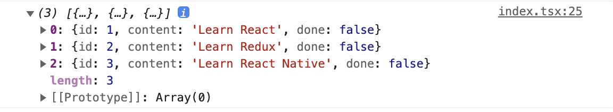

# 1. 배경설명

프론트에서는 서버에 저장되어 있는 데이터를 다룰 때가 많다. 예를 들어서 사용자 프로필 정보같은 것이다. 이를 관리할 때 원래는 useEffect를 사용하여 페이지의 로드 시 서버에서 정보를 받아오고, 프론트단에 저장하는 게 보통이었다. 그리고 서버 정보 업데이트가 있을 시 프론트에서 계속 그 부분에 대한 처리를 해주어야 했다.

React 18부터는 Suspense가 나와서 페이지 로드 시 비동기 처리를 간편하게 해주기는 했지만 서버에서 받아온 데이터를 프론트에 저장해 둔다는 건 마찬가지였다.

이런 상황에 SWR, React query와 같은 라이브러리는 서버 데이터를 프론트에 저장하지 않고 관심사를 분리해야 한다는 철학을 가지고 등장했다.

그 중에 SWR이라는 라이브러리를 사용해 보았다. state-while-revalidate라는 전략의 약자를 따왔다고 한다. 먼저 캐시에서 데이터를 반환한 후 fetch로 재검증하고 최신화 데이터를 가져오는 전략이다. SWR이 요즘은 React-query에 밀리고 있는 것 같지만 원조를 한번 써보기로 했다.

# 2. vs React-query

차후에 기회가 되면 직접 React-query도 써보고 비교해 보려고 한다. 그런데 [매드업 기술블로그의 글](https://tech.madup.com/react-query-vs-swr/)에 잘 비교된 글이 있어 한번 읽어 보았다.

React-query에서는 Mutation을 통해 서버 데이터를 변형하는 것을 지원하고, devTool을 기본적으로 제공하며 무한 스크롤과 같은 UI를 사용할 때 기본 제공하는 프로퍼티를 이용하여 이전 페이지 데이터를 간편하게 불러올 수 있다고 한다. 그리고 React-query는 다음 데이터를 불러오기 전까지 현재 캐싱된 데이터를 자동으로 반환한다. 이런 것들이 SWR에서도 가능은 하지만 부가적인 코드 작성이 필요하다.

그리고 React-query는 selector라는 것을 이용하여 쿼리 결과 부분을 추출할 수도 있다. 쿼리가 업데이트될 때만 컴포넌트를 업데이트하고, 여러 컴포넌트가 같은 쿼리를 사용할 시 묶어서 업데이트해주는 등 렌더링 퍼포먼스 최적화도 잘 되어 있다. 지정된 시간 동안 쿼리가 사용되지 않을 경우 가비지 컬렉션하는 기능도 React-query에서만 지원한다.

더 자세한 기능은 [React-query 공식문서에서의 비교](https://tanstack.com/query/latest/docs/react/comparison?from=reactQueryV3&original=https%3A%2F%2Ftanstack.com%2Fquery%2Fv3%2Fdocs%2Fcomparison)에서 더 볼 수 있다. 이런 React-query의 우위가 있긴 하지만 [카카오 기술블로그](https://fe-developers.kakaoent.com/2022/220224-data-fetching-libs/)에 의하면 SWR도 function이름 정도만 대체하면 쉽게 React-query로 넘어갈 수 있다고 하고, SWR이 더 먼저 나왔다고 하여 한번 사용해 보려고 한다.

간단한 todoList 정도를 만들까 한다.

먼저 CRA로 생성한 어플리케이션에 SWR을 깔자. 여기서는 typescript를 사용했다.

```bash
npm i swr
```

# 3. 서버 모킹

그리고 간단하게 서버를 모킹하기 위해서 json-server를 사용하였다. msw를 이용할 수도 있겠지만 이는 json-server보다 러닝커브가 좀 더 높다고 생각되어 나중에 테스트를 공부하면서 해볼 예정이다.

먼저 폴더를 생성한 후 json-server를 설치하자.

```bash
mkdir json-server-test && cd json-server-test
npm init -y
npm install json-server
```

그리고 프로젝트 루트에 db.json 파일을 생성하자. 내용은 다음과 같이 간단한 todo리스트 파일을 작성하였다.

```json
{
  "todos": [
    {
      "id": 1,
      "content": "Learn React",
      "done": false
    },
    {
      "id": 2,
      "content": "Learn Redux",
      "done": false
    },
    {
      "id": 3,
      "content": "Learn React Native",
      "done": false
    }
  ]
}
```

그리고 json-server-test폴더의 package.json의 스크립트에 다음과 같은 내용을 추가하자. json-server를 포트 5000으로 실행하도록 하는 것이다.

```json
"scripts": {
  "start": "json-server --watch db.json --port 5000",
  "test": "echo \"Error: no test specified\" && exit 1"
},
```

`npm start`명령으로 실행하면 다음과 같이 서버가 열린다.


# 4. 기초적인 SWR 사용

서버에 요청을 보낼 때는 axios를 사용할 것이다. 따라서 todolist 폴더로 돌아와서 이를 설치하자.

```bash
npm i axios
```

URL에서 데이터를 가져오는 fetcher 함수를 만들어 보자.

```jsx
import axios from 'axios';
const fetcher = (url: string) => axios.get(url).then((res) => res.data);
```

그리고 TodoList의 todo 항목들을 나타낼 요소를 간단하게 만든다. 완료 표시와 같은 것들도 만들어야 하겠지만 일단 리스트 요소만 표시하였다.

```tsx
interface Todo {
  id: number;
  content: string;
  done: boolean;
}

function TodoListItem({ todo }: { todo: Todo }) {
  return (
    <li>
      <span>{todo.content}</span>
    </li>
  );
}
```

그리고 useSWR 함수를 사용한다. 이따가 더 자세히 알아보겠지만 가장 간단하게 fetch할 주소와 fetcher 함수를 가져오는 방식으로 사용하겠다.

```tsx
function TodoListPage() {
  const { data, error } = useSWR("http://localhost:5000/todos", fetcher);

  useEffect(() => {
    console.log(data);
  }, [data]);

  return (
    <ul>
      {data
        ? data.map((todo: Todo) => <TodoListItem key={todo.id} todo={todo} />)
        : null}
    </ul>
  );
}
```

이러면 데이터를 잘 가져오는 것을 확인할 수 있다.



아니면 isLoading을 사용하여 다음과 같이 짤 수도 있다.

```tsx
function TodoListPage() {
  const { data, error, isLoading } = useSWR(
    "http://localhost:5000/todos",
    fetcher
  );

  if (error) {
    return <div>failed to load!</div>;
  }
  if (isLoading) {
    return <div>loading TodoList...</div>;
  }

  return (
    <ul>
      {data
        ? data.map((todo: Todo) => <TodoListItem key={todo.id} todo={todo} />)
        : null}
    </ul>
  );
}
```

# 5. useSWR

useSWR은 다음과 같이 사용한다. 이때 key 외에는 모두 선택 인자라서 없어도 된다. 그런데 fetcher가 없어도 된다고? 

알고 보니 fetcher를 전역으로 제공할 수 있는 방법이 있고 이럴 경우에 생략이 가능하다는 것이었다. 이렇게 전역 설정을 하는 법은 조금 뒤에 정리할 것이다.

```tsx
const { data, error, isLoading, isValidating, mutate } = useSWR(key, fetcher, options)
```

위에서 보았듯이 key는 요청할 URL이다. 함수, 배열, null도 전달할 수 있다. fetcher는 데이터를 가져오기 위한 함수를 반환하는 Promise이고 options는 옵션들을 담은 객체이다.


# 참고

공식 문서 https://swr.vercel.app/ko

https://fe-developers.kakaoent.com/2022/220224-data-fetching-libs/

https://tech.madup.com/react-query-vs-swr/

json-server https://poiemaweb.com/json-server